# Análise Estatística do Questionário 1 sobre CEUAs

## Instalação de bibliotecas necessárias


```python
#!pip install google-auth google-auth-oauthlib google-auth-httplib2 google-api-python-client statsmodels gspread oauth2client
#!pip install --upgrade --force-reinstall numpy matplotlib
#!pip install "numpy<2.0" matplotlib --force-reinstall
#!pip install nltk
#!pip install geopandas
```

## Importação das bibliotecas usadas na análise


```python
# import pandas as pd
# import gspread

# # --- Configuration ---
# # The name of your original, messy spreadsheet
# SOURCE_SPREADSHEET_NAME = 'Análise estatística Q1_corrigido'
# # The name for the new, clean local CSV file
# CLEANED_LOCAL_FILENAME = 'Análise estatística Q1_corrigido (Cleaned).csv'
# # The path to your JSON key file
# KEY_FILE_PATH = 'data-analysis-ceuas-887bb6706d4f.json'


# def clean_and_save_locally(source_name, new_filename, key_path):
#     """
#     Reads a Google Sheet, cleans whitespace from all cells,
#     and saves the result to a local CSV file.
#     """
#     try:
#         # --- 1. Connect and Load the Messy Data ---
#         print(f"Connecting to Google Sheets and loading '{source_name}'...")
#         gc = gspread.service_account(filename=key_path)
#         spreadsheet = gc.open(source_name)
#         worksheet = spreadsheet.get_worksheet(0)
#         data = worksheet.get_all_values()
        
#         # Load into a DataFrame to make cleaning easy
#         df = pd.DataFrame(data[1:], columns=data[0])
#         print("Successfully loaded the source data.")

#         # --- 2. Clean the Data ---
#         print("Cleaning whitespace from all headers and cells...")
#         # Clean column headers
#         df.columns = df.columns.str.strip()
        
#         # Clean every cell in the DataFrame
#         # We apply a function that strips whitespace if the cell is a string
#         df = df.apply(lambda col: col.str.strip() if col.dtype == "object" else col)
#         print("Data cleaning complete!")

#         # --- 3. Save the Cleaned Data Locally ---
#         print(f"Saving cleaned data to local file: '{new_filename}'...")
#         # Save the cleaned DataFrame to a CSV file.
#         # index=False prevents pandas from writing row numbers into the file.
#         # encoding='utf-8-sig' helps ensure special characters are read correctly in Excel.
#         df.to_csv(new_filename, index=False, encoding='utf-8-sig')
        
#         print(f"\nSuccess! A new, cleaned CSV file has been saved locally.")
#         print(f"File name: '{new_filename}'")

#     except gspread.exceptions.SpreadsheetNotFound:
#         print(f"ERROR: Spreadsheet '{source_name}' not found.")
#     except Exception as e:
#         print(f"An unexpected error occurred: {e}")

# if __name__ == '__main__':
#     clean_and_save_locally(SOURCE_SPREADSHEET_NAME, CLEANED_LOCAL_FILENAME, KEY_FILE_PATH)

```


```python
import numpy as np
import pandas as pd
import matplotlib.pyplot as plt
import seaborn as sns
from scipy import stats
import statsmodels.api as sm
import gspread
import nltk
from nltk.corpus import stopwords
from sklearn.feature_extraction.text import CountVectorizer
from sklearn.metrics.pairwise import cosine_similarity
from scipy.sparse import triu
import sqlite3
import re

#import os
#import io
#from google.oauth2 import service_account
#from googleapiclient.discovery import build
#from googleapiclient.http import MediaIoBaseDownload
from oauth2client.service_account import ServiceAccountCredentials
import gspread
```

## Importando dados atualizados a partir do Google Drive

Usando a base de dados original, obtida do Google Forms, vamos analizar as semelhanças entre as respostas para rejeitar respostas que formam vetores 85% ou mais similares, usando a regra do cotovelo. 


```python
# # --- NLTK Stopwords Setup ---
# # Download stopwords list if not already present
# try:
#     stopwords.words('portuguese')
# except LookupError:
#     print("Downloading nltk stopwords for Portuguese...")
#     nltk.download('stopwords')

# # --- Configuration ---
# SPREADSHEET_NAME = 'Principal'
# KEY_FILE_PATH = 'data-analysis-ceuas-887bb6706d4f.json'

# def load_data(sheet_name, key_path):
#     """Connects to Google Sheets and loads the specified sheet into a DataFrame."""
#     try:
#         gc = gspread.service_account(filename=key_path)
#         spreadsheet = gc.open(sheet_name)
#         worksheet = spreadsheet.get_worksheet(0)
#         data = worksheet.get_all_values()
#         headers = data.pop(0)
#         df = pd.DataFrame(data, columns=headers)
#         print(f"Success! Spreadsheet '{sheet_name}' loaded into a DataFrame.")
#         return df
#     except FileNotFoundError:
#         print(f"ERROR: The key file was not found at '{key_path}'.")
#     except gspread.exceptions.SpreadsheetNotFound:
#         print(f"ERROR: Spreadsheet '{sheet_name}' not found.")
#     except Exception as e:
#         print(f"An unexpected error occurred during data loading: {e}")
#     return None

# def preprocess_data(df):
#     """Prepares the DataFrame for analysis by handling IDs and combining text."""
#     if 'Cód.' in df.columns:
#         df['Original_ID'] = df['Cód.'].copy()
#         df = df.drop(columns=['Cód.'])
#         print("Preserved 'Cód.' column as Original_ID and dropped the original.")
#     else:
#         print("'Cód.' column not found - using 1-based row numbers as Original_ID.")
#         df['Original_ID'] = np.arange(len(df)) + 1
    
#     columns_to_compare = [col for col in df.columns if col != 'Original_ID']
#     df['Combined'] = df[columns_to_compare].apply(lambda row: ' '.join(row.values.astype(str)), axis=1)
#     df_filtered = df[df['Combined'].str.len() > 10].reset_index(drop=True)
    
#     return df_filtered, columns_to_compare

# def plot_threshold_analysis(df, text_column, stop_words_list):
#     """Calculates similarity and plots the number of similar pairs vs. threshold."""
#     print("\n--- Analyzing Similarity Thresholds ---")
#     vectorizer = CountVectorizer(
#         lowercase=True,
#         stop_words=stop_words_list,
#         ngram_range=(1, 2),
#         min_df=2
#     )
#     text_matrix = vectorizer.fit_transform(df[text_column])
#     cosine_similarities = cosine_similarity(text_matrix)
    
#     threshold_values = np.arange(0.75, 1.0, 0.02)
#     similar_rows_counts = []
    
#     upper_triangle = triu(cosine_similarities, k=1)

#     for threshold in threshold_values:
#         similar_indices = np.argwhere(upper_triangle >= threshold)
#         similar_rows_counts.append(len(similar_indices))
        
#     plt.figure(figsize=(10, 6))
#     plt.plot(threshold_values, similar_rows_counts, marker='o', linestyle='-')
#     plt.xlabel('Similarity Threshold')
#     plt.ylabel('Number of Similar Pairs Found')
#     plt.title('Effect of Similarity Threshold on Number of Duplicates Found')
#     plt.grid(True)
#     plt.xticks(np.arange(0.75, 1.0, 0.05))
#     plt.show()
#     print("Plot generated to help choose a similarity cutoff.")


# def find_similar_rows(df, text_column, stop_words_list, threshold=0.85):
#     """Vectorizes text and finds pairs of rows with cosine similarity above a threshold."""
#     vectorizer = CountVectorizer(
#         lowercase=True,
#         stop_words=stop_words_list, # Use the provided list
#         ngram_range=(1, 2),
#         min_df=2
#     )
#     text_matrix = vectorizer.fit_transform(df[text_column])
#     cosine_similarities = cosine_similarity(text_matrix)
    
#     upper_triangle = triu(cosine_similarities, k=1)
#     similar_indices = np.argwhere(upper_triangle >= threshold)
    
#     return [(i, j, cosine_similarities[i, j]) for i, j in similar_indices]

# def highlight_differences(text1, text2):
#     """Highlights differences between two texts using HTML formatting."""
#     # Simple word-by-word comparison
#     words1 = text1.split()
#     words2 = text2.split()
    
#     highlighted1 = []
#     highlighted2 = []
    
#     # Compare words and highlight differences
#     for i in range(max(len(words1), len(words2))):
#         if i >= len(words1):
#             highlighted2.append(f'<span style="background-color: #ffcccc">{words2[i]}</span>')
#         elif i >= len(words2):
#             highlighted1.append(f'<span style="background-color: #ffcccc">{words1[i]}</span>')
#         elif words1[i] != words2[i]:
#             highlighted1.append(f'<span style="background-color: #ffcccc">{words1[i]}</span>')
#             highlighted2.append(f'<span style="background-color: #ffcccc">{words2[i]}</span>')
#         else:
#             highlighted1.append(words1[i])
#             highlighted2.append(words2[i])
    
#     return ' '.join(highlighted1), ' '.join(highlighted2)

# def generate_report(df, similar_pairs, columns_to_compare):
#     """Generates a DataFrame report of the similar pairs found with detailed differences."""
#     report_data = []
    
#     for i, j, similarity in similar_pairs:
#         id1 = df.loc[i, 'Original_ID']
#         id2 = df.loc[j, 'Original_ID']
        
#         row1_data = df.loc[i, columns_to_compare]
#         row2_data = df.loc[j, columns_to_compare]
        
#         # Find differing columns
#         diff_mask = row1_data != row2_data
#         differing_columns = diff_mask.index[diff_mask].tolist()
        
#         # Create detailed difference report for each column
#         column_differences = []
#         for col in columns_to_compare:
#             val1 = str(row1_data[col])
#             val2 = str(row2_data[col])
            
#             if val1 != val2:
#                 # Highlight the actual differences in the text
#                 highlighted1, highlighted2 = highlight_differences(val1, val2)
#                 column_differences.append({
#                     'column': col,
#                     'value_A': val1,
#                     'value_B': val2,
#                     'highlighted_A': highlighted1,
#                     'highlighted_B': highlighted2
#                 })
        
#         # Prepare content previews
#         content_a = df.loc[i, 'Combined']
#         content_b = df.loc[j, 'Combined']
        
#         # Highlight differences in the combined content
#         highlighted_a, highlighted_b = highlight_differences(content_a, content_b)
        
#         report_data.append({
#             'ID_A': id1,
#             'ID_B': id2,
#             'Similarity': round(similarity, 4),
#             'Differing_Columns': ', '.join(differing_columns) if differing_columns else 'None',
#             'Column_Differences': column_differences,
#             'Content_A': content_a[:200] + '...' if len(content_a) > 200 else content_a,
#             'Content_B': content_b[:200] + '...' if len(content_b) > 200 else content_b,
#             'Highlighted_A': highlighted_a,
#             'Highlighted_B': highlighted_b
#         })
    
#     return pd.DataFrame(report_data)

# def save_detailed_report(report_df, filename='detailed_similarity_report.html'):
#     """Saves a detailed HTML report with highlighted differences."""
#     # CSS style with escaped curly braces
#     css_style = """
#     <style>
#         body {{ font-family: Arial, sans-serif; margin: 20px; }}
#         .pair {{ border: 1px solid #ccc; margin-bottom: 20px; padding: 15px; border-radius: 5px; }}
#         .header {{ background-color: #f0f0f0; padding: 10px; border-radius: 3px; }}
#         .differences {{ margin-top: 10px; }}
#         .column-diff {{ margin-bottom: 15px; }}
#         .column-name {{ font-weight: bold; color: #333; }}
#         .content {{ background-color: #f9f9f9; padding: 10px; border-radius: 3px; margin-top: 5px; }}
#         .highlight {{ background-color: #ffcccc; }}
#     </style>
#     """
    
#     html_content = f"""
#     <html>
#     <head>
#         <title>Detailed Similarity Report</title>
#         {css_style}
#     </head>
#     <body>
#         <h1>Detailed Similarity Report</h1>
#         <p>Found {len(report_df)} similar pairs with similarity threshold ≥ 0.85</p>
#     """
    
#     for idx, row in report_df.iterrows():
#         html_content += f"""
#         <div class="pair">
#             <div class="header">
#                 <h2>Pair {idx+1}: ID {row['ID_A']} vs ID {row['ID_B']} (Similarity: {row['Similarity']})</h2>
#                 <p>Differing columns: {row['Differing_Columns']}</p>
#             </div>
#         """
        
#         # Add column differences
#         if row['Column_Differences']:
#             html_content += '<div class="differences"><h3>Column Differences:</h3>'
#             for diff in row['Column_Differences']:
#                 html_content += f"""
#                 <div class="column-diff">
#                     <p class="column-name">Column: {diff['column']}</p>
#                     <div class="content">
#                         <p><strong>Row A:</strong> {diff['highlighted_A']}</p>
#                         <p><strong>Row B:</strong> {diff['highlighted_B']}</p>
#                     </div>
#                 </div>
#                 """
#             html_content += '</div>'
        
#         # Add combined content comparison
#         html_content += f"""
#         <div class="content-comparison">
#             <h3>Combined Content Comparison:</h3>
#             <div class="content">
#                 <p><strong>Row A (ID: {row['ID_A']}):</strong><br>{row['Highlighted_A']}</p>
#                 <p><strong>Row B (ID: {row['ID_B']}):</strong><br>{row['Highlighted_B']}</p>
#             </div>
#         </div>
#         """
        
#         html_content += "</div>"
    
#     html_content += """
#     </body>
#     </html>
#     """
    
#     with open(filename, 'w', encoding='utf-8') as f:
#         f.write(html_content)
    
#     print(f"Detailed HTML report saved to '{filename}'")

# def main():
#     """Main function to run the similarity analysis workflow."""
#     df_raw = load_data(SPREADSHEET_NAME, KEY_FILE_PATH)
    
#     if df_raw is not None:
#         df_processed, columns_to_compare = preprocess_data(df_raw.copy())
        
#         # Get the Portuguese stop words list
#         portuguese_stopwords = stopwords.words('portuguese')
        
#         # --- Generate and show the plot first ---
#         plot_threshold_analysis(df_processed, 'Combined', portuguese_stopwords)
        
#         # --- Then, proceed with the chosen threshold ---
#         print(f"\n--- Finding pairs with similarity >= 0.85 ---")
#         similar_pairs = find_similar_rows(df_processed, 'Combined', portuguese_stopwords, threshold=0.85)
        
#         if similar_pairs:
#             report_df = generate_report(df_processed, similar_pairs, columns_to_compare)
            
#             duplicate_ids_to_remove = sorted(list(set(report_df['ID_B'])))
#             print(f"\nFound {len(report_df)} similar pairs.")
#             print(f"Suggested rows to remove (duplicates): {', '.join(map(str, duplicate_ids_to_remove))}")
            
#             # Save CSV report
#             csv_report = report_df.drop(columns=['Column_Differences', 'Highlighted_A', 'Highlighted_B'])
#             csv_report.to_csv('similar_rows_report.csv', index=False)
#             print("\nBasic report saved to 'similar_rows_report.csv'")
            
#             # Save detailed HTML report
#             save_detailed_report(report_df)
            
#             # Print a few examples to console
#             print("\n--- Example Differences Found ---")
#             for idx, row in report_df.head(2).iterrows():
#                 print(f"\nPair {idx+1}: ID {row['ID_A']} vs ID {row['ID_B']} (Similarity: {row['Similarity']})")
#                 print(f"Differing columns: {row['Differing_Columns']}")
                
#                 if row['Column_Differences']:
#                     for diff in row['Column_Differences'][:2]:  # Show first 2 column differences
#                         print(f"  Column '{diff['column']}':")
#                         print(f"    Row A: {diff['value_A'][:100]}{'...' if len(diff['value_A']) > 100 else ''}")
#                         print(f"    Row B: {diff['value_B'][:100]}{'...' if len(diff['value_B']) > 100 else ''}")
#         else:
#             print("\nNo similar rows found above the threshold.")

# if __name__ == '__main__':
#     main()
```


```python
# --- NLTK Stopwords Setup ---
# Download stopwords list if not already present
try:
    stopwords.words('portuguese')
except LookupError:
    print("Downloading nltk stopwords for Portuguese...")
    nltk.download('stopwords')

# --- Configuration ---
SPREADSHEET_NAME = 'Principal'
KEY_FILE_PATH = 'data-analysis-ceuas-887bb6706d4f.json'

def load_data(sheet_name, key_path):
    """Connects to Google Sheets and loads the specified sheet into a DataFrame."""
    try:
        gc = gspread.service_account(filename=key_path)
        spreadsheet = gc.open(sheet_name)
        worksheet = spreadsheet.get_worksheet(0)
        data = worksheet.get_all_values()
        headers = data.pop(0)
        df = pd.DataFrame(data, columns=headers)
        print(f"Success! Spreadsheet '{sheet_name}' loaded into a DataFrame.")
        return df
    except FileNotFoundError:
        print(f"ERROR: The key file was not found at '{key_path}'.")
    except gspread.exceptions.SpreadsheetNotFound:
        print(f"ERROR: Spreadsheet '{sheet_name}' not found.")
    except Exception as e:
        print(f"An unexpected error occurred during data loading: {e}")
    return None

def preprocess_data(df):
    """Prepares the DataFrame for analysis by handling IDs and combining text."""
    if 'Cód.' in df.columns:
        df['Original_ID'] = df['Cód.'].copy()
        df = df.drop(columns=['Cód.'])
        print("Preserved 'Cód.' column as Original_ID and dropped the original.")
    else:
        print("'Cód.' column not found - using 1-based row numbers as Original_ID.")
        df['Original_ID'] = np.arange(len(df)) + 1
    
    columns_to_compare = [col for col in df.columns if col != 'Original_ID']
    df['Combined'] = df[columns_to_compare].apply(lambda row: ' '.join(row.values.astype(str)), axis=1)
    df_filtered = df[df['Combined'].str.len() > 10].reset_index(drop=True)
    
    return df_filtered, columns_to_compare

def plot_threshold_analysis(df, text_column, stop_words_list):
    """Calculates similarity and plots the number of similar pairs vs. threshold."""
    print("\n--- Analyzing Similarity Thresholds ---")
    vectorizer = CountVectorizer(
        lowercase=True,
        stop_words=stop_words_list,
        ngram_range=(1, 2),
        min_df=2
    )
    text_matrix = vectorizer.fit_transform(df[text_column])
    cosine_similarities = cosine_similarity(text_matrix)
    
    threshold_values = np.arange(0.75, 1.0, 0.02)
    similar_rows_counts = []
    
    upper_triangle = triu(cosine_similarities, k=1)

    for threshold in threshold_values:
        similar_indices = np.argwhere(upper_triangle >= threshold)
        similar_rows_counts.append(len(similar_indices))
        
    plt.figure(figsize=(10, 6))
    plt.plot(threshold_values, similar_rows_counts, marker='o', linestyle='-')
    plt.xlabel('Similarity Threshold')
    plt.ylabel('Number of Similar Pairs Found')
    plt.title('Effect of Similarity Threshold on Number of Duplicates Found')
    plt.grid(True)
    plt.xticks(np.arange(0.75, 1.0, 0.05))
    plt.show()
    print("Plot generated to help choose a similarity cutoff.")


def find_similar_rows(df, text_column, stop_words_list, threshold=0.85):
    """Vectorizes text and finds pairs of rows with cosine similarity above a threshold."""
    vectorizer = CountVectorizer(
        lowercase=True,
        stop_words=stop_words_list, # Use the provided list
        ngram_range=(1, 2),
        min_df=2
    )
    text_matrix = vectorizer.fit_transform(df[text_column])
    cosine_similarities = cosine_similarity(text_matrix)
    
    upper_triangle = triu(cosine_similarities, k=1)
    similar_indices = np.argwhere(upper_triangle >= threshold)
    
    return [(i, j, cosine_similarities[i, j]) for i, j in similar_indices]

def generate_report(df, similar_pairs, columns_to_compare):
    """Generates a DataFrame report of the similar pairs found."""
    report_data = []
    for i, j, similarity in similar_pairs:
        id1 = df.loc[i, 'Original_ID']
        id2 = df.loc[j, 'Original_ID']
        
        row1_data = df.loc[i, columns_to_compare]
        row2_data = df.loc[j, columns_to_compare]
        diff_mask = row1_data != row2_data
        differing_columns = diff_mask.index[diff_mask].tolist()
        
        report_data.append({
            'ID_A': id1,
            'ID_B': id2,
            'Similarity': round(similarity, 4),
            'Differing_Columns': ', '.join(differing_columns) if differing_columns else 'None',
            'Content_A': df.loc[i, 'Combined'][:100] + '...',
            'Content_B': df.loc[j, 'Combined'][:100] + '...'
        })
    return pd.DataFrame(report_data)

def main():
    """Main function to run the similarity analysis workflow."""
    df_raw = load_data(SPREADSHEET_NAME, KEY_FILE_PATH)
    
    if df_raw is not None:
        df_processed, columns_to_compare = preprocess_data(df_raw.copy())
        
        # Get the Portuguese stop words list
        portuguese_stopwords = stopwords.words('portuguese')
        
        # --- NEW: Generate and show the plot first ---
        plot_threshold_analysis(df_processed, 'Combined', portuguese_stopwords)
        
        # --- Then, proceed with the chosen threshold ---
        print(f"\n--- Finding pairs with similarity >= 0.85 ---")
        similar_pairs = find_similar_rows(df_processed, 'Combined', portuguese_stopwords, threshold=0.85)
        
        if similar_pairs:
            report_df = generate_report(df_processed, similar_pairs, columns_to_compare)
            
            duplicate_ids_to_remove = sorted(list(set(report_df['ID_B'])))
            print(f"\nFound {len(report_df)} similar pairs.")
            print(f"Suggested rows to remove (duplicates): {', '.join(map(str, duplicate_ids_to_remove))}")
            
            report_df.to_csv('similar_rows_report.csv', index=False)
            print("\nFull report saved to 'similar_rows_report.csv'")
        else:
            print("\nNo similar rows found above the threshold.")

if __name__ == '__main__':
    main()

```

    Success! Spreadsheet 'Principal' loaded into a DataFrame.
    Preserved 'Cód.' column as Original_ID and dropped the original.
    
    --- Analyzing Similarity Thresholds ---


    
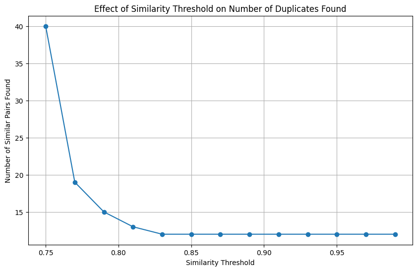
    


    Plot generated to help choose a similarity cutoff.
    
    --- Finding pairs with similarity >= 0.85 ---
    
    Found 12 similar pairs.
    Suggested rows to remove (duplicates): 115, 118, 159, 17, 302, 343, 354, 365, 80, 85, 87
    
    Full report saved to 'similar_rows_report.csv'


## Carregando a base pós análise qualitativa


```python
# --- Configuration ---
# The name of the Google Sheet file as it appears in your Drive
SPREADSHEET_NAME = 'Análise estatística Q1_corrigido'
# The path to your downloaded JSON key file
KEY_FILE_PATH = 'data-analysis-ceuas-887bb6706d4f.json'

# --- Authenticate and Connect ---
try:
    # Use gspread's built-in service account function for modern authentication
    gc = gspread.service_account(filename=KEY_FILE_PATH)

    # --- Load the Data ---
    # Open the spreadsheet by its name
    spreadsheet = gc.open(SPREADSHEET_NAME)

    # Select the first worksheet
    worksheet = spreadsheet.get_worksheet(0)

    # Get all records from the worksheet and load into a pandas DataFrame
    records = worksheet.get_all_records()
    df = pd.DataFrame(records)
    print("Success! Your spreadsheet has been loaded into a DataFrame.")

except FileNotFoundError:
    print(f"ERROR: The key file was not found at '{KEY_FILE_PATH}'.")
    print("Please make sure the file name is correct and it's in the right directory.")
except gspread.exceptions.SpreadsheetNotFound:
    print(f"ERROR: Spreadsheet '{SPREADSHEET_NAME}' not found.")
    print("Please check the spreadsheet name and make sure you've shared it with the service account email.")
except Exception as e:
    print(f"An unexpected error occurred: {e}")

```

    Success! Your spreadsheet has been loaded into a DataFrame.


## Mostrando algumas linhas da base de dados Análise estatística Q1_corrigido


```python
df
```


<div>
<style scoped>
    .dataframe tbody tr th:only-of-type {
        vertical-align: middle;
    }

    .dataframe tbody tr th {
        vertical-align: top;
    }

    .dataframe thead th {
        text-align: right;
    }
</style>
<table border="1" class="dataframe">
  <thead>
    <tr style="text-align: right;">
      <th></th>
      <th>Cod.</th>
      <th>Ativo</th>
      <th>3. Idade</th>
      <th>4. Genero</th>
      <th>5. Regiao</th>
      <th>6. Estado</th>
      <th>7. Cidade</th>
      <th>8. Religiao</th>
      <th>Religiao_codificado(8)</th>
      <th>9. Vinculo</th>
      <th>...</th>
      <th>55. Suas_colocacoes_sao_respeitadas</th>
      <th>56. Ha_resistencia_as_suas_propostas</th>
      <th>57. Demais_membros_atribuem_o_mesmo_nivel_de_preocupacao</th>
      <th>58. Sente-se_estressado_nas_reunioes</th>
      <th>59. Receio_de_aceitar_ou_rejeitar_protocolo</th>
      <th>60. Membros_tem_receio_de_rejeitar_protocolos</th>
      <th>61. Ao_avaliar_projeto_de_membro_ele_deve_se_ausentar</th>
      <th>62. Membros_que_pesquisam_com_modelos_animais_minimizam_o_sofrimento_deles</th>
      <th>63. O_quanto_a_CEUA_se_baseia_no_principio_dos_3Rs_escala</th>
      <th>64. Comentario_sobre_CEUAs</th>
    </tr>
  </thead>
  <tbody>
    <tr>
      <th>0</th>
      <td>1</td>
      <td>TRUE</td>
      <td>Entre 31 e 40 anos</td>
      <td>Masculino</td>
      <td>Sul</td>
      <td>RS</td>
      <td>Santa Maria</td>
      <td>Catolicismo</td>
      <td>2</td>
      <td>Não</td>
      <td>...</td>
      <td>Constantemente</td>
      <td>Raramente</td>
      <td>Constantemente</td>
      <td>Nunca</td>
      <td>Nunca</td>
      <td>Nunca</td>
      <td>Sim</td>
      <td>Nunca</td>
      <td>5</td>
      <td></td>
    </tr>
    <tr>
      <th>1</th>
      <td>2</td>
      <td>TRUE</td>
      <td>Entre 31 e 40 anos</td>
      <td>Feminino</td>
      <td>Sul</td>
      <td>SC</td>
      <td>Curitibanos</td>
      <td>Não tenho religião</td>
      <td>5</td>
      <td>Não</td>
      <td>...</td>
      <td>Constantemente</td>
      <td>Nunca</td>
      <td>Constantemente</td>
      <td>Raramente</td>
      <td>Nunca</td>
      <td>Raramente</td>
      <td>Sim</td>
      <td>Raramente</td>
      <td>4</td>
      <td></td>
    </tr>
    <tr>
      <th>2</th>
      <td>3</td>
      <td>TRUE</td>
      <td>Entre 51 e 60 anos</td>
      <td>Feminino</td>
      <td>Sul</td>
      <td>RS</td>
      <td>Cerro Largo</td>
      <td>Evangélica</td>
      <td>3</td>
      <td>Não</td>
      <td>...</td>
      <td>Frequentemente</td>
      <td>Nunca</td>
      <td>Frequentemente</td>
      <td>Nunca</td>
      <td>Nunca</td>
      <td>Raramente</td>
      <td>Sim</td>
      <td>Raramente</td>
      <td>4</td>
      <td></td>
    </tr>
    <tr>
      <th>3</th>
      <td>4</td>
      <td>TRUE</td>
      <td>Entre 41 e 50 anos</td>
      <td>Feminino</td>
      <td>Nordeste</td>
      <td>SE</td>
      <td>Aracaju</td>
      <td>Não tenho religião</td>
      <td>5</td>
      <td>Não</td>
      <td>...</td>
      <td>Constantemente</td>
      <td>Raramente</td>
      <td>Frequentemente</td>
      <td>Frequentemente</td>
      <td>Raramente</td>
      <td>Nunca</td>
      <td>Sim</td>
      <td>Frequentemente</td>
      <td>3</td>
      <td>Percepo  que as CEUAs ainda formalizam o uso d...</td>
    </tr>
    <tr>
      <th>4</th>
      <td>5</td>
      <td>TRUE</td>
      <td>Entre 61 e 70 anos</td>
      <td>Feminino</td>
      <td>Centro-oeste</td>
      <td>DF</td>
      <td>Brasília</td>
      <td>Espiritismo</td>
      <td>4</td>
      <td>Não</td>
      <td>...</td>
      <td>Constantemente</td>
      <td>Raramente</td>
      <td>Frequentemente</td>
      <td>Nunca</td>
      <td>Nunca</td>
      <td>Nunca</td>
      <td>Sim</td>
      <td>Raramente</td>
      <td>4</td>
      <td></td>
    </tr>
    <tr>
      <th>...</th>
      <td>...</td>
      <td>...</td>
      <td>...</td>
      <td>...</td>
      <td>...</td>
      <td>...</td>
      <td>...</td>
      <td>...</td>
      <td>...</td>
      <td>...</td>
      <td>...</td>
      <td>...</td>
      <td>...</td>
      <td>...</td>
      <td>...</td>
      <td>...</td>
      <td>...</td>
      <td>...</td>
      <td>...</td>
      <td>...</td>
      <td>...</td>
    </tr>
    <tr>
      <th>376</th>
      <td>377</td>
      <td>TRUE</td>
      <td>Entre 31 e 40 anos</td>
      <td>Feminino</td>
      <td>Sul</td>
      <td>PR</td>
      <td>Realeza</td>
      <td>Catolicismo</td>
      <td>2</td>
      <td>Sim</td>
      <td>...</td>
      <td>Constantemente</td>
      <td>Nunca</td>
      <td>Frequentemente</td>
      <td>Raramente</td>
      <td>Nunca</td>
      <td>Raramente</td>
      <td>Sim</td>
      <td>Raramente</td>
      <td>4</td>
      <td></td>
    </tr>
    <tr>
      <th>377</th>
      <td>378</td>
      <td>TRUE</td>
      <td>Entre 51 e 60 anos</td>
      <td>Feminino</td>
      <td>Sudeste</td>
      <td>MG</td>
      <td>Uberaba</td>
      <td>Espiritismo</td>
      <td>4</td>
      <td>Sim</td>
      <td>...</td>
      <td>Frequentemente</td>
      <td>Raramente</td>
      <td>Frequentemente</td>
      <td>Raramente</td>
      <td>Nunca</td>
      <td>Raramente</td>
      <td>Sim</td>
      <td>Frequentemente</td>
      <td>3</td>
      <td>Sinto-me gratificada por participar de uma CEU...</td>
    </tr>
    <tr>
      <th>378</th>
      <td>379</td>
      <td>TRUE</td>
      <td>Entre 41 e 50 anos</td>
      <td>Feminino</td>
      <td>Norte</td>
      <td>PA</td>
      <td>Belém</td>
      <td>Cristã protestante</td>
      <td>3</td>
      <td>Não</td>
      <td>...</td>
      <td>Constantemente</td>
      <td>Nunca</td>
      <td>Constantemente</td>
      <td>Nunca</td>
      <td>Nunca</td>
      <td>Nunca</td>
      <td>Sim</td>
      <td>Constantemente</td>
      <td>5</td>
      <td></td>
    </tr>
    <tr>
      <th>379</th>
      <td>380</td>
      <td>TRUE</td>
      <td>Entre 31 e 40 anos</td>
      <td>Prefiro não responder</td>
      <td>Sudeste</td>
      <td>SP</td>
      <td>São Paulo</td>
      <td>Catolicismo</td>
      <td>2</td>
      <td>Não</td>
      <td>...</td>
      <td>Frequentemente</td>
      <td>Não sei dizer</td>
      <td>Frequentemente</td>
      <td>Raramente</td>
      <td>Frequentemente</td>
      <td>Raramente</td>
      <td>Sim</td>
      <td>Raramente</td>
      <td>4</td>
      <td>Acho a existência delas algo importante, mas a...</td>
    </tr>
    <tr>
      <th>380</th>
      <td></td>
      <td></td>
      <td></td>
      <td></td>
      <td></td>
      <td></td>
      <td></td>
      <td></td>
      <td></td>
      <td></td>
      <td>...</td>
      <td></td>
      <td></td>
      <td></td>
      <td></td>
      <td></td>
      <td></td>
      <td></td>
      <td></td>
      <td></td>
      <td></td>
    </tr>
  </tbody>
</table>
<p>381 rows × 78 columns</p>
</div>


## Criando um banco de dados relacional


```python
import pandas as pd
import gspread
import sqlite3
from sqlite3 import Error
import re

# --- Configuration ---
DATABASE_NAME = 'ceua_analysis_v3.db'
SPREADSHEET_NAME = 'Análise estatística Q1_corrigido'
KEY_FILE_PATH = 'data-analysis-ceuas-887bb6706d4f.json'

def connect_and_load_gsheet(key_path, sheet_name):
    """Loads the Google Sheet into a pandas DataFrame."""
    try:
        gc = gspread.service_account(filename=key_path)
        spreadsheet = gc.open(sheet_name)
        worksheet = spreadsheet.get_worksheet(0)
        data = worksheet.get_all_values()
        headers = [h.strip() for h in data.pop(0)]
        df = pd.DataFrame(data, columns=headers)
        print("Success: Google Sheet loaded.")
        return df
    except Exception as e:
        print(f"Error loading Google Sheet: {e}")
        return None

def create_connection(db_file):
    """Creates a SQLite database connection."""
    conn = None
    try:
        conn = sqlite3.connect(db_file)
        return conn
    except Error as e:
        print(e)
    return conn

def main():
    """Performs the complete, correct database migration."""
    df = connect_and_load_gsheet(KEY_FILE_PATH, SPREADSHEET_NAME)
    if df is None:
        return

    conn = create_connection(DATABASE_NAME)
    if conn is None:
        return
        
    cursor = conn.cursor()
    
    # 1. Clear any old structure for a fresh start.
    print("\n--- Clearing database for a fresh start ---")
    cursor.execute("SELECT name FROM sqlite_master WHERE type='table' AND name != 'sqlite_sequence';")
    tables = cursor.fetchall()
    for table_name in tables:
        cursor.execute(f"DROP TABLE IF EXISTS {table_name[0]}")
    print(f"Cleared {len(tables)} old tables.")

    # 2. Define and Create the DEFINITIVE Schema.
    print("\n--- Creating new, complete relational schema ---")
    
    # Lookup Tables
    codified_columns = {
        "Religiao_codificado(8)": "Religions",
        "Justifique_dever_assumir_relatoria_codificado(25)": "JustificativaRelatoriaLookup",
        "Justifique_SPA_deve_ter_formacao_aberta_codificado(27)": "JustificativaFormacaoLookup",
        "Papel_na_CEUA_codificado(28)": "PapelCEUALookup",
        "Funcao_administrativa_na_CEUA_codificado(32)": "FuncaoAdminLookup",
        "Justifique_experimentacao_animal_ser_mal_necessario_codificado(45)": "JustificativaMalNecessarioLookup",
        "Na_avaliacao_de_danos_e_beneficios_o_que_e_importante_codificada(47)": "AvaliacaoDanosBeneficiosLookup"
    }
    for table_name in codified_columns.values():
        cursor.execute(f"CREATE TABLE IF NOT EXISTS {table_name} (id INTEGER PRIMARY KEY, name TEXT NOT NULL);")
        print(f"Table '{table_name}' created.")

    # Main Respondents table with core info
    cursor.execute("""
    CREATE TABLE IF NOT EXISTS Respondents (
        "Cod." INTEGER PRIMARY KEY,
        "Ativo" BOOLEAN NOT NULL,
        "3. Idade" TEXT,
        "4. Genero" TEXT
    );""")
    print("Table 'Respondents' created.")

    # SurveyAnswers table for all other columns to ensure no data is lost
    core_cols = {'Cod.', 'Ativo', '3. Idade', '4. Genero'}
    survey_answer_cols = [f'"{col}" TEXT' for col in df.columns if col not in core_cols and col.strip() != '']
    survey_answers_table_sql = f"""
    CREATE TABLE IF NOT EXISTS SurveyAnswers (
        AnswerID INTEGER PRIMARY KEY AUTOINCREMENT,
        RespondentID INTEGER NOT NULL UNIQUE,
        {', '.join(survey_answer_cols)},
        FOREIGN KEY (RespondentID) REFERENCES Respondents ("Cod.")
    );"""
    cursor.execute(survey_answers_table_sql)
    print("Table 'SurveyAnswers' created to hold all original columns.")
    
    # 3. Populate Lookup Tables
    print("\n--- Populating Lookup Tables ---")
    religion_data = [(1, 'Ateismo/Agnosticismo'),(2, 'Catolicismo'),(3, 'Cristãos outros/protestantes/evangélicos'),(4, 'Espiritismo'),(5, 'Não segue religião específica'),(6, 'Outras/Não respondeu'),(7, 'Religiões Afrobrasileiras')]
    justificativa_relatoria_data = [(0, "Não opinou; declarou não ter opinião; declarou algo não definível"),(1, "Falta de Competências, Conhecimentos Técnicos/Científicos (incluindo em BEA), treinamento, formação superior ou capacidades (incluindo argumentativa). Falta de imparcialidade/Antiético;SPA é passional/pode haver extremismo e conflito; Pessoas de dificil convivência"),(2, "Falta de engajamento, participação, comunicação/contato, presença, constância, abertura, diálogo/não há interesse por participar. Falta de engajamento da SPA; dificuldade em encontrar representantes"),(3, "Desde que: tenha formação superior ou conhecimento técnico/científico, ou receba ajuda/orientação/contribuição de outro membro/conheça as normativas do CONCEA/seja qualificado/tenha disponibilidade."),(4, "SPA tem competência/ Por ser membro de uma sociedade protetora deve ter conhecimento de ética e legislações pertinentes ao bem-estar animal."),(5, "Contribuição positiva: Gera Aprendizado para a CEUA ou para o membro SPA ou aumenta engajamento do SPA, visão externa e Diversidade de opiniões ajudam, melhor distribuição de tarefas. Função educativa (para SPA ou a CEUA ). Positivo para a defesa ou proteção dos animais, positivo para o BEA.Representam os interesses dos animais; protegem decisão ética/correta."),(6, "Respeito à Isonomia, Imparcialidade, acesso igualitário, igualdade, inclusão, diversidade de opiniões/pois a CEUA é multidisciplinar. Não deve haver diferenciação. A regra é a mesma para todos/A decisão final é coletiva/colegiada. Direito; Representatividade"),(7, "Não é função do SPA. Regra do CONCEA, Papel exclusivo, para membros institucionais, internos ou com certos papeis (médico veterinário, zootecnista ou biólogo). Papel exclusivo de certos membros; Riscos (confidencialidade). Desnecessário; não há benefício; não acrescenta; os outros membros são suficientes; indiferente"),(8, "Falta de imparcialidade/Antiético;SPA é passional/pode haver extremismo e conflito; Pessoas de dificil convivência")]
    justificativa_formacao_data = [(0, "Não opinou; declarou não ter opinião; declarou algo não definível"),(1, "É necessário: para entender, avaliar e contribuir. Para estar no nível apropriado/conseguir entender e dialogar os proponentes de pesquisa e seus pares. Para fazer Avaliação técnica. O entendimento dos projetos requer noções de estatistica, delineamento experimental; manipulação de animais, ciências agrárias. Para poder assumir relatoria de protocolos; para dar parecer, avaliar protocolos. Conhecimento acadêmico básico/nível superior. Para ter conhecimento teórico em vários assuntos, o que é muito importante. Graduação em geral contribui, sem especificar área."),(2, "Evitar Imparcialidade, achismo; \"fundamentalismo\"; fanatismo, atitude anti cientifica, paixoes, realmente contribuir, ter visão mais racional da proteção aos animais, evitar viés emocional."),(3, "Não é necessário; As habilidades e conhecimentos importantes para a função não dependem de formação academica. Não é necessário mas é desejável. Um curso ou algum tipo de capacitação poderia resolver"),(4, "É preciso ter Conhecimentos relevantes à proteção animal, para cumporirem o papel de defesa e cuidado com os animais. Conhecimento em ética, direito dos animais. Conhecimentos especificos: anatomia sobre a espécie que se defende; particularidades de cada espécie; legislação, bem-estar animal."),(5, "Pode ser uma Exigência negativa: Necessidade de formação pode ser negativo: não ser representativo da siociedade, restringir participação, reduzir visão diferente"),(6, "Para entender a importancia do uso de animais")]
    papel_ceua_data = [(1, "Biólogo (a)"),(2, "Consultor Ad-hoc"),(3, "Docente"),(4, "Incerto"),(5, "Médico(a) Veterinário (a)"),(6, "Representantes de outras áreas"),(7, "Pesquisador(a)"),(8, "Representante da Sociedade Protetora de Animais")]
    funcao_admin_data = [(1, "Coordenador"),(2, "Não ocupo nenhuma função administrativa"),(3, "Secretário"),(4, "Vice-coordenador")]
    justificativa_mal_necessario_data = [(0, "Não clasificável"),(1, "Discorda que seja um mal: Respostas que discordam da ideia de que a experimentação animal seja um mal, especialmente quando seguem preceitos éticos. Não é mal, é só necessário -aparente incomodo com a afirmação. Críticas à pergunta, considera ofensiva. Foco em apontar que não é um mal. Parece não entender a complexidade ética da pergunta."),(2, "Confiança em Métodos Alternativos: Respostas que confiam em métodos alternativos, incluindo modelos in vitro e métodos já existentes ou em desenvolvimento. Menciona expectativa de quem em breve não seja mais necessário."),(3, "Crítica à Experimentação: Respostas que criticam ou questionam a necessidade de animais ou manifestam incômodo com práticas de uso de animais atual. Crítica à quantidade usada. Muitos estudos poderiam ser substituidos. Aponta resistência dos pesquisadores, na busca por alternativas."),(4, "confiança na ética e Responsabilidade: Respostas que destacam a importância de seguir protocolos éticos, os 3Rs, e a responsabilidade dos pesquisadores. Basta seguir os 3Rs"),(5, "Condicional: Respostas que mencionam que depende, que a experimentação é necessária em alguns casos, ou enquanto as técnicas de substituição não forem aprimoradas ou disponíveis: Ainda é necessário. Ou Dependendo do objetivo. Se for para o próprio animal. Foco na justificativa."),(6, "Limitações das alternativas: Respostas que apontam limitações dos métodos alternativos ou falta de recursos."),(7, "Avanços Científicos e Benefícios para a Humanidade: Respostas que justificam a experimentação animal destacando os avanços científicos e os benefícios resultantes para a saúde e o bem-estar humano. Foco nos fins. Alegação de que é necessário ou ainda é necessário."),(8, "Confiança no modelo Animal: Engloba respostas que afirmam a adequabilidade ou superioridade do modelo animal enquanro método, reconhecendo a confiança nos métodos atuais, incluindo refinamento e redução, e a dificuldade de substituição em certos contextos. Menciona ter sido útil no passado. Sugere que este é o jeito de fazer ciência, sem entrar em questões éticas. Foca na vantagem do método"),(9, "destaca o dano para o animal")]
    
    # *** ALTERAÇÃO INICIA AQUI ***
    # Dados para a nova tabela de consulta que estava faltando.
    avaliacao_danos_beneficios_data = [
        (0, 'Não classificável'),
        (1, 'Conhecimento'),
        (2, 'Qualidade da pesquisa'),
        (3, 'Relevância e benefícios'),
        (4, 'Substituição'),
        (5, 'Redução'),
        (6, 'Refinamento'),
        (7, 'Processo de avaliação'),
        (8, 'Princípios éticos'),
        (9, '3Rs')
    ]
    # *** ALTERAÇÃO TERMINA AQUI ***

    cursor.executemany("INSERT OR IGNORE INTO Religions (id, name) VALUES (?, ?)", religion_data)
    cursor.executemany("INSERT OR IGNORE INTO JustificativaRelatoriaLookup (id, name) VALUES (?, ?)", justificativa_relatoria_data)
    cursor.executemany("INSERT OR IGNORE INTO JustificativaFormacaoLookup (id, name) VALUES (?, ?)", justificativa_formacao_data)
    cursor.executemany("INSERT OR IGNORE INTO PapelCEUALookup (id, name) VALUES (?, ?)", papel_ceua_data)
    cursor.executemany("INSERT OR IGNORE INTO FuncaoAdminLookup (id, name) VALUES (?, ?)", funcao_admin_data)
    cursor.executemany("INSERT OR IGNORE INTO JustificativaMalNecessarioLookup (id, name) VALUES (?, ?)", justificativa_mal_necessario_data)
    
    # *** ALTERAÇÃO INICIA AQUI ***
    # Executa a inserção dos dados para a tabela de consulta de danos e benefícios.
    cursor.executemany("INSERT OR IGNORE INTO AvaliacaoDanosBeneficiosLookup (id, name) VALUES (?, ?)", avaliacao_danos_beneficios_data)
    # *** ALTERAÇÃO TERMINA AQUI ***

    print("Populated all available lookup tables with provided meanings.")

    # Populate other lookup tables with placeholders
    # *** ALTERAÇÃO INICIA AQUI ***
    # Adicionado 'AvaliacaoDanosBeneficiosLookup' à lista para que não seja sobrescrito com valores de placeholder.
    populated_tables = ["Religions", "JustificativaRelatoriaLookup", "JustificativaFormacaoLookup", "PapelCEUALookup", "FuncaoAdminLookup", "JustificativaMalNecessarioLookup", "AvaliacaoDanosBeneficiosLookup"]
    # *** ALTERAÇÃO TERMINA AQUI ***
    for original_col, table_name in codified_columns.items():
        if table_name not in populated_tables:
            unique_codes = df[original_col].dropna().unique()
            for code in unique_codes:
                if str(code).strip():
                    try:
                        cursor.execute(f"INSERT OR IGNORE INTO {table_name} (id, name) VALUES (?, ?)", (int(code), f"Meaning for code {code}"))
                    except (ValueError, TypeError): pass
            print(f"Populated '{table_name}' with placeholder values.")
    conn.commit()

    # 4. Populate Main Data Tables
    print("\n--- Populating main data tables ---")
    survey_cols_for_insert = [col for col in df.columns if col not in core_cols and col.strip() != '']
    quoted_survey_cols = ', '.join([f'"{col}"' for col in survey_cols_for_insert])
    placeholders = ', '.join(['?'] * (len(survey_cols_for_insert) + 1))
    sql_insert_survey = f"INSERT INTO SurveyAnswers (RespondentID, {quoted_survey_cols}) VALUES ({placeholders})"
    
    for index, row in df.iterrows():
        if pd.isna(row['Cod.']) or str(row['Cod.']).strip() == '': continue
        
        respondent_id = int(row['Cod.'])
        is_active = True if str(row.get('Ativo', '')).strip().upper() == 'TRUE' else False
        
        cursor.execute('INSERT INTO Respondents ("Cod.", "Ativo", "3. Idade", "4. Genero") VALUES (?, ?, ?, ?)',
                       (respondent_id, is_active, row.get('3. Idade'), row.get('4. Genero')))
        
        survey_values = [row.get(col, None) for col in survey_cols_for_insert]
        cursor.execute(sql_insert_survey, [respondent_id] + survey_values)

    conn.commit()
    conn.close()
    
    print(f"\nMigration complete! The database 'ceua_analysis_v3.db' is correct and ready for use.")

if __name__ == '__main__':
    main()

```

    Success: Google Sheet loaded.
    
    --- Clearing database for a fresh start ---
    Cleared 9 old tables.
    
    --- Creating new, complete relational schema ---
    Table 'Religions' created.
    Table 'JustificativaRelatoriaLookup' created.
    Table 'JustificativaFormacaoLookup' created.
    Table 'PapelCEUALookup' created.
    Table 'FuncaoAdminLookup' created.
    Table 'JustificativaMalNecessarioLookup' created.
    Table 'AvaliacaoDanosBeneficiosLookup' created.
    Table 'Respondents' created.
    Table 'SurveyAnswers' created to hold all original columns.
    
    --- Populating Lookup Tables ---
    Populated all available lookup tables with provided meanings.
    
    --- Populating main data tables ---
    
    Migration complete! The database 'ceua_analysis_v3.db' is correct and ready for use.


```python
# import pandas as pd
# import gspread
# import sqlite3
# from sqlite3 import Error
# import re

# # --- Configuration ---
# DATABASE_NAME = 'ceua_analysis_v3.db'
# SPREADSHEET_NAME = 'Análise estatística Q1_corrigido'
# KEY_FILE_PATH = 'data-analysis-ceuas-887bb6706d4f.json'

# def connect_and_load_gsheet(key_path, sheet_name):
#     """Loads the Google Sheet into a pandas DataFrame."""
#     try:
#         gc = gspread.service_account(filename=key_path)
#         spreadsheet = gc.open(sheet_name)
#         worksheet = spreadsheet.get_worksheet(0)
#         data = worksheet.get_all_values()
#         headers = [h.strip() for h in data.pop(0)]
#         df = pd.DataFrame(data, columns=headers)
#         print("Success: Google Sheet loaded.")
#         return df
#     except Exception as e:
#         print(f"Error loading Google Sheet: {e}")
#         return None

# def create_connection(db_file):
#     """Creates a SQLite database connection."""
#     conn = None
#     try:
#         conn = sqlite3.connect(db_file)
#         return conn
#     except Error as e:
#         print(e)
#     return conn

# def main():
#     """Performs the complete, correct database migration."""
#     df = connect_and_load_gsheet(KEY_FILE_PATH, SPREADSHEET_NAME)
#     if df is None:
#         return

#     conn = create_connection(DATABASE_NAME)
#     if conn is None:
#         return
        
#     cursor = conn.cursor()
    
#     # 1. Clear any old structure for a fresh start.
#     print("\n--- Clearing database for a fresh start ---")
#     cursor.execute("SELECT name FROM sqlite_master WHERE type='table' AND name != 'sqlite_sequence';")
#     tables = cursor.fetchall()
#     for table_name in tables:
#         cursor.execute(f"DROP TABLE IF EXISTS {table_name[0]}")
#     print(f"Cleared {len(tables)} old tables.")

#     # 2. Define and Create the DEFINITIVE Schema.
#     print("\n--- Creating new, complete relational schema ---")
    
#     # Lookup Tables
#     codified_columns = {
#         "Religiao_codificado(8)": "Religions",
#         "Justifique_dever_assumir_relatoria_codificado(25)": "JustificativaRelatoriaLookup",
#         "Justifique_SPA_deve_ter_formacao_aberta_codificado(27)": "JustificativaFormacaoLookup",
#         "Papel_na_CEUA_codificado(28)": "PapelCEUALookup",
#         "Funcao_administrativa_na_CEUA_codificado(32)": "FuncaoAdminLookup",
#         "Justifique_experimentacao_animal_ser_mal_necessario_codificado(45)": "JustificativaMalNecessarioLookup",
#         "Na_avaliacao_de_danos_e_beneficios_o_que_e_importante_codificada(47)": "AvaliacaoDanosBeneficiosLookup"
#     }
#     for table_name in codified_columns.values():
#         cursor.execute(f"CREATE TABLE IF NOT EXISTS {table_name} (id INTEGER PRIMARY KEY, name TEXT NOT NULL);")
#         print(f"Table '{table_name}' created.")

#     # Main Respondents table with core info
#     cursor.execute("""
#     CREATE TABLE IF NOT EXISTS Respondents (
#         "Cod." INTEGER PRIMARY KEY,
#         "Ativo" BOOLEAN NOT NULL,
#         "3. Idade" TEXT,
#         "4. Genero" TEXT
#     );""")
#     print("Table 'Respondents' created.")

#     # SurveyAnswers table for all other columns to ensure no data is lost
#     core_cols = {'Cod.', 'Ativo', '3. Idade', '4. Genero'}
#     survey_answer_cols = [f'"{col}" TEXT' for col in df.columns if col not in core_cols and col.strip() != '']
#     survey_answers_table_sql = f"""
#     CREATE TABLE IF NOT EXISTS SurveyAnswers (
#         AnswerID INTEGER PRIMARY KEY AUTOINCREMENT,
#         RespondentID INTEGER NOT NULL UNIQUE,
#         {', '.join(survey_answer_cols)},
#         FOREIGN KEY (RespondentID) REFERENCES Respondents ("Cod.")
#     );"""
#     cursor.execute(survey_answers_table_sql)
#     print("Table 'SurveyAnswers' created to hold all original columns.")
    
#     # 3. Populate Lookup Tables
#     print("\n--- Populating Lookup Tables ---")
#     religion_data = [(1, 'Ateismo/Agnosticismo'),(2, 'Catolicismo'),(3, 'Cristãos outros/protestantes/evangélicos'),(4, 'Espiritismo'),(5, 'Não segue religião específica'),(6, 'Outras/Não respondeu'),(7, 'Religiões Afrobrasileiras')]
#     justificativa_relatoria_data = [(0, "Não opinou; declarou não ter opinião; declarou algo não definível"),(1, "Falta de Competências, Conhecimentos Técnicos/Científicos (incluindo em BEA), treinamento, formação superior ou capacidades (incluindo argumentativa). Falta de imparcialidade/Antiético;SPA é passional/pode haver extremismo e conflito; Pessoas de dificil convivência"),(2, "Falta de engajamento, participação, comunicação/contato, presença, constância, abertura, diálogo/não há interesse por participar. Falta de engajamento da SPA; dificuldade em encontrar representantes"),(3, "Desde que: tenha formação superior ou conhecimento técnico/científico, ou receba ajuda/orientação/contribuição de outro membro/conheça as normativas do CONCEA/seja qualificado/tenha disponibilidade."),(4, "SPA tem competência/ Por ser membro de uma sociedade protetora deve ter conhecimento de ética e legislações pertinentes ao bem-estar animal."),(5, "Contribuição positiva: Gera Aprendizado para a CEUA ou para o membro SPA ou aumenta engajamento do SPA, visão externa e Diversidade de opiniões ajudam, melhor distribuição de tarefas. Função educativa (para SPA ou a CEUA ). Positivo para a defesa ou proteção dos animais, positivo para o BEA.Representam os interesses dos animais; protegem decisão ética/correta."),(6, "Respeito à Isonomia, Imparcialidade, acesso igualitário, igualdade, inclusão, diversidade de opiniões/pois a CEUA é multidisciplinar. Não deve haver diferenciação. A regra é a mesma para todos/A decisão final é coletiva/colegiada. Direito; Representatividade"),(7, "Não é função do SPA. Regra do CONCEA, Papel exclusivo, para membros institucionais, internos ou com certos papeis (médico veterinário, zootecnista ou biólogo). Papel exclusivo de certos membros; Riscos (confidencialidade). Desnecessário; não há benefício; não acrescenta; os outros membros são suficientes; indiferente"),(8, "Falta de imparcialidade/Antiético;SPA é passional/pode haver extremismo e conflito; Pessoas de dificil convivência")]
#     justificativa_formacao_data = [(0, "Não opinou; declarou não ter opinião; declarou algo não definível"),(1, "É necessário: para entender, avaliar e contribuir. Para estar no nível apropriado/conseguir entender e dialogar os proponentes de pesquisa e seus pares. Para fazer Avaliação técnica. O entendimento dos projetos requer noções de estatistica, delineamento experimental; manipulação de animais, ciências agrárias. Para poder assumir relatoria de protocolos; para dar parecer, avaliar protocolos. Conhecimento acadêmico básico/nível superior. Para ter conhecimento teórico em vários assuntos, o que é muito importante. Graduação em geral contribui, sem especificar área."),(2, "Evitar Imparcialidade, achismo; \"fundamentalismo\"; fanatismo, atitude anti cientifica, paixoes, realmente contribuir, ter visão mais racional da proteção aos animais, evitar viés emocional."),(3, "Não é necessário; As habilidades e conhecimentos importantes para a função não dependem de formação academica. Não é necessário mas é desejável. Um curso ou algum tipo de capacitação poderia resolver"),(4, "É preciso ter Conhecimentos relevantes à proteção animal, para cumporirem o papel de defesa e cuidado com os animais. Conhecimento em ética, direito dos animais. Conhecimentos especificos: anatomia sobre a espécie que se defende; particularidades de cada espécie; legislação, bem-estar animal."),(5, "Pode ser uma Exigência negativa: Necessidade de formação pode ser negativo: não ser representativo da siociedade, restringir participação, reduzir visão diferente"),(6, "Para entender a importancia do uso de animais")]
#     papel_ceua_data = [(1, "Biólogo (a)"),(2, "Consultor Ad-hoc"),(3, "Docente"),(4, "Incerto"),(5, "Médico(a) Veterinário (a)"),(6, "Representantes de outras áreas"),(7, "Pesquisador(a)"),(8, "Representante da Sociedade Protetora de Animais")]
#     funcao_admin_data = [(1, "Coordenador"),(2, "Não ocupo nenhuma função administrativa"),(3, "Secretário"),(4, "Vice-coordenador")]
    
#     # NEW: Data for JustificativaMalNecessarioLookup
#     justificativa_mal_necessario_data = [
#         (0, "Não clasificável"),
#         (1, "Discorda que seja um mal: Respostas que discordam da ideia de que a experimentação animal seja um mal, especialmente quando seguem preceitos éticos. Não é mal, é só necessário -aparente incomodo com a afirmação. Críticas à pergunta, considera ofensiva. Foco em apontar que não é um mal. Parece não entender a complexidade ética da pergunta."),
#         (2, "Confiança em Métodos Alternativos: Respostas que confiam em métodos alternativos, incluindo modelos in vitro e métodos já existentes ou em desenvolvimento. Menciona expectativa de quem em breve não seja mais necessário."),
#         (3, "Crítica à Experimentação: Respostas que criticam ou questionam a necessidade de animais ou manifestam incômodo com práticas de uso de animais atual. Crítica à quantidade usada. Muitos estudos poderiam ser substituidos. Aponta resistência dos pesquisadores, na busca por alternativas."),
#         (4, "confiança na ética e Responsabilidade: Respostas que destacam a importância de seguir protocolos éticos, os 3Rs, e a responsabilidade dos pesquisadores. Basta seguir os 3Rs"),
#         (5, "Condicional: Respostas que mencionam que depende, que a experimentação é necessária em alguns casos, ou enquanto as técnicas de substituição não forem aprimoradas ou disponíveis: Ainda é necessário. Ou Dependendo do objetivo. Se for para o próprio animal. Foco na justificativa."),
#         (6, "Limitações das alternativas: Respostas que apontam limitações dos métodos alternativos ou falta de recursos."),
#         (7, "Avanços Científicos e Benefícios para a Humanidade: Respostas que justificam a experimentação animal destacando os avanços científicos e os benefícios resultantes para a saúde e o bem-estar humano. Foco nos fins. Alegação de que é necessário ou ainda é necessário."),
#         (8, "Confiança no modelo Animal: Engloba respostas que afirmam a adequabilidade ou superioridade do modelo animal enquanro método, reconhecendo a confiança nos métodos atuais, incluindo refinamento e redução, e a dificuldade de substituição em certos contextos. Menciona ter sido útil no passado. Sugere que este é o jeito de fazer ciência, sem entrar em questões éticas. Foca na vantagem do método"),
#         (9, "destaca o dano para o animal")
#     ]

#     cursor.executemany("INSERT OR IGNORE INTO Religions (id, name) VALUES (?, ?)", religion_data)
#     cursor.executemany("INSERT OR IGNORE INTO JustificativaRelatoriaLookup (id, name) VALUES (?, ?)", justificativa_relatoria_data)
#     cursor.executemany("INSERT OR IGNORE INTO JustificativaFormacaoLookup (id, name) VALUES (?, ?)", justificativa_formacao_data)
#     cursor.executemany("INSERT OR IGNORE INTO PapelCEUALookup (id, name) VALUES (?, ?)", papel_ceua_data)
#     cursor.executemany("INSERT OR IGNORE INTO FuncaoAdminLookup (id, name) VALUES (?, ?)", funcao_admin_data)
#     cursor.executemany("INSERT OR IGNORE INTO JustificativaMalNecessarioLookup (id, name) VALUES (?, ?)", justificativa_mal_necessario_data)
#     print("Populated all available lookup tables with provided meanings.")

#     # Populate other lookup tables with placeholders
#     populated_tables = ["Religions", "JustificativaRelatoriaLookup", "JustificativaFormacaoLookup", "PapelCEUALookup", "FuncaoAdminLookup", "JustificativaMalNecessarioLookup"]
#     for original_col, table_name in codified_columns.items():
#         if table_name not in populated_tables:
#             unique_codes = df[original_col].dropna().unique()
#             for code in unique_codes:
#                 if str(code).strip():
#                     try:
#                         cursor.execute(f"INSERT OR IGNORE INTO {table_name} (id, name) VALUES (?, ?)", (int(code), f"Meaning for code {code}"))
#                     except (ValueError, TypeError): pass
#             print(f"Populated '{table_name}' with placeholder values.")
#     conn.commit()

#     # 4. Populate Main Data Tables
#     print("\n--- Populating main data tables ---")
#     survey_cols_for_insert = [col for col in df.columns if col not in core_cols and col.strip() != '']
#     quoted_survey_cols = ', '.join([f'"{col}"' for col in survey_cols_for_insert])
#     placeholders = ', '.join(['?'] * (len(survey_cols_for_insert) + 1))
#     sql_insert_survey = f"INSERT INTO SurveyAnswers (RespondentID, {quoted_survey_cols}) VALUES ({placeholders})"
    
#     for index, row in df.iterrows():
#         if pd.isna(row['Cod.']) or str(row['Cod.']).strip() == '': continue
        
#         respondent_id = int(row['Cod.'])
#         is_active = True if str(row.get('Ativo', '')).strip().upper() == 'TRUE' else False
        
#         cursor.execute('INSERT INTO Respondents ("Cod.", "Ativo", "3. Idade", "4. Genero") VALUES (?, ?, ?, ?)',
#                        (respondent_id, is_active, row.get('3. Idade'), row.get('4. Genero')))
        
#         survey_values = [row.get(col, None) for col in survey_cols_for_insert]
#         cursor.execute(sql_insert_survey, [respondent_id] + survey_values)

#     conn.commit()
#     conn.close()
    
#     print(f"\nMigration complete! The database 'ceua_analysis_v3.db' is correct and ready for use.")

# if __name__ == '__main__':
#     main()

```

#### Analise univariada


```python
import pandas as pd
import sqlite3
import matplotlib.pyplot as plt
import seaborn as sns
import numpy as np
import re

# --- Configuration ---
DATABASE_NAME = 'ceua_analysis_v3.db'

def get_active_respondent_ages(db_name):
    """
    Queries the database to get the age data for all active respondents.
    """
    conn = None
    try:
        conn = sqlite3.connect(db_name)
        query = """
        SELECT
          r."3. Idade"
        FROM
          Respondents AS r
        WHERE
          r."Ativo" = 1;
        """
        df = pd.read_sql_query(query, conn)
        print("Success: Loaded age data for active respondents.")
        return df
    except Exception as e:
        print(f"An error occurred while querying the database: {e}")
        return None
    finally:
        if conn:
            conn.close()

def convert_age_range_to_numeric(age_range):
    """Converts an age range string to its approximate midpoint."""
    if pd.isna(age_range):
        return np.nan
    age_range = str(age_range)
    if 'Até 30' in age_range:
        return 30
    elif 'Mais de 70' in age_range:
        return 75 # An estimate for the upper range
    elif 'Entre' in age_range:
        # This regex is more robust for parsing 'Entre XX e YY'
        parts = re.findall(r'\d+', age_range)
        if len(parts) == 2:
            low = int(parts[0])
            high = int(parts[1])
            return (low + high) / 2
    return np.nan


def main():
    """
    Main function to perform and display the univariate analysis of age.
    """
    age_df = get_active_respondent_ages(DATABASE_NAME)
    
    if age_df is not None and not age_df.empty:
        age_df.rename(columns={'3. Idade': 'AgeRange'}, inplace=True)

        # --- 1. Descriptive Statistics for Categorical Data ---
        print("\n--- Descriptive Statistics for Age Range (Categorical) ---")
        print(age_df['AgeRange'].describe())

        # --- 2. Numerical Analysis ---
        print("\n--- Descriptive Statistics for Age (Estimated Numeric) ---")
        # Create a new column with the estimated numeric age
        age_df['NumericAge'] = age_df['AgeRange'].apply(convert_age_range_to_numeric)
        
        # Now we can calculate mean, median, std, etc.
        print(f"Mean Age (estimated): {age_df['NumericAge'].mean():.2f}")
        print(f"Median Age (estimated): {age_df['NumericAge'].median():.2f}")
        print(f"Standard Deviation (estimated): {age_df['NumericAge'].std():.2f}")


        # --- 3. Plotting the Data ---
        print("\n--- Generating Age Distribution Plot ---")
        
        age_order = [
            'Até 30 anos', 
            'Entre 31 e 40 anos', 
            'Entre 41 e 50 anos',
            'Entre 51 e 60 anos', 
            'Entre 61 e 70 anos', 
            'Mais de 70 anos'
        ]
        
        sns.set_style("whitegrid")
        plt.figure(figsize=(10, 6))
        
        ax = sns.countplot(
            data=age_df,
            x='AgeRange',
            order=age_order,
            color='steelblue', # Using a single, professional color
            legend=False
        )
        
        plt.xlabel('Age Range', fontsize=12)
        plt.ylabel('Number of Respondents', fontsize=12)
        plt.title('Age Distribution of Active Respondents', fontsize=14, fontweight='bold')
        plt.xticks(rotation=45, ha='right')
        
        total_respondents = len(age_df)
        
        # MODIFICATION: Add both count and percentage to the bar labels.
        for p in ax.patches:
            height = p.get_height()
            if height > 0: # Only add labels to bars with data
                percentage = 100 * height / total_respondents
                label = f'{int(height)}\n({percentage:.1f}%)'
                ax.annotate(label, 
                            (p.get_x() + p.get_width() / 2., height), 
                            ha = 'center', va = 'bottom',
                            xytext = (0, 5), 
                            textcoords = 'offset points',
                            fontsize=9,
                            color='black')

        # MODIFICATION: Add more space at the top of the plot
        # to prevent labels from overlapping the title.
        max_height = age_df['AgeRange'].value_counts().max()
        ax.set_ylim(0, max_height * 1.15)
        
        # MODIFICATION: Add a text box with the total number of respondents.
        ax.text(0.95, 0.95, f'Total Respondents: {total_respondents}',
                transform=ax.transAxes,
                fontsize=10,
                verticalalignment='top',
                horizontalalignment='right',
                bbox=dict(boxstyle='round,pad=0.5', fc='aliceblue', alpha=0.6))

        plt.tight_layout()
        plt.show()

if __name__ == '__main__':
    main()

```

    Success: Loaded age data for active respondents.
    
    --- Descriptive Statistics for Age Range (Categorical) ---
    count                    369
    unique                     5
    top       Entre 41 e 50 anos
    freq                     134
    Name: AgeRange, dtype: object
    
    --- Descriptive Statistics for Age (Estimated Numeric) ---
    Mean Age (estimated): 43.52
    Median Age (estimated): 45.50
    Standard Deviation (estimated): 9.62
    
    --- Generating Age Distribution Plot ---


    /home/leon/anaconda3/lib/python3.10/site-packages/seaborn/categorical.py:1273: FutureWarning: DataFrameGroupBy.apply operated on the grouping columns. This behavior is deprecated, and in a future version of pandas the grouping columns will be excluded from the operation. Either pass `include_groups=False` to exclude the groupings or explicitly select the grouping columns after groupby to silence this warning.
      .apply(aggregator, agg_var)


    

    


```python
import pandas as pd
import sqlite3
import matplotlib.pyplot as plt
import seaborn as sns
import numpy as np

# --- Configuration ---
DATABASE_NAME = 'ceua_analysis_v3.db'

def get_active_respondent_gender(db_name):
    """
    Queries the database to get the gender data for all active respondents.
    """
    conn = None
    try:
        conn = sqlite3.connect(db_name)
        # SQL query to select the '4. Genero' column from the Respondents table
        # for all rows where 'Ativo' is True (1).
        query = """
        SELECT
          r."4. Genero"
        FROM
          Respondents AS r
        WHERE
          r."Ativo" = 1;
        """
        df = pd.read_sql_query(query, conn)
        print("Success: Loaded gender data for active respondents.")
        return df
    except Exception as e:
        print(f"An error occurred while querying the database: {e}")
        return None
    finally:
        if conn:
            conn.close()

def main():
    """
    Main function to perform and display the univariate analysis of gender.
    """
    gender_df = get_active_respondent_gender(DATABASE_NAME)
    
    if gender_df is not None and not gender_df.empty:
        # Rename the column for easier use and clearer outputs.
        gender_df.rename(columns={'4. Genero': 'Gender'}, inplace=True)

        # --- 1. Descriptive Statistics ---
        print("\n--- Descriptive Statistics for Gender ---")
        print(gender_df['Gender'].describe())
        
        # We can also get a more detailed frequency count
        print("\nFrequency Count:")
        print(gender_df['Gender'].value_counts())


        # --- 2. Plotting the Data ---
        print("\n--- Generating Gender Distribution Plot ---")
        
        sns.set_style("whitegrid")
        plt.figure(figsize=(10, 6))
        
        # MODIFICATION: Changed color to 'steelblue' for consistency.
        ax = sns.countplot(
            data=gender_df,
            x='Gender',
            color='steelblue', # A nice, single color consistent with previous plot
            order = gender_df['Gender'].value_counts().index # Order by frequency
        )
        
        plt.xlabel('Gender', fontsize=12)
        plt.ylabel('Number of Respondents', fontsize=12)
        plt.title('Gender Distribution of Active Respondents', fontsize=14, fontweight='bold')
        
        total_respondents = len(gender_df)
        
        # Add both count and percentage to the bar labels.
        for p in ax.patches:
            height = p.get_height()
            if height > 0:
                percentage = 100 * height / total_respondents
                label = f'{int(height)}\n({percentage:.1f}%)'
                ax.annotate(label, 
                            (p.get_x() + p.get_width() / 2., height), 
                            ha = 'center', va = 'bottom',
                            xytext = (0, 5), 
                            textcoords = 'offset points',
                            fontsize=9,
                            color='black')

        # Add more space at the top of the plot
        max_height = gender_df['Gender'].value_counts().max()
        ax.set_ylim(0, max_height * 1.15)
        
        # Add a text box with the total number of respondents.
        ax.text(0.95, 0.95, f'Total Respondents: {total_respondents}',
                transform=ax.transAxes,
                fontsize=10,
                verticalalignment='top',
                horizontalalignment='right',
                bbox=dict(boxstyle='round,pad=0.5', fc='aliceblue', alpha=0.6))

        plt.tight_layout()
        plt.show()

if __name__ == '__main__':
    main()

```

    Success: Loaded gender data for active respondents.
    
    --- Descriptive Statistics for Gender ---
    count          369
    unique           3
    top       Feminino
    freq           233
    Name: Gender, dtype: object
    
    Frequency Count:
    Gender
    Feminino                 233
    Masculino                135
    Prefiro não responder      1
    Name: count, dtype: int64
    
    --- Generating Gender Distribution Plot ---


    /home/leon/anaconda3/lib/python3.10/site-packages/seaborn/categorical.py:1273: FutureWarning: DataFrameGroupBy.apply operated on the grouping columns. This behavior is deprecated, and in a future version of pandas the grouping columns will be excluded from the operation. Either pass `include_groups=False` to exclude the groupings or explicitly select the grouping columns after groupby to silence this warning.
      .apply(aggregator, agg_var)


    
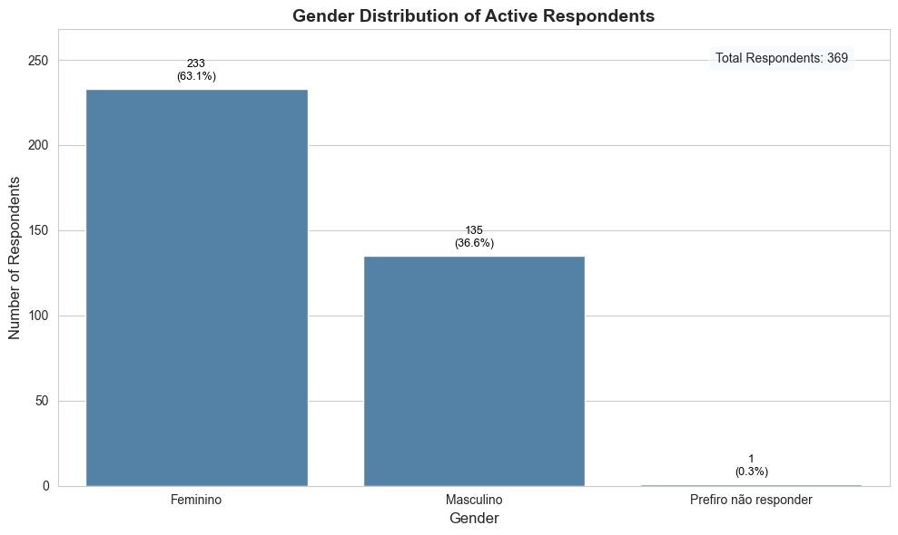
    


```python
import pandas as pd
import sqlite3
import matplotlib.pyplot as plt
import seaborn as sns
import numpy as np

# --- Configuration ---
DATABASE_NAME = 'ceua_analysis_v3.db'

def get_active_respondent_region(db_name):
    """
    Queries the database to get the region data for all active respondents.
    """
    conn = None
    try:
        conn = sqlite3.connect(db_name)
        # SQL query to join Respondents and SurveyAnswers to get the region
        # for all rows where 'Ativo' is True (1).
        query = """
        SELECT
          s."5. Regiao"
        FROM
          Respondents AS r
        JOIN
          SurveyAnswers AS s ON r."Cod." = s.RespondentID
        WHERE
          r."Ativo" = 1;
        """
        df = pd.read_sql_query(query, conn)
        print("Success: Loaded region data for active respondents.")
        return df
    except Exception as e:
        print(f"An error occurred while querying the database: {e}")
        return None
    finally:
        if conn:
            conn.close()

def main():
    """
    Main function to perform and display the univariate analysis of region.
    """
    region_df = get_active_respondent_region(DATABASE_NAME)
    
    if region_df is not None and not region_df.empty:
        # Rename the column for easier use and clearer outputs.
        region_df.rename(columns={'5. Regiao': 'Region'}, inplace=True)

        # --- 1. Descriptive Statistics ---
        print("\n--- Descriptive Statistics for Region ---")
        print(region_df['Region'].describe())
        
        print("\nFrequency Count:")
        print(region_df['Region'].value_counts())


        # --- 2. Plotting the Data ---
        print("\n--- Generating Region Distribution Plot ---")
        
        sns.set_style("whitegrid")
        plt.figure(figsize=(10, 6))
        
        ax = sns.countplot(
            data=region_df,
            x='Region',
            color='steelblue', # Consistent color
            order = region_df['Region'].value_counts().index # Order by frequency
        )
        
        plt.xlabel('Region', fontsize=12)
        plt.ylabel('Number of Respondents', fontsize=12)
        plt.title('Geographical Distribution of Active Respondents', fontsize=14, fontweight='bold')
        
        total_respondents = len(region_df)
        
        # Add both count and percentage to the bar labels.
        for p in ax.patches:
            height = p.get_height()
            if height > 0:
                percentage = 100 * height / total_respondents
                label = f'{int(height)}\n({percentage:.1f}%)'
                ax.annotate(label, 
                            (p.get_x() + p.get_width() / 2., height), 
                            ha = 'center', va = 'bottom',
                            xytext = (0, 5), 
                            textcoords = 'offset points',
                            fontsize=9,
                            color='black')

        # Add more space at the top of the plot
        max_height = region_df['Region'].value_counts().max()
        ax.set_ylim(0, max_height * 1.15)
        
        # Add a text box with the total number of respondents.
        ax.text(0.95, 0.95, f'Total Respondents: {total_respondents}',
                transform=ax.transAxes,
                fontsize=10,
                verticalalignment='top',
                horizontalalignment='right',
                bbox=dict(boxstyle='round,pad=0.5', fc='aliceblue', alpha=0.6))

        plt.tight_layout()
        plt.show()

if __name__ == '__main__':
    main()

```

    Success: Loaded region data for active respondents.
    
    --- Descriptive Statistics for Region ---
    count         369
    unique          5
    top       Sudeste
    freq          179
    Name: Region, dtype: object
    
    Frequency Count:
    Region
    Sudeste         179
    Sul              73
    Nordeste         58
    Norte            30
    Centro-oeste     29
    Name: count, dtype: int64
    
    --- Generating Region Distribution Plot ---


    /home/leon/anaconda3/lib/python3.10/site-packages/seaborn/categorical.py:1273: FutureWarning: DataFrameGroupBy.apply operated on the grouping columns. This behavior is deprecated, and in a future version of pandas the grouping columns will be excluded from the operation. Either pass `include_groups=False` to exclude the groupings or explicitly select the grouping columns after groupby to silence this warning.
      .apply(aggregator, agg_var)


    
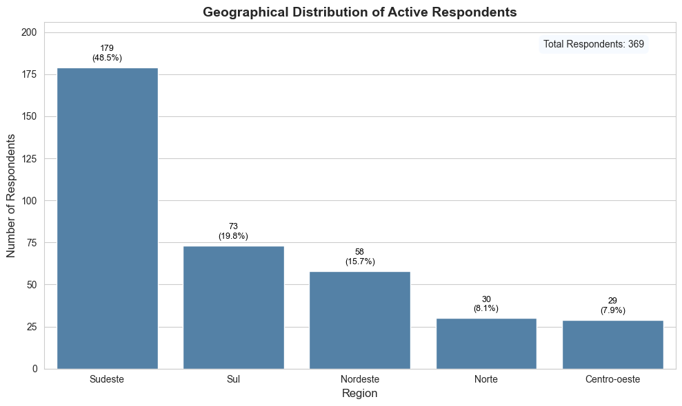
    


```python
import pandas as pd
import sqlite3
import matplotlib.pyplot as plt
import seaborn as sns
import numpy as np

# --- Configuration ---
DATABASE_NAME = 'ceua_analysis_v3.db'

def get_active_respondent_state(db_name):
    """
    Queries the database to get the state data for all active respondents.
    """
    conn = None
    try:
        conn = sqlite3.connect(db_name)
        # SQL query to join Respondents and SurveyAnswers to get the state
        # for all rows where 'Ativo' is True (1).
        query = """
        SELECT
          s."6. Estado"
        FROM
          Respondents AS r
        JOIN
          SurveyAnswers AS s ON r."Cod." = s.RespondentID
        WHERE
          r."Ativo" = 1;
        """
        df = pd.read_sql_query(query, conn)
        print("Success: Loaded state data for active respondents.")
        return df
    except Exception as e:
        print(f"An error occurred while querying the database: {e}")
        return None
    finally:
        if conn:
            conn.close()

def main():
    """
    Main function to perform and display the univariate analysis of state.
    """
    state_df = get_active_respondent_state(DATABASE_NAME)
    
    if state_df is not None and not state_df.empty:
        # Rename the column for easier use and clearer outputs.
        state_df.rename(columns={'6. Estado': 'State'}, inplace=True)

        # --- NEW: Data Cleaning Step ---
        # Standardize state abbreviations to uppercase to handle inconsistencies like 'sp' vs 'SP'.
        # Also remove any leading/trailing whitespace.
        state_df['State'] = state_df['State'].str.strip().str.upper()
        
        # Drop any rows that might be empty after cleaning
        state_df.dropna(subset=['State'], inplace=True)
        state_df = state_df[state_df['State'] != '']


        # --- 1. Descriptive Statistics ---
        print("\n--- Descriptive Statistics for State (Cleaned) ---")
        print(state_df['State'].describe())
        
        print("\nFrequency Count (Cleaned):")
        print(state_df['State'].value_counts())


        # --- 2. Plotting the Data ---
        print("\n--- Generating State Distribution Plot ---")
        
        sns.set_style("whitegrid")
        # Adjusting figure size for potentially more categories
        plt.figure(figsize=(12, 8))
        
        ax = sns.countplot(
            data=state_df,
            y='State', # Use y-axis for better readability with many states
            color='steelblue', # Consistent color
            order = state_df['State'].value_counts().index # Order by frequency
        )
        
        plt.xlabel('Number of Respondents', fontsize=12)
        plt.ylabel('State', fontsize=12)
        plt.title('Geographical Distribution by State for Active Respondents', fontsize=14, fontweight='bold')
        
        total_respondents = len(state_df)
        
        # Add both count and percentage to the bar labels.
        for p in ax.patches:
            width = p.get_width()
            if width > 0:
                percentage = 100 * width / total_respondents
                label = f'{int(width)} ({percentage:.1f}%)'
                ax.text(width + 0.3, p.get_y() + p.get_height() / 2,
                        label, 
                        va='center',
                        fontsize=9,
                        color='black')

        # Add more space at the right of the plot for labels
        max_width = state_df['State'].value_counts().max()
        ax.set_xlim(0, max_width * 1.25)
        
        # Add a text box with the total number of respondents.
        ax.text(0.95, 0.95, f'Total Respondents: {total_respondents}',
                transform=ax.transAxes,
                fontsize=10,
                verticalalignment='top',
                horizontalalignment='right',
                bbox=dict(boxstyle='round,pad=0.5', fc='aliceblue', alpha=0.6))

        plt.tight_layout()
        plt.show()

if __name__ == '__main__':
    main()

```

    Success: Loaded state data for active respondents.
    
    --- Descriptive Statistics for State (Cleaned) ---
    count     369
    unique     24
    top        SP
    freq       99
    Name: State, dtype: object
    
    Frequency Count (Cleaned):
    State
    SP    99
    MG    42
    RJ    34
    RS    28
    PR    26
    SC    18
    DF    14
    PA    14
    BA    12
    PE     9
    PB     8
    CE     8
    SE     7
    PI     7
    AM     6
    ES     6
    MS     5
    TO     5
    GO     5
    MA     4
    MT     4
    RN     3
    RO     3
    AC     2
    Name: count, dtype: int64
    
    --- Generating State Distribution Plot ---


    /home/leon/anaconda3/lib/python3.10/site-packages/seaborn/categorical.py:1273: FutureWarning: DataFrameGroupBy.apply operated on the grouping columns. This behavior is deprecated, and in a future version of pandas the grouping columns will be excluded from the operation. Either pass `include_groups=False` to exclude the groupings or explicitly select the grouping columns after groupby to silence this warning.
      .apply(aggregator, agg_var)


    
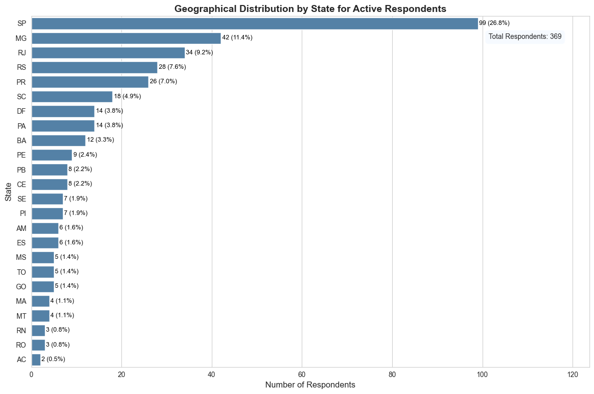
    


```python
import pandas as pd
import sqlite3
import matplotlib.pyplot as plt
import seaborn as sns
import numpy as np

# --- Configuration ---
DATABASE_NAME = 'ceua_analysis_v3.db'

def get_active_respondent_religion(db_name):
    """
    Queries the database to get the decoded religion for all active respondents.
    """
    conn = None
    try:
        conn = sqlite3.connect(db_name)
        # SQL query to join Respondents, SurveyAnswers, and the Religions lookup table.
        # This gets the meaningful religion name for all active respondents.
        query = """
        SELECT
          rel.name AS Religion
        FROM
          Respondents AS r
        JOIN
          SurveyAnswers AS s ON r."Cod." = s.RespondentID
        JOIN
          Religions AS rel ON s."Religiao_codificado(8)" = rel.id
        WHERE
          r."Ativo" = 1;
        """
        df = pd.read_sql_query(query, conn)
        print("Success: Loaded religion data for active respondents.")
        return df
    except Exception as e:
        print(f"An error occurred while querying the database: {e}")
        return None
    finally:
        if conn:
            conn.close()

def main():
    """
    Main function to perform and display the univariate analysis of religion.
    """
    religion_df = get_active_respondent_religion(DATABASE_NAME)
    
    if religion_df is not None and not religion_df.empty:
        # --- 1. Descriptive Statistics ---
        print("\n--- Descriptive Statistics for Religion ---")
        print(religion_df['Religion'].describe())
        
        print("\nFrequency Count:")
        print(religion_df['Religion'].value_counts())


        # --- 2. Plotting the Data ---
        print("\n--- Generating Religion Distribution Plot ---")
        
        sns.set_style("whitegrid")
        # Using a taller figure for better readability with many categories
        plt.figure(figsize=(12, 8))
        
        ax = sns.countplot(
            data=religion_df,
            y='Religion', # Using y-axis for long labels
            color='steelblue', # Consistent color
            order = religion_df['Religion'].value_counts().index # Order by frequency
        )
        
        plt.xlabel('Number of Respondents', fontsize=12)
        plt.ylabel('Religion', fontsize=12)
        plt.title('Religion Distribution of Active Respondents', fontsize=14, fontweight='bold')
        
        total_respondents = len(religion_df)
        
        # Add both count and percentage to the bar labels.
        for p in ax.patches:
            width = p.get_width()
            if width > 0:
                percentage = 100 * width / total_respondents
                label = f'{int(width)} ({percentage:.1f}%)'
                ax.text(width + 0.3, p.get_y() + p.get_height() / 2,
                        label, 
                        va='center',
                        fontsize=9,
                        color='black')

        # Add more space at the right of the plot for labels
        max_width = religion_df['Religion'].value_counts().max()
        ax.set_xlim(0, max_width * 1.25)
        
        # Add a text box with the total number of respondents.
        ax.text(0.95, 0.05, f'Total Respondents: {total_respondents}',
                transform=ax.transAxes,
                fontsize=10,
                verticalalignment='bottom',
                horizontalalignment='right',
                bbox=dict(boxstyle='round,pad=0.5', fc='aliceblue', alpha=0.6))

        plt.tight_layout()
        plt.show()

if __name__ == '__main__':
    main()

```

    Success: Loaded religion data for active respondents.
    
    --- Descriptive Statistics for Religion ---
    count             369
    unique              7
    top       Catolicismo
    freq              168
    Name: Religion, dtype: object
    
    Frequency Count:
    Religion
    Catolicismo                                 168
    Espiritismo                                  61
    Não segue religião específica                56
    Ateismo/Agnosticismo                         33
    Cristãos outros/protestantes/evangélicos     28
    Religiões Afrobrasileiras                    13
    Outras/Não respondeu                         10
    Name: count, dtype: int64
    
    --- Generating Religion Distribution Plot ---


    /home/leon/anaconda3/lib/python3.10/site-packages/seaborn/categorical.py:1273: FutureWarning: DataFrameGroupBy.apply operated on the grouping columns. This behavior is deprecated, and in a future version of pandas the grouping columns will be excluded from the operation. Either pass `include_groups=False` to exclude the groupings or explicitly select the grouping columns after groupby to silence this warning.
      .apply(aggregator, agg_var)


    
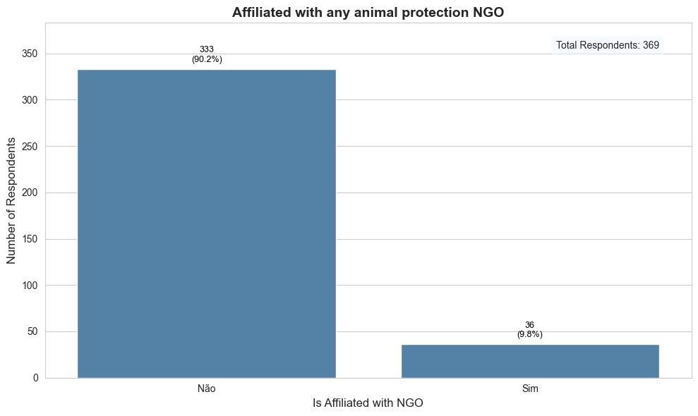
    


```python
import pandas as pd
import sqlite3
import matplotlib.pyplot as plt
import seaborn as sns
import numpy as np

# --- Configuration ---
DATABASE_NAME = 'ceua_analysis_v3.db'

def get_active_respondent_vinculo(db_name):
    """
    Queries the database to get the 'Vinculo' data for all active respondents.
    """
    conn = None
    try:
        conn = sqlite3.connect(db_name)
        # SQL query to join Respondents and SurveyAnswers to get the 'Vinculo'
        # for all rows where 'Ativo' is True (1).
        query = """
        SELECT
          s."9. Vinculo"
        FROM
          Respondents AS r
        JOIN
          SurveyAnswers AS s ON r."Cod." = s.RespondentID
        WHERE
          r."Ativo" = 1;
        """
        df = pd.read_sql_query(query, conn)
        print("Success: Loaded 'Vinculo' data for active respondents.")
        return df
    except Exception as e:
        print(f"An error occurred while querying the database: {e}")
        return None
    finally:
        if conn:
            conn.close()

def main():
    """
    Main function to perform and display the univariate analysis of 'Vinculo'.
    """
    vinculo_df = get_active_respondent_vinculo(DATABASE_NAME)
    
    if vinculo_df is not None and not vinculo_df.empty:
        # Rename the column for easier use and clearer outputs.
        vinculo_df.rename(columns={'9. Vinculo': 'Vinculo'}, inplace=True)

        # --- 1. Descriptive Statistics ---
        print("\n--- Descriptive Statistics for Vinculo ---")
        print(vinculo_df['Vinculo'].describe())
        
        print("\nFrequency Count:")
        print(vinculo_df['Vinculo'].value_counts())


        # --- 2. Plotting the Data ---
        print("\n--- Generating Vinculo Distribution Plot ---")
        
        sns.set_style("whitegrid")
        plt.figure(figsize=(10, 6))
        
        ax = sns.countplot(
            data=vinculo_df,
            x='Vinculo',
            color='steelblue', # Consistent color
            order = vinculo_df['Vinculo'].value_counts().index # Order by frequency
        )
        
        plt.xlabel('Is Affiliated with NGO', fontsize=12)
        plt.ylabel('Number of Respondents', fontsize=12)
        plt.title('Affiliated with any animal protection NGO', fontsize=14, fontweight='bold')
        
        total_respondents = len(vinculo_df)
        
        # Add both count and percentage to the bar labels.
        for p in ax.patches:
            height = p.get_height()
            if height > 0:
                percentage = 100 * height / total_respondents
                label = f'{int(height)}\n({percentage:.1f}%)'
                ax.annotate(label, 
                            (p.get_x() + p.get_width() / 2., height), 
                            ha = 'center', va = 'bottom',
                            xytext = (0, 5), 
                            textcoords = 'offset points',
                            fontsize=9,
                            color='black')

        # Add more space at the top of the plot
        max_height = vinculo_df['Vinculo'].value_counts().max()
        ax.set_ylim(0, max_height * 1.15)
        
        # Add a text box with the total number of respondents.
        ax.text(0.95, 0.95, f'Total Respondents: {total_respondents}',
                transform=ax.transAxes,
                fontsize=10,
                verticalalignment='top',
                horizontalalignment='right',
                bbox=dict(boxstyle='round,pad=0.5', fc='aliceblue', alpha=0.6))

        plt.tight_layout()
        plt.show()

if __name__ == '__main__':
    main()

```

    Success: Loaded 'Vinculo' data for active respondents.
    
    --- Descriptive Statistics for Vinculo ---
    count     369
    unique      2
    top       Não
    freq      333
    Name: Vinculo, dtype: object
    
    Frequency Count:
    Vinculo
    Não    333
    Sim     36
    Name: count, dtype: int64
    
    --- Generating Vinculo Distribution Plot ---


    /home/leon/anaconda3/lib/python3.10/site-packages/seaborn/categorical.py:1273: FutureWarning: DataFrameGroupBy.apply operated on the grouping columns. This behavior is deprecated, and in a future version of pandas the grouping columns will be excluded from the operation. Either pass `include_groups=False` to exclude the groupings or explicitly select the grouping columns after groupby to silence this warning.
      .apply(aggregator, agg_var)


    

    


```python
import pandas as pd
import sqlite3

# --- Configuration ---
DATABASE_NAME = 'ceua_analysis_v3.db'

def get_raw_ngo_names(db_name):
    """
    Queries the database to get the raw NGO names for active respondents with a 'vinculo'.
    """
    conn = None
    try:
        conn = sqlite3.connect(db_name)
        # SQL query to get '10. Nome_da_ONG' for active respondents who answered 'Sim' to '9. Vinculo'.
        query = """
        SELECT
          s."10. Nome_da_ONG"
        FROM
          Respondents AS r
        JOIN
          SurveyAnswers AS s ON r."Cod." = s.RespondentID
        WHERE
          r."Ativo" = 1 AND s."9. Vinculo" = 'Sim';
        """
        df = pd.read_sql_query(query, conn)
        print("Success: Loaded raw NGO name data.")
        return df
    except Exception as e:
        print(f"An error occurred while querying the database: {e}")
        return None
    finally:
        if conn:
            conn.close()

def main():
    """
    Main function to query and print the raw NGO names.
    """
    ngo_df = get_raw_ngo_names(DATABASE_NAME)
    
    if ngo_df is not None and not ngo_df.empty:
        # Rename the column for clarity.
        ngo_df.rename(columns={'10. Nome_da_ONG': 'RawNGOName'}, inplace=True)

        # --- Print the Raw Data ---
        print("\n--- Raw NGO Names as they appear in the database ---")
        # Use to_string() to ensure all names are printed without being cut off.
        # index=False and header=False makes for a clean, simple list.
        print(ngo_df['RawNGOName'].to_string(index=False, header=False))

if __name__ == '__main__':
    main()

```

    Success: Loaded raw NGO name data.
    
    --- Raw NGO Names as they appear in the database ---
                          ONG Sou Amigo - Coordenadora
                                   AMAA - colaboradora
                                        Seres Viventes
                             SOS Animal - colaboradora
                                             Lar Oasis
                        Adote um Gatinho ( voluntaria)
                                              ALPA. RT
            Samb Sociedade Amor de Bicho 1a tesoureira
                                                 Amada
           APAT - ASSOCIAÇÃO DE PROTEÃO ANIMAL DE TEFÉ
    Associação Melhores Amigos dos Animais - Presid...
                                           Adota Patos
                                                 KAOSA
                    Viva Bichos, Defesa da Vida Animal
               Instituto Espaço Silvestre - Presidente
                                       ONG DEIXE VIVER
                                    Refugio dos bichos
                ADA - Associação Defensora dos Animais
                                     UPAP - Voluntária
                                                  GAAR
                                   Membro da Diretoria
                        SOS ANIMAIS DE RUA, voluntária
                                                Amacap
                                                Sospet
    pastoral de protetores/apoio técnico e atendime...
                    Ong Animais da Aldeia - Voluntário
             Associação Ouropretana de Proteção Animal
                              Forum Animal, consultora
    Associação Defensora dos Animais São Francisco ...
                     Instituto Flora Vida - Voluntária
                                           Desabandone
    AMPARA, auxílio em atividade com animais da ong...
                               APATA, doadora de ração
                                          SOS Bichinho
    Amaa. Presidente do conselho deliberativo e fis...
                Colaboradora- Santuário Anjos de Assis


```python
import pandas as pd
import sqlite3
from IPython.display import display, HTML

# --- Configuration ---
DATABASE_NAME = 'ceua_analysis_v3.db'

def generate_html_table(name_list):
    """
    Generates an HTML string for a styled table from a list of names.
    """
    # Sort the list alphabetically
    name_list.sort()
    
    # Build the HTML for the table rows
    table_rows = ""
    for i, name in enumerate(name_list):
        # Alternate row colors for readability
        row_class = "bg-gray-50" if i % 2 != 0 else ""
        table_rows += f"""
        <tr class="{row_class}">
            <td class="px-6 py-4 whitespace-nowrap text-sm font-medium text-gray-900">{i + 1}</td>
            <td class="px-6 py-4 whitespace-nowrap text-sm text-gray-700">{name}</td>
        </tr>
        """

    # The full HTML structure
    full_html = f"""
    <!DOCTYPE html>
    <html lang="en">
    <head>
        <meta charset="UTF-8">
        <meta name="viewport" content="width=device-width, initial-scale=1.0">
        <title>NGO Names List</title>
        <script src="https://cdn.tailwindcss.com"></script>
        <style> body {{ font-family: 'Inter', sans-serif; }} </style>
    </head>
    <body class="bg-gray-100 text-gray-800">
        <div class="container mx-auto p-4 sm:p-6 lg:p-8">
            <div class="bg-white rounded-2xl shadow-lg overflow-hidden">
                <div class="p-6 border-b border-gray-200">
                    <h1 class="text-2xl font-bold text-gray-900">NGO Affiliations of Respondents</h1>
                    <p class="mt-1 text-sm text-gray-600">A cleaned, alphabetized list of unique NGO names provided in the survey.</p>
                </div>
                <div class="overflow-x-auto">
                    <table class="min-w-full divide-y divide-gray-200">
                        <thead class="bg-gray-50">
                            <tr>
                                <th scope="col" class="px-6 py-3 text-left text-xs font-medium text-gray-500 uppercase tracking-wider w-16">#</th>
                                <th scope="col" class="px-6 py-3 text-left text-xs font-medium text-gray-500 uppercase tracking-wider">NGO Name</th>
                            </tr>
                        </thead>
                        <tbody class="bg-white divide-y divide-gray-200">
                            {table_rows}
                        </tbody>
                    </table>
                </div>
            </div>
        </div>
    </body>
    </html>
    """
    return full_html

def main():
    """
    Main function to display the curated list of NGO names.
    """
    # This is the manually curated list that we agreed was perfect.
    # We are using this static list to ensure 100% accuracy.
    cleaned_ngo_names = [
        "Ada - Associação Defensora Dos Animais", "Adota Patos", "Adote Um Gatinho", "Alpa", "Amacap", "Amada",
        "Ampara", "Amaa", "Apat - Associação De Proteão Animal De Tefé", "Apata",
        "Associação Defensora Dos Animais São Francisco De Assis (Adasfa)", "Associação Melhores Amigos Dos Animais",
        "Associação Ouropretana De Proteção Animal", "Santuário Anjos De Assis", "Desabandone", "Forum Animal", "Gaar",
        "Instituto Espaço Silvestre", "Instituto Flora Vida", "Kaosa", "Lar Oasis", "Ong Animais Da Aldeia",
        "Ong Sou Amigo", "Pastoral De Protetores", "Refugio Dos Bichos", "Samb Sociedade Amor De Bicho",
        "Seres Viventes", "Sos Animais De Rua", "Sos Animal", "Sos Bichinho", "Sospet", "Upap", "Viva Bichos"
    ]
    
    # Generate the HTML table from our perfect list
    html_output = generate_html_table(cleaned_ngo_names)
    
    # Display the HTML in the Jupyter output
    display(HTML(html_output))

if __name__ == '__main__':
    main()

```


<!DOCTYPE html>
<html lang="en">
<head>
    <meta charset="UTF-8">
    <meta name="viewport" content="width=device-width, initial-scale=1.0">
    <title>NGO Names List</title>
    <script src="https://cdn.tailwindcss.com"></script>
    <style> body { font-family: 'Inter', sans-serif; } </style>
</head>
<body class="bg-gray-100 text-gray-800">
    <div class="container mx-auto p-4 sm:p-6 lg:p-8">
        <div class="bg-white rounded-2xl shadow-lg overflow-hidden">
            <div class="p-6 border-b border-gray-200">
                <h1 class="text-2xl font-bold text-gray-900">NGO Affiliations of Respondents</h1>
                <p class="mt-1 text-sm text-gray-600">A cleaned, alphabetized list of unique NGO names provided in the survey.</p>
            </div>
            <div class="overflow-x-auto">
                <table class="min-w-full divide-y divide-gray-200">
                    <thead class="bg-gray-50">
                        <tr>
                            <th scope="col" class="px-6 py-3 text-left text-xs font-medium text-gray-500 uppercase tracking-wider w-16">#</th>
                            <th scope="col" class="px-6 py-3 text-left text-xs font-medium text-gray-500 uppercase tracking-wider">NGO Name</th>
                        </tr>
                    </thead>
                    <tbody class="bg-white divide-y divide-gray-200">

    <tr class="">
        <td class="px-6 py-4 whitespace-nowrap text-sm font-medium text-gray-900">1</td>
        <td class="px-6 py-4 whitespace-nowrap text-sm text-gray-700">Ada - Associação Defensora Dos Animais</td>
    </tr>

    <tr class="bg-gray-50">
        <td class="px-6 py-4 whitespace-nowrap text-sm font-medium text-gray-900">2</td>
        <td class="px-6 py-4 whitespace-nowrap text-sm text-gray-700">Adota Patos</td>
    </tr>

    <tr class="">
        <td class="px-6 py-4 whitespace-nowrap text-sm font-medium text-gray-900">3</td>
        <td class="px-6 py-4 whitespace-nowrap text-sm text-gray-700">Adote Um Gatinho</td>
    </tr>

    <tr class="bg-gray-50">
        <td class="px-6 py-4 whitespace-nowrap text-sm font-medium text-gray-900">4</td>
        <td class="px-6 py-4 whitespace-nowrap text-sm text-gray-700">Alpa</td>
    </tr>

    <tr class="">
        <td class="px-6 py-4 whitespace-nowrap text-sm font-medium text-gray-900">5</td>
        <td class="px-6 py-4 whitespace-nowrap text-sm text-gray-700">Amaa</td>
    </tr>

    <tr class="bg-gray-50">
        <td class="px-6 py-4 whitespace-nowrap text-sm font-medium text-gray-900">6</td>
        <td class="px-6 py-4 whitespace-nowrap text-sm text-gray-700">Amacap</td>
    </tr>

    <tr class="">
        <td class="px-6 py-4 whitespace-nowrap text-sm font-medium text-gray-900">7</td>
        <td class="px-6 py-4 whitespace-nowrap text-sm text-gray-700">Amada</td>
    </tr>

    <tr class="bg-gray-50">
        <td class="px-6 py-4 whitespace-nowrap text-sm font-medium text-gray-900">8</td>
        <td class="px-6 py-4 whitespace-nowrap text-sm text-gray-700">Ampara</td>
    </tr>

    <tr class="">
        <td class="px-6 py-4 whitespace-nowrap text-sm font-medium text-gray-900">9</td>
        <td class="px-6 py-4 whitespace-nowrap text-sm text-gray-700">Apat - Associação De Proteão Animal De Tefé</td>
    </tr>

    <tr class="bg-gray-50">
        <td class="px-6 py-4 whitespace-nowrap text-sm font-medium text-gray-900">10</td>
        <td class="px-6 py-4 whitespace-nowrap text-sm text-gray-700">Apata</td>
    </tr>

    <tr class="">
        <td class="px-6 py-4 whitespace-nowrap text-sm font-medium text-gray-900">11</td>
        <td class="px-6 py-4 whitespace-nowrap text-sm text-gray-700">Associação Defensora Dos Animais São Francisco De Assis (Adasfa)</td>
    </tr>

    <tr class="bg-gray-50">
        <td class="px-6 py-4 whitespace-nowrap text-sm font-medium text-gray-900">12</td>
        <td class="px-6 py-4 whitespace-nowrap text-sm text-gray-700">Associação Melhores Amigos Dos Animais</td>
    </tr>

    <tr class="">
        <td class="px-6 py-4 whitespace-nowrap text-sm font-medium text-gray-900">13</td>
        <td class="px-6 py-4 whitespace-nowrap text-sm text-gray-700">Associação Ouropretana De Proteção Animal</td>
    </tr>

    <tr class="bg-gray-50">
        <td class="px-6 py-4 whitespace-nowrap text-sm font-medium text-gray-900">14</td>
        <td class="px-6 py-4 whitespace-nowrap text-sm text-gray-700">Desabandone</td>
    </tr>

    <tr class="">
        <td class="px-6 py-4 whitespace-nowrap text-sm font-medium text-gray-900">15</td>
        <td class="px-6 py-4 whitespace-nowrap text-sm text-gray-700">Forum Animal</td>
    </tr>

    <tr class="bg-gray-50">
        <td class="px-6 py-4 whitespace-nowrap text-sm font-medium text-gray-900">16</td>
        <td class="px-6 py-4 whitespace-nowrap text-sm text-gray-700">Gaar</td>
    </tr>

    <tr class="">
        <td class="px-6 py-4 whitespace-nowrap text-sm font-medium text-gray-900">17</td>
        <td class="px-6 py-4 whitespace-nowrap text-sm text-gray-700">Instituto Espaço Silvestre</td>
    </tr>

    <tr class="bg-gray-50">
        <td class="px-6 py-4 whitespace-nowrap text-sm font-medium text-gray-900">18</td>
        <td class="px-6 py-4 whitespace-nowrap text-sm text-gray-700">Instituto Flora Vida</td>
    </tr>

    <tr class="">
        <td class="px-6 py-4 whitespace-nowrap text-sm font-medium text-gray-900">19</td>
        <td class="px-6 py-4 whitespace-nowrap text-sm text-gray-700">Kaosa</td>
    </tr>

    <tr class="bg-gray-50">
        <td class="px-6 py-4 whitespace-nowrap text-sm font-medium text-gray-900">20</td>
        <td class="px-6 py-4 whitespace-nowrap text-sm text-gray-700">Lar Oasis</td>
    </tr>

    <tr class="">
        <td class="px-6 py-4 whitespace-nowrap text-sm font-medium text-gray-900">21</td>
        <td class="px-6 py-4 whitespace-nowrap text-sm text-gray-700">Ong Animais Da Aldeia</td>
    </tr>

    <tr class="bg-gray-50">
        <td class="px-6 py-4 whitespace-nowrap text-sm font-medium text-gray-900">22</td>
        <td class="px-6 py-4 whitespace-nowrap text-sm text-gray-700">Ong Sou Amigo</td>
    </tr>

    <tr class="">
        <td class="px-6 py-4 whitespace-nowrap text-sm font-medium text-gray-900">23</td>
        <td class="px-6 py-4 whitespace-nowrap text-sm text-gray-700">Pastoral De Protetores</td>
    </tr>

    <tr class="bg-gray-50">
        <td class="px-6 py-4 whitespace-nowrap text-sm font-medium text-gray-900">24</td>
        <td class="px-6 py-4 whitespace-nowrap text-sm text-gray-700">Refugio Dos Bichos</td>
    </tr>

    <tr class="">
        <td class="px-6 py-4 whitespace-nowrap text-sm font-medium text-gray-900">25</td>
        <td class="px-6 py-4 whitespace-nowrap text-sm text-gray-700">Samb Sociedade Amor De Bicho</td>
    </tr>

    <tr class="bg-gray-50">
        <td class="px-6 py-4 whitespace-nowrap text-sm font-medium text-gray-900">26</td>
        <td class="px-6 py-4 whitespace-nowrap text-sm text-gray-700">Santuário Anjos De Assis</td>
    </tr>

    <tr class="">
        <td class="px-6 py-4 whitespace-nowrap text-sm font-medium text-gray-900">27</td>
        <td class="px-6 py-4 whitespace-nowrap text-sm text-gray-700">Seres Viventes</td>
    </tr>

    <tr class="bg-gray-50">
        <td class="px-6 py-4 whitespace-nowrap text-sm font-medium text-gray-900">28</td>
        <td class="px-6 py-4 whitespace-nowrap text-sm text-gray-700">Sos Animais De Rua</td>
    </tr>

    <tr class="">
        <td class="px-6 py-4 whitespace-nowrap text-sm font-medium text-gray-900">29</td>
        <td class="px-6 py-4 whitespace-nowrap text-sm text-gray-700">Sos Animal</td>
    </tr>

    <tr class="bg-gray-50">
        <td class="px-6 py-4 whitespace-nowrap text-sm font-medium text-gray-900">30</td>
        <td class="px-6 py-4 whitespace-nowrap text-sm text-gray-700">Sos Bichinho</td>
    </tr>

    <tr class="">
        <td class="px-6 py-4 whitespace-nowrap text-sm font-medium text-gray-900">31</td>
        <td class="px-6 py-4 whitespace-nowrap text-sm text-gray-700">Sospet</td>
    </tr>

    <tr class="bg-gray-50">
        <td class="px-6 py-4 whitespace-nowrap text-sm font-medium text-gray-900">32</td>
        <td class="px-6 py-4 whitespace-nowrap text-sm text-gray-700">Upap</td>
    </tr>

    <tr class="">
        <td class="px-6 py-4 whitespace-nowrap text-sm font-medium text-gray-900">33</td>
        <td class="px-6 py-4 whitespace-nowrap text-sm text-gray-700">Viva Bichos</td>
    </tr>

                    </tbody>
                </table>
            </div>
        </div>
    </div>
</body>
</html>


```python
import pandas as pd
import sqlite3
import matplotlib.pyplot as plt
import seaborn as sns
import numpy as np

# --- Configuration ---
DATABASE_NAME = 'ceua_analysis_v3.db'

def get_active_respondent_ceua_names(db_name):
    """
    Queries the database to get the unified CEUA names for active respondents.
    """
    conn = None
    try:
        conn = sqlite3.connect(db_name)
        # Querying the correct 'CEUA_unificada(11)' column now.
        query = """
        SELECT
          s."CEUA_unificada(11)"
        FROM
          Respondents AS r
        JOIN
          SurveyAnswers AS s ON r."Cod." = s.RespondentID
        WHERE
          r."Ativo" = 1;
        """
        df = pd.read_sql_query(query, conn)
        print("Success: Loaded unified CEUA name data for active respondents.")
        return df
    except Exception as e:
        print(f"An error occurred while querying the database: {e}")
        return None
    finally:
        if conn:
            conn.close()

def main():
    """
    Main function to perform and display the univariate analysis of the Top 20 unified CEUA names.
    """
    ceua_df = get_active_respondent_ceua_names(DATABASE_NAME)
    
    if ceua_df is not None and not ceua_df.empty:
        # Renaming the correct column.
        ceua_df.rename(columns={'CEUA_unificada(11)': 'CEUAName'}, inplace=True)

        # --- Data Cleaning ---
        # MODIFIED: Changed to .upper() for acronyms.
        ceua_df['CEUAName'] = ceua_df['CEUAName'].str.strip().str.upper()
        # Filter out any empty or non-descriptive entries like 'N/A' or 'CEUA'
        ceua_df = ceua_df[~ceua_df['CEUAName'].isin(['', 'N/A', 'CEUA'])].dropna()

        # --- 1. Get Top 20 ---
        # Calculate frequencies and select the top 20
        top_20_ceuas = ceua_df['CEUAName'].value_counts().nlargest(20)
        top_20_df = top_20_ceuas.reset_index()
        top_20_df.columns = ['CEUAName', 'Count']

        # --- 2. Plotting the Data ---
        # MODIFIED: Removed the preliminary text printout.
        print("\n--- Generating Top 20 Unified CEUA Name Distribution Plot ---")
        
        sns.set_style("whitegrid")
        plt.figure(figsize=(12, 10))
        
        ax = sns.barplot(
            data=top_20_df,
            y='CEUAName',
            x='Count',
            color='steelblue',
            orient='h'
        )
        
        plt.xlabel('Number of Mentions', fontsize=12)
        plt.ylabel('Unified CEUA Name', fontsize=12)
        plt.title('Top 20 Most Frequent Unified CEUAs for Active Respondents', fontsize=14, fontweight='bold')
        
        # Add count labels to the bars.
        for p in ax.patches:
            width = p.get_width()
            if width > 0:
                label = f'{int(width)}'
                ax.text(width + 0.1, p.get_y() + p.get_height() / 2,
                        label, 
                        va='center',
                        fontsize=9,
                        color='black')

        max_width = top_20_df['Count'].max()
        ax.set_xlim(0, max_width * 1.15)
        
        plt.tight_layout()
        plt.show()

if __name__ == '__main__':
    main()

```

    Success: Loaded unified CEUA name data for active respondents.
    
    --- Generating Top 20 Unified CEUA Name Distribution Plot ---


    /home/leon/anaconda3/lib/python3.10/site-packages/seaborn/categorical.py:1273: FutureWarning: DataFrameGroupBy.apply operated on the grouping columns. This behavior is deprecated, and in a future version of pandas the grouping columns will be excluded from the operation. Either pass `include_groups=False` to exclude the groupings or explicitly select the grouping columns after groupby to silence this warning.
      .apply(aggregator, agg_var)


    
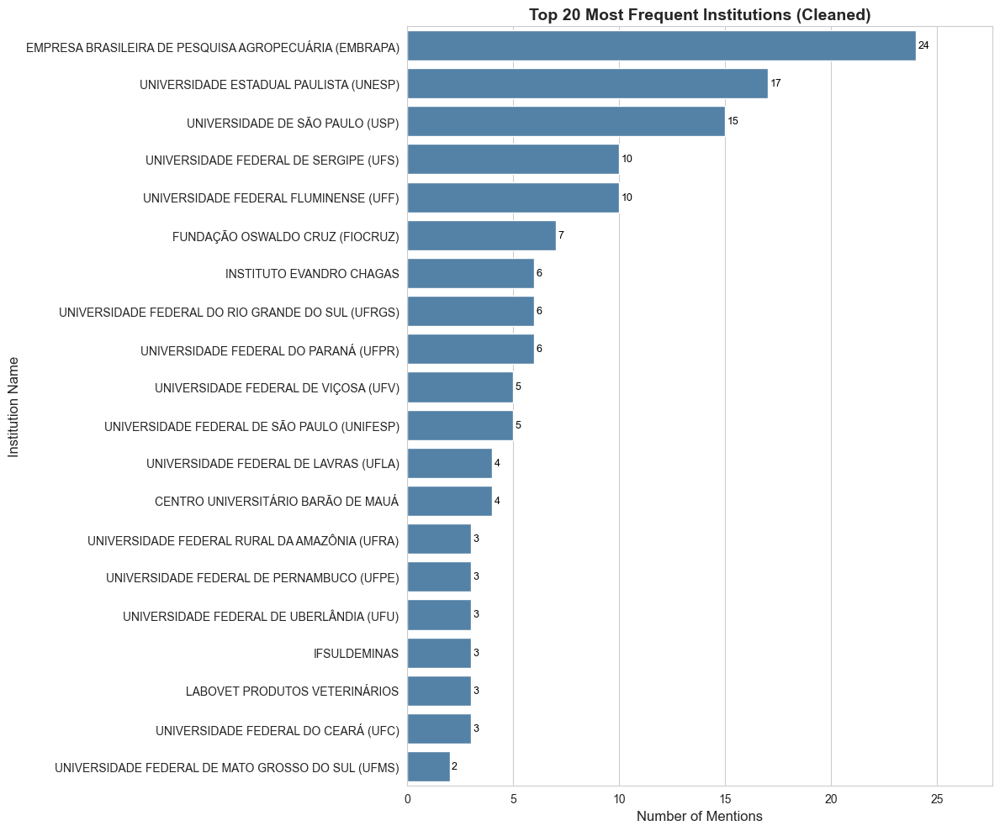
    


```python
import pandas as pd
import sqlite3
import re
import matplotlib.pyplot as plt
import seaborn as sns

# --- Configuration ---
DATABASE_NAME = 'ceua_analysis_v3.db'

def get_raw_institution_names(db_name):
    """
    Queries the database to get the raw institution names for active respondents.
    """
    conn = None
    try:
        conn = sqlite3.connect(db_name)
        query = """
        SELECT
          s."12. Instituicao"
        FROM
          Respondents AS r
        JOIN
          SurveyAnswers AS s ON r."Cod." = s.RespondentID
        WHERE
          r."Ativo" = 1;
        """
        df = pd.read_sql_query(query, conn)
        print("Success: Loaded raw institution name data.")
        return df
    except Exception as e:
        print(f"An error occurred while querying the database: {e}")
        return None
    finally:
        if conn:
            conn.close()

def clean_and_group_institution(name):
    """
    Applies a more robust and intelligent set of rules to clean and group institution names.
    """
    if pd.isna(name) or name.strip() == '':
        return None
    
    # Standardize to uppercase and remove extra spaces
    name_upper = name.strip().upper()
    
    # --- Comprehensive Grouping Rules (Order is important) ---
    # Major Research Institutions
    if 'EMBRAPA' in name_upper: return 'EMPRESA BRASILEIRA DE PESQUISA AGROPECUÁRIA (EMBRAPA)'
    if 'FIOCRUZ' in name_upper or 'OSWALDO CRUZ' in name_upper: return 'FUNDAÇÃO OSWALDO CRUZ (FIOCRUZ)'
    if 'BUTANTAN' in name_upper: return 'INSTITUTO BUTANTAN'
    if 'EVANDRO CHAGAS' in name_upper: return 'INSTITUTO EVANDRO CHAGAS'

    # University Acronym Expansion (Specific Rules First)
    if 'UFABC' in name_upper: return 'UNIVERSIDADE FEDERAL DO ABC (UFABC)'
    if 'UFAC' in name_upper: return 'UNIVERSIDADE FEDERAL DO ACRE (UFAC)'
    if 'UFAL' in name_upper: return 'UNIVERSIDADE FEDERAL DE ALAGOAS (UFAL)'
    if 'UFAM' in name_upper: return 'UNIVERSIDADE FEDERAL DO AMAZONAS (UFAM)'
    if 'UFBA' in name_upper: return 'UNIVERSIDADE FEDERAL DA BAHIA (UFBA)'
    if 'UFC' in name_upper: return 'UNIVERSIDADE FEDERAL DO CEARÁ (UFC)'
    if 'UFCG' in name_upper: return 'UNIVERSIDADE FEDERAL DE CAMPINA GRANDE (UFCG)'
    if 'UFERSA' in name_upper: return 'UNIVERSIDADE FEDERAL RURAL DO SEMI-ÁRIDO (UFERSA)'
    if 'UFES' in name_upper: return 'UNIVERSIDADE FEDERAL DO ESPÍRITO SANTO (UFES)'
    if 'UFF' in name_upper or 'FLUMINENSE' in name_upper: return 'UNIVERSIDADE FEDERAL FLUMINENSE (UFF)'
    if 'UFFS' in name_upper: return 'UNIVERSIDADE FEDERAL DA FRONTEIRA SUL (UFFS)'
    if 'UFG' in name_upper: return 'UNIVERSIDADE FEDERAL DE GOIÁS (UFG)'
    if 'UFGD' in name_upper: return 'UNIVERSIDADE FEDERAL DA GRANDE DOURADOS (UFGD)'
    if 'UFLA' in name_upper or 'LAVRAS' in name_upper: return 'UNIVERSIDADE FEDERAL DE LAVRAS (UFLA)'
    if 'UFMG' in name_upper: return 'UNIVERSIDADE FEDERAL DE MINAS GERAIS (UFMG)'
    if 'UFMS' in name_upper: return 'UNIVERSIDADE FEDERAL DE MATO GROSSO DO SUL (UFMS)'
    if 'UFMT' in name_upper: return 'UNIVERSIDADE FEDERAL DE MATO GROSSO (UFMT)'
    if 'UFPA' in name_upper: return 'UNIVERSIDADE FEDERAL DO PARÁ (UFPA)'
    if 'UFPB' in name_upper: return 'UNIVERSIDADE FEDERAL DA PARAÍBA (UFPB)'
    if 'UFPE' in name_upper or 'PERNAMBUCO' in name_upper and 'FEDERAL' in name_upper: return 'UNIVERSIDADE FEDERAL DE PERNAMBUCO (UFPE)'
    if 'UFPI' in name_upper: return 'UNIVERSIDADE FEDERAL DO PIAUÍ (UFPI)'
    if 'UFPR' in name_upper or 'PARANÁ' in name_upper and 'FEDERAL' in name_upper: return 'UNIVERSIDADE FEDERAL DO PARANÁ (UFPR)'
    if 'UFRA' in name_upper: return 'UNIVERSIDADE FEDERAL RURAL DA AMAZÔNIA (UFRA)'
    if 'UFRB' in name_upper: return 'UNIVERSIDADE FEDERAL DO RECÔNCAVO DA BAHIA (UFRB)'
    if 'UFRGS' in name_upper: return 'UNIVERSIDADE FEDERAL DO RIO GRANDE DO SUL (UFRGS)'
    if 'UFRJ' in name_upper: return 'UNIVERSIDADE FEDERAL DO RIO DE JANEIRO (UFRJ)'
    if 'UFRN' in name_upper: return 'UNIVERSIDADE FEDERAL DO RIO GRANDE DO NORTE (UFRN)'
    if 'UFRPE' in name_upper: return 'UNIVERSIDADE FEDERAL RURAL DE PERNAMBUCO (UFRPE)'
    if 'UFRRJ' in name_upper: return 'UNIVERSIDADE FEDERAL RURAL DO RIO DE JANEIRO (UFRRJ)'
    if 'UFS' in name_upper or 'SERGIPE' in name_upper and 'FEDERAL' in name_upper: return 'UNIVERSIDADE FEDERAL DE SERGIPE (UFS)'
    if 'UFSC' in name_upper: return 'UNIVERSIDADE FEDERAL DE SANTA CATARINA (UFSC)'
    if 'UFSCAR' in name_upper: return 'UNIVERSIDADE FEDERAL DE SÃO CARLOS (UFSCAR)'
    if 'UFT' in name_upper: return 'UNIVERSIDADE FEDERAL DO TOCANTINS (UFT)'
    if 'UFTM' in name_upper: return 'UNIVERSIDADE FEDERAL DO TRIÂNGULO MINEIRO (UFTM)'
    if 'UFU' in name_upper or 'UBERLÂNDIA' in name_upper: return 'UNIVERSIDADE FEDERAL DE UBERLÂNDIA (UFU)'
    if 'UFV' in name_upper or 'VIÇOSA' in name_upper: return 'UNIVERSIDADE FEDERAL DE VIÇOSA (UFV)'
    if 'UFVJM' in name_upper: return 'UNIVERSIDADE FEDERAL DOS VALES DO JEQUITINHONHA E MUCURI (UFVJM)'
    if 'UNB' in name_upper or 'BRASILIA' in name_upper and 'UNIVERSIDADE' in name_upper: return 'UNIVERSIDADE DE BRASÍLIA (UNB)'
    if 'UNESP' in name_upper or 'ESTADUAL PAULISTA' in name_upper: return 'UNIVERSIDADE ESTADUAL PAULISTA (UNESP)'
    if 'UNIFESP' in name_upper or 'SÃO PAULO' in name_upper and 'FEDERAL' in name_upper: return 'UNIVERSIDADE FEDERAL DE SÃO PAULO (UNIFESP)'
    if 'USP' in name_upper or 'SÃO PAULO' in name_upper and 'UNIVERSIDADE DE' in name_upper: return 'UNIVERSIDADE DE SÃO PAULO (USP)'
    
    # Private Companies & Other Institutions
    if 'BIOAGRI' in name_upper: return 'BIOAGRI LABORATÓRIOS'
    if 'GRANDFOOD' in name_upper: return 'GRANDFOOD'
    if 'DECHRA' in name_upper: return 'DECHRA BRASIL'
    if 'LABOVET' in name_upper: return 'LABOVET PRODUTOS VETERINÁRIOS'
    if 'EINSTEIN' in name_upper: return 'HOSPITAL ISRAELITA ALBERT EINSTEIN'
    if 'SÍRIO-LIBANÊS' in name_upper: return 'HOSPITAL SÍRIO-LIBANÊS'
    if 'AC CAMARGO' in name_upper: return 'AC CAMARGO CANCER CENTER'
    if 'HOSPITAL DE CLÍNICAS DE PORTO ALEGRE' in name_upper: return 'HOSPITAL DE CLÍNICAS DE PORTO ALEGRE'

    # If no specific rule matches, return the cleaned name
    return name_upper

def main():
    """
    Main function to query, clean, and plot the top 20 institution names.
    """
    institution_df = get_raw_institution_names(DATABASE_NAME)
    
    if institution_df is not None and not institution_df.empty:
        institution_df.rename(columns={'12. Instituicao': 'RawInstitutionName'}, inplace=True)

        # Apply the enhanced cleaning and grouping function
        institution_df['CleanedName'] = institution_df['RawInstitutionName'].apply(clean_and_group_institution)
        
        # --- Sanity Check (Commented Out) ---
        # This section can be uncommented to print the full list of cleaned names
        # for verification purposes.
        # unique_cleaned_names = sorted(institution_df['CleanedName'].dropna().unique())
        # print("\n--- Full List of Cleaned, Grouped, and Alphabetized Institutions ---")
        # for name in unique_cleaned_names:
        #     print(name)
        
        # --- Get Top 20 ---
        top_20_institutions = institution_df['CleanedName'].dropna().value_counts().nlargest(20)
        top_20_df = top_20_institutions.reset_index()
        top_20_df.columns = ['InstitutionName', 'Count']

        # --- Plotting the Data ---
        print("\n--- Generating Top 20 Cleaned Institution Name Distribution Plot ---")
        
        sns.set_style("whitegrid")
        plt.figure(figsize=(12, 10))
        
        ax = sns.barplot(
            data=top_20_df,
            y='InstitutionName',
            x='Count',
            color='steelblue',
            orient='h'
        )
        
        plt.xlabel('Number of Mentions', fontsize=12)
        plt.ylabel('Institution Name', fontsize=12)
        plt.title('Top 20 Most Frequent Institutions (Cleaned)', fontsize=14, fontweight='bold')
        
        # Add count labels to the bars.
        for p in ax.patches:
            width = p.get_width()
            if width > 0:
                label = f'{int(width)}'
                ax.text(width + 0.1, p.get_y() + p.get_height() / 2,
                        label, 
                        va='center',
                        fontsize=9,
                        color='black')

        max_width = top_20_df['Count'].max()
        ax.set_xlim(0, max_width * 1.15)
        
        plt.tight_layout()
        plt.show()

if __name__ == '__main__':
    main()

```

    Success: Loaded raw institution name data.
    
    --- Generating Top 20 Cleaned Institution Name Distribution Plot ---


    /home/leon/anaconda3/lib/python3.10/site-packages/seaborn/categorical.py:1273: FutureWarning: DataFrameGroupBy.apply operated on the grouping columns. This behavior is deprecated, and in a future version of pandas the grouping columns will be excluded from the operation. Either pass `include_groups=False` to exclude the groupings or explicitly select the grouping columns after groupby to silence this warning.
      .apply(aggregator, agg_var)


    

    


```python
import pandas as pd
import sqlite3
import matplotlib.pyplot as plt
import seaborn as sns
import numpy as np

# --- Configuration ---
DATABASE_NAME = 'ceua_analysis_v3.db'

def get_active_respondent_nature(db_name):
    """
    Queries the database to get the 'Natureza_Inst' data for all active respondents.
    """
    conn = None
    try:
        conn = sqlite3.connect(db_name)
        # SQL query to join Respondents and SurveyAnswers to get the 'Natureza_Inst'
        # for all rows where 'Ativo' is True (1).
        query = """
        SELECT
          s."14. Natureza_Inst"
        FROM
          Respondents AS r
        JOIN
          SurveyAnswers AS s ON r."Cod." = s.RespondentID
        WHERE
          r."Ativo" = 1;
        """
        df = pd.read_sql_query(query, conn)
        print("Success: Loaded 'Natureza_Inst' data for active respondents.")
        return df
    except Exception as e:
        print(f"An error occurred while querying the database: {e}")
        return None
    finally:
        if conn:
            conn.close()

def main():
    """
    Main function to perform and display the univariate analysis of 'Natureza_Inst'.
    """
    nature_df = get_active_respondent_nature(DATABASE_NAME)
    
    if nature_df is not None and not nature_df.empty:
        # Rename the column for easier use and clearer outputs.
        nature_df.rename(columns={'14. Natureza_Inst': 'InstitutionNature'}, inplace=True)

        # --- Data Cleaning ---
        nature_df['InstitutionNature'] = nature_df['InstitutionNature'].str.strip()
        nature_df.dropna(subset=['InstitutionNature'], inplace=True)
        nature_df = nature_df[nature_df['InstitutionNature'] != '']
        
        # --- 1. Descriptive Statistics ---
        print("\n--- Descriptive Statistics for Institution Nature ---")
        print(nature_df['InstitutionNature'].describe())
        
        print("\nFrequency Count:")
        print(nature_df['InstitutionNature'].value_counts())


        # --- 2. Plotting the Data ---
        print("\n--- Generating Institution Nature Distribution Plot ---")
        
        sns.set_style("whitegrid")
        plt.figure(figsize=(10, 6))
        
        ax = sns.countplot(
            data=nature_df,
            x='InstitutionNature',
            color='steelblue', # Consistent color
            order = nature_df['InstitutionNature'].value_counts().index # Order by frequency
        )
        
        plt.xlabel('Nature of Institution', fontsize=12)
        plt.ylabel('Number of Respondents', fontsize=12)
        plt.title('What is the institutional affiliation of the Animal Ethics Committee?', fontsize=14, fontweight='bold')
        
        total_respondents = len(nature_df)
        
        # Add both count and percentage to the bar labels.
        for p in ax.patches:
            height = p.get_height()
            if height > 0:
                percentage = 100 * height / total_respondents
                label = f'{int(height)}\n({percentage:.1f}%)'
                ax.annotate(label, 
                            (p.get_x() + p.get_width() / 2., height), 
                            ha = 'center', va = 'bottom',
                            xytext = (0, 5), 
                            textcoords = 'offset points',
                            fontsize=9,
                            color='black')

        # Add more space at the top of the plot
        max_height = nature_df['InstitutionNature'].value_counts().max()
        ax.set_ylim(0, max_height * 1.15)
        
        # Add a text box with the total number of respondents.
        ax.text(0.95, 0.95, f'Total Respondents: {total_respondents}',
                transform=ax.transAxes,
                fontsize=10,
                verticalalignment='top',
                horizontalalignment='right',
                bbox=dict(boxstyle='round,pad=0.5', fc='aliceblue', alpha=0.6))

        plt.tight_layout()
        plt.show()

if __name__ == '__main__':
    main()

```

    Success: Loaded 'Natureza_Inst' data for active respondents.
    
    --- Descriptive Statistics for Institution Nature ---
    count         367
    unique          3
    top       Pública
    freq          249
    Name: InstitutionNature, dtype: object
    
    Frequency Count:
    InstitutionNature
    Pública      249
    Privada      102
    Comercial     16
    Name: count, dtype: int64
    
    --- Generating Institution Nature Distribution Plot ---


    /home/leon/anaconda3/lib/python3.10/site-packages/seaborn/categorical.py:1273: FutureWarning: DataFrameGroupBy.apply operated on the grouping columns. This behavior is deprecated, and in a future version of pandas the grouping columns will be excluded from the operation. Either pass `include_groups=False` to exclude the groupings or explicitly select the grouping columns after groupby to silence this warning.
      .apply(aggregator, agg_var)


    
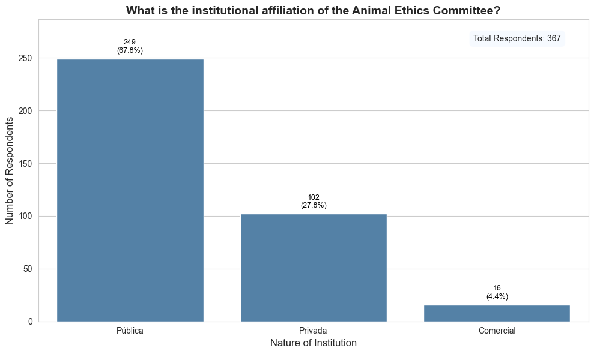
    


```python
import pandas as pd
import sqlite3
import matplotlib.pyplot as plt
import seaborn as sns
import numpy as np
import textwrap

# --- Configuration ---
DATABASE_NAME = 'ceua_analysis_v3.db'

def get_active_respondent_spa_rep(db_name):
    """
    Queries the database to get the 'Representante_SPA' data for all active respondents.
    """
    conn = None
    try:
        conn = sqlite3.connect(db_name)
        # SQL query to get '15. Representante_SPA' for active respondents.
        query = """
        SELECT
          s."15. Representante_SPA"
        FROM
          Respondents AS r
        JOIN
          SurveyAnswers AS s ON r."Cod." = s.RespondentID
        WHERE
          r."Ativo" = 1;
        """
        df = pd.read_sql_query(query, conn)
        print("Success: Loaded 'Representante_SPA' data for active respondents.")
        return df
    except Exception as e:
        print(f"An error occurred while querying the database: {e}")
        return None
    finally:
        if conn:
            conn.close()

def main():
    """
    Main function to perform and display the univariate analysis of 'Representante_SPA'.
    """
    spa_rep_df = get_active_respondent_spa_rep(DATABASE_NAME)
    
    if spa_rep_df is not None and not spa_rep_df.empty:
        # Rename the column for easier use and clearer outputs.
        spa_rep_df.rename(columns={'15. Representante_SPA': 'SPARepresentative'}, inplace=True)

        # --- Data Cleaning ---
        spa_rep_df['SPARepresentative'] = spa_rep_df['SPARepresentative'].str.strip()
        spa_rep_df.dropna(subset=['SPARepresentative'], inplace=True)
        spa_rep_df = spa_rep_df[spa_rep_df['SPARepresentative'] != '']
        
        # --- 1. Descriptive Statistics ---
        print("\n--- Descriptive Statistics for SPA Representative ---")
        print(spa_rep_df['SPARepresentative'].describe())
        
        print("\nFrequency Count:")
        print(spa_rep_df['SPARepresentative'].value_counts())


        # --- 2. Plotting the Data ---
        print("\n--- Generating SPA Representative Distribution Plot ---")
        
        sns.set_style("whitegrid")
        plt.figure(figsize=(10, 6))
        
        # Get the order of categories by frequency
        order = spa_rep_df['SPARepresentative'].value_counts().index
        
        ax = sns.countplot(
            data=spa_rep_df,
            y='SPARepresentative', # Use y-axis for long labels
            color='steelblue', # Consistent color
            order=order
        )
        
        # MODIFICATION: Wrap the long y-axis labels
        # Create a list of wrapped labels corresponding to the plot order
        wrapped_labels = ['\n'.join(textwrap.wrap(label, width=30)) for label in order]
        ax.set_yticklabels(wrapped_labels)
        
        plt.ylabel('Is Respondent an SPA Representative?', fontsize=12)
        plt.xlabel('Number of Respondents', fontsize=12)
        plt.title('Is there a representative from an animal protection society on the Animal Ethics Committee that you are a member of?', fontsize=14, fontweight='bold')
        
        total_respondents = len(spa_rep_df)
        
        for p in ax.patches:
            width = p.get_width()
            if width > 0:
                percentage = 100 * width / total_respondents
                label = f'{int(width)} ({percentage:.1f}%)'
                ax.text(width + 0.3, p.get_y() + p.get_height() / 2,
                        label, 
                        va='center',
                        fontsize=9,
                        color='black')

        max_width = spa_rep_df['SPARepresentative'].value_counts().max()
        ax.set_xlim(0, max_width * 1.25)
        
        # MODIFICATION: Moved the text box to the bottom-right corner to avoid overlap.
        ax.text(0.95, 0.05, f'Total Respondents: {total_respondents}',
                transform=ax.transAxes,
                fontsize=10,
                verticalalignment='bottom',
                horizontalalignment='right',
                bbox=dict(boxstyle='round,pad=0.5', fc='aliceblue', alpha=0.6))

        plt.tight_layout()
        plt.show()

if __name__ == '__main__':
    main()

```

    Success: Loaded 'Representante_SPA' data for active respondents.
    
    --- Descriptive Statistics for SPA Representative ---
    count                     369
    unique                      4
    top       Sim, apenas titular
    freq                      137
    Name: SPARepresentative, dtype: object
    
    Frequency Count:
    SPARepresentative
    Sim, apenas titular                                       137
    Sim, titular e suplente                                   120
    Não há representante da sociedade protetora de animais     76
    Não sei dizer                                              36
    Name: count, dtype: int64
    
    --- Generating SPA Representative Distribution Plot ---


    /home/leon/anaconda3/lib/python3.10/site-packages/seaborn/categorical.py:1273: FutureWarning: DataFrameGroupBy.apply operated on the grouping columns. This behavior is deprecated, and in a future version of pandas the grouping columns will be excluded from the operation. Either pass `include_groups=False` to exclude the groupings or explicitly select the grouping columns after groupby to silence this warning.
      .apply(aggregator, agg_var)
    /tmp/ipykernel_15051/3732651780.py:81: UserWarning: set_ticklabels() should only be used with a fixed number of ticks, i.e. after set_ticks() or using a FixedLocator.
      ax.set_yticklabels(wrapped_labels)


    
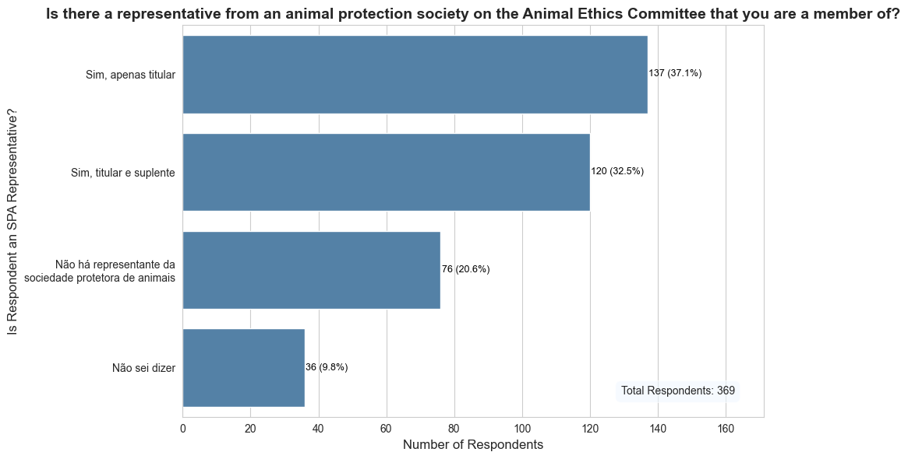
    


```python
import pandas as pd
import sqlite3
from scipy.stats import chi2_contingency
import textwrap
import numpy as np

# --- Configuration ---
DATABASE_NAME = 'ceua_analysis_v3.db'

def classify_stance(text: str) -> str:
    """
    Classifies a respondent's stance as 'User' or 'Non-user' based on their
    text response, handling nuanced cases of non-use.
    """
    if pd.isna(text) or not text.strip():
        return 'Non-user'
    
    text_lower = text.lower()
    
    non_user_phrases = [
        'não uso', 'hoje não mais', 'no momento não', 'atualmente não'
    ]
    
    if any(phrase in text_lower for phrase in non_user_phrases):
        return 'Non-user'
        
    return 'User'

def get_data_for_test(db_name):
    """
    Queries the database for the two variables needed for the Chi-Square test.
    """
    conn = None
    try:
        conn = sqlite3.connect(db_name)
        query = """
        SELECT
          s."31. Area_em_que_usa_animais_lista",
          s."44. Experimentacao_animal_e_um_mal_necessario"
        FROM
          Respondents AS r
        JOIN
          SurveyAnswers AS s ON r."Cod." = s.RespondentID
        WHERE
          r."Ativo" = 1;
        """
        df = pd.read_sql_query(query, conn)
        print("Success: Loaded data for analysis.")
        return df
    except Exception as e:
        print(f"An error occurred while querying the database: {e}")
        return None
    finally:
        if conn:
            conn.close()

def main():
    """
    Main function to perform the Chi-Square test and interpret the results.
    """
    df = get_data_for_test(DATABASE_NAME)
    
    if df is not None and not df.empty:
        df.rename(columns={
            '31. Area_em_que_usa_animais_lista': 'AreaOfAnimalUse',
            '44. Experimentacao_animal_e_um_mal_necessario': 'OpinionNecessaryEvil'
        }, inplace=True)

        # --- Data Preparation (IMPROVED) ---
        # Use the more robust classification function
        df['StanceOnExperimentation'] = df['AreaOfAnimalUse'].apply(classify_stance)
        
        # Clean up the response variable
        df['OpinionNecessaryEvil'] = df['OpinionNecessaryEvil'].str.strip()
        df.dropna(subset=['StanceOnExperimentation', 'OpinionNecessaryEvil'], inplace=True)
        df = df[df['OpinionNecessaryEvil'] != '']
        
        # --- (OPTIONAL METHODOLOGICAL CHOICE) ---
        # To run a 2x2 test focusing only on firm opinions, uncomment the next line:
        # df = df[df['OpinionNecessaryEvil'] != 'Não sei dizer']
        
        contingency_table = pd.crosstab(df['StanceOnExperimentation'], df['OpinionNecessaryEvil'])
        
        print("\n--- Contingency Table (Observed Frequencies) ---")
        print(contingency_table)

        if contingency_table.shape[0] < 2 or contingency_table.shape[1] < 2:
            print("\nWarning: Contingency table is too small for the Chi-Square test.")
            return
            
        chi2, p_value, dof, expected = chi2_contingency(contingency_table)

        # --- Print Results and Interpretation ---
        print("\n" + "="*50)
        print("### CHI-SQUARE TEST RESULTS ###")
        print("="*50)

        print("\n[1] HYPOTHESIS:")
        hypothesis = "Whether an individual uses animals in their work is associated with their opinion on animal experimentation being a 'necessary evil'."
        null_hypothesis = "There is NO association between using animals in work and the opinion on animal experimentation being a 'necessary evil'."
        print(textwrap.fill(f"H₀ (Null Hypothesis): {null_hypothesis}", 80))
        print(textwrap.fill(f"H₁ (Alternative Hypothesis): {hypothesis}", 80))
        
        print("\n[2] P-VALUE:")
        print(f"The calculated p-value is: {p_value:.4f}")

        print("\n[3] CONCLUSION:")
        alpha = 0.05
        if p_value < alpha:
            print(f"Since the p-value ({p_value:.4f}) is less than our significance level ({alpha}), we REJECT the null hypothesis.")
            print(textwrap.fill("This means there is a statistically significant association between whether a person uses animals in their work and their opinion on it being a 'necessary evil'.", 80))
        else:
            print(f"Since the p-value ({p_value:.4f}) is greater than our significance level ({alpha}), we FAIL TO REJECT the null hypothesis.")
            print(textwrap.fill("This means we do not have sufficient evidence from our data to conclude that there is an association between the two variables.", 80))

        # 4. Effect Size
        print("\n[4] EFFECT SIZE:")
        n = contingency_table.sum().sum()
        #cramers_v = np.sqrt(chi2 / (n * min(contingency_table.shape) - 1))
        # The corrected formula for Cramer's V
        k = min(contingency_table.shape)
        cramers_v = np.sqrt(chi2 / (n * (k - 1)))
        print(f"Cramer's V: {cramers_v:.4f}")
        interpretation = (
            "Cramer's V measures the strength of the association (0=none, 1=perfect). "
            f"For this test (df={dof}), a value around 0.1 is small, 0.3 is medium, and 0.5 is large."
        )
        print(textwrap.fill(interpretation, 80))
        print("="*50)


if __name__ == '__main__':
    main()
```

    Success: Loaded data for analysis.
    
    --- Contingency Table (Observed Frequencies) ---
    OpinionNecessaryEvil     Não  Não sei dizer  Sim
    StanceOnExperimentation                         
    Non-user                  29              8   25
    User                     139             27  141
    
    ==================================================
    ### CHI-SQUARE TEST RESULTS ###
    ==================================================
    
    [1] HYPOTHESIS:
    H₀ (Null Hypothesis): There is NO association between using animals in work and
    the opinion on animal experimentation being a 'necessary evil'.
    H₁ (Alternative Hypothesis): Whether an individual uses animals in their work is
    associated with their opinion on animal experimentation being a 'necessary
    evil'.
    
    [2] P-VALUE:
    The calculated p-value is: 0.5211
    
    [3] CONCLUSION:
    Since the p-value (0.5211) is greater than our significance level (0.05), we FAIL TO REJECT the null hypothesis.
    This means we do not have sufficient evidence from our data to conclude that
    there is an association between the two variables.
    
    [4] EFFECT SIZE:
    Cramer's V: 0.0594
    Cramer's V measures the strength of the association (0=none, 1=perfect). For
    this test (df=2), a value around 0.1 is small, 0.3 is medium, and 0.5 is large.
    ==================================================


```python
import pandas as pd
import sqlite3
from scipy.stats import chi2_contingency
import textwrap
import numpy as np

# --- Configuration ---
DATABASE_NAME = 'ceua_analysis_v3.db'


def classify_stance(text: str) -> str:
    """
    Classifies a respondent's stance as 'User' or 'Non-user' based on their
    text response, handling nuanced cases of non-use.

    Args:
        text: The string response from the survey.

    Returns:
        'User' or 'Non-user'.
    """
    # 1. Handle empty or missing data as 'Non-user' by default.
    if pd.isna(text) or not text.strip():
        return 'Non-user'

    # 2. Normalize the text to lowercase for case-insensitive matching.
    text_lower = text.lower()

    # 3. Define a list of phrases that indicate non-use.
    # This list can be expanded if more patterns are found.
    non_user_phrases = [
        'não uso',         # Catches "não uso animais"
        'hoje não mais',   # Catches the "former user" case
        'no momento não',  # Catches "no momento não utilizo"
        'atualmente não',  # Catches "atualmente não uso"
    ]

    # 4. If any non-user phrase is found, classify as 'Non-user'.
    if any(phrase in text_lower for phrase in non_user_phrases):
        return 'Non-user'

    # 5. If no non-user phrases are found, the default is 'User'.
    return 'User'


def get_data_for_test(db_name):
    """
    Queries the database for the variables needed for the Chi-Square test.
    """
    conn = None
    try:
        conn = sqlite3.connect(db_name)
        query = """
        SELECT
          s."31. Area_em_que_usa_animais_lista",
          s."Justifique_experimentacao_animal_ser_mal_necessario_codificado(45)" AS JustificationCode
        FROM
          Respondents AS r
        JOIN
          SurveyAnswers AS s ON r."Cod." = s.RespondentID
        WHERE
          r."Ativo" = 1;
        """
        df = pd.read_sql_query(query, conn)
        print("Success: Loaded data for analysis.")
        return df
    except Exception as e:
        print(f"An error occurred while querying the database: {e}")
        return None
    finally:
        if conn:
            conn.close()


def main():
    """
    Main function to perform the Chi-Square test and interpret the results.
    """
    df = get_data_for_test(DATABASE_NAME)
    
    if df is not None and not df.empty:
        df.rename(columns={'31. Area_em_que_usa_animais_lista': 'AreaOfAnimalUse'}, inplace=True)

        # --- Data Preparation (IMPROVED) ---
        # Apply the new, more robust classification function
        df['StanceOnExperimentation'] = df['AreaOfAnimalUse'].apply(classify_stance)
        
        # Convert JustificationCode to numeric, coercing errors to NaN
        df['JustificationCode'] = pd.to_numeric(df['JustificationCode'], errors='coerce')
        df.dropna(subset=['StanceOnExperimentation', 'JustificationCode'], inplace=True)
        
        # Exclude the 'Não clasificável' (code 0) category
        df = df[df['JustificationCode'] != 0]

        # --- Bucketing Justifications ---
        # Define the mapping for the two buckets based on our qualitative analysis.
        justification_buckets = {
            1: 'Favorable', 4: 'Favorable', 5: 'Favorable', 6: 'Favorable', 7: 'Favorable', 8: 'Favorable',
            2: 'Critical', 3: 'Critical', 9: 'Critical'
        }
        df['JustificationBucket'] = df['JustificationCode'].map(justification_buckets)
        
        # Drop any rows that didn't map to a bucket
        df.dropna(subset=['JustificationBucket'], inplace=True)

        # --- Create a Contingency Table ---
        contingency_table = pd.crosstab(df['StanceOnExperimentation'], df['JustificationBucket'])
        
        print("\n--- Contingency Table (Observed Frequencies) ---")
        print("This table shows the number of respondents in each categorized stance.")
        print(contingency_table)

        # --- Perform Chi-Square Test ---
        if contingency_table.shape[0] < 2 or contingency_table.shape[1] < 2:
            print("\nWarning: The contingency table has less than two rows or columns.")
            print("Chi-Square test cannot be performed. The data does not have enough variation.")
            return
            
        chi2, p_value, dof, expected = chi2_contingency(contingency_table)

        # --- Print Results and Interpretation ---
        print("\n" + "="*50)
        print("### CHI-SQUARE TEST RESULTS ###")
        print("="*50)

        # 1. Hypothesis
        print("\n[1] HYPOTHESIS:")
        hypothesis = "Whether an individual uses animals in their work is associated with their justification stance (Favorable vs. Critical) on animal experimentation."
        null_hypothesis = "There is NO association between using animals in work and their justification stance on animal experimentation."
        print(textwrap.fill(f"H₀ (Null Hypothesis): {null_hypothesis}", 80))
        print(textwrap.fill(f"H₁ (Alternative Hypothesis): {hypothesis}", 80))
        
        # 2. P-Value
        print("\n[2] P-VALUE:")
        print(f"The calculated p-value is: {p_value:.4f}")

        # 3. Conclusion
        print("\n[3] CONCLUSION:")
        alpha = 0.05
        if p_value < alpha:
            print(f"Since the p-value ({p_value:.4f}) is less than our significance level ({alpha}), we REJECT the null hypothesis.")
            print(textwrap.fill("This indicates a statistically significant association between a person's status as an animal user and their justification stance.", 80))
        else:
            print(f"Since the p-value ({p_value:.4f}) is greater than our significance level ({alpha}), we FAIL TO REJECT the null hypothesis.")
            print(textwrap.fill("This means we do not have sufficient evidence from our data to conclude that there is an association between the two variables.", 80))

        # 4. Effect Size (ADDED FOR MORE COMPLETE ANALYSIS)
        print("\n[4] EFFECT SIZE:")
        n = contingency_table.sum().sum()
        phi2 = chi2 / n
        r, k = contingency_table.shape
        cramers_v = np.sqrt(phi2 / min(r - 1, k - 1))
        print(f"Cramer's V: {cramers_v:.4f}")
        
        interpretation = (
            "Cramer's V measures the strength of the association (from 0 to 1). "
            "Typical interpretations for this test's degrees of freedom (df=1) are: "
            "~0.1 (small), ~0.3 (medium), ~0.5 (large effect)."
        )
        print(textwrap.fill(interpretation, 80))
        print("="*50)


if __name__ == '__main__':
    main()
```

    Success: Loaded data for analysis.
    
    --- Contingency Table (Observed Frequencies) ---
    This table shows the number of respondents in each categorized stance.
    JustificationBucket      Critical  Favorable
    StanceOnExperimentation                     
    Non-user                       21         37
    User                           41        257
    
    ==================================================
    ### CHI-SQUARE TEST RESULTS ###
    ==================================================
    
    [1] HYPOTHESIS:
    H₀ (Null Hypothesis): There is NO association between using animals in work and
    their justification stance on animal experimentation.
    H₁ (Alternative Hypothesis): Whether an individual uses animals in their work is
    associated with their justification stance (Favorable vs. Critical) on animal
    experimentation.
    
    [2] P-VALUE:
    The calculated p-value is: 0.0001
    
    [3] CONCLUSION:
    Since the p-value (0.0001) is less than our significance level (0.05), we REJECT the null hypothesis.
    This indicates a statistically significant association between a person's status
    as an animal user and their justification stance.
    
    [4] EFFECT SIZE:
    Cramer's V: 0.2086
    Cramer's V measures the strength of the association (from 0 to 1). Typical
    interpretations for this test's degrees of freedom (df=1) are: ~0.1 (small),
    ~0.3 (medium), ~0.5 (large effect).
    ==================================================


```python
import pandas as pd
import sqlite3
import numpy as np
import matplotlib.pyplot as plt
import seaborn as sns
import textwrap

# --- Configuration ---
DATABASE_NAME = 'ceua_analysis_v3.db'

def print_methodology_report(df, final_cols):
    """
    Prints a detailed report on the data preparation and methodology for the correlation matrix.
    """
    print("\n" + "="*80)
    print("### Data Dictionary & Methodology for Correlation Matrix ###")
    print("="*80)

    print("\n--- I. Variable Definitions and Preprocessing ---\n")
    
    # Define the descriptions for each variable
    descriptions = {
        'Stance_Critical': "Target Variable. Derived from 'Justifique...codificado(45)'. Binary. Codes 2, 3, 9 ('Critical') mapped to 1; others mapped to 0 ('Favorable').",
        'Is_Vegan': "Derived from '50. Vegano_ou_vegetariano_binario'. Binary. 'Sim' mapped to 1, otherwise 0.",
        'Is_Animal_User': "Derived from '31. Area_em_que_usa_animais_lista'. Binary. Presence of text indicating animal use mapped to 1, 'não uso' or empty mapped to 0.",
        'NGO_Affiliation': "Derived from '9. Vinculo'. Binary. 'Sim' mapped to 1, otherwise 0.",
        'Age': "Derived from '3. Idade'. Ordinal Text. Mapped ranges 'Até 30 anos' through 'Mais de 70 anos' to a numeric scale of 0 to 5.",
        'Education': "Derived from '30. Escolaridade'. Ordinal Text. Mapped 'Graduação' through 'Pós doutorado' to a numeric scale of 0 to 4.",
        'Role_Code': "Derived from 'Papel_na_CEUA_codificado(28)'. Coded Categorical (Nominal). Used directly. Note: Correlation with nominal codes should be interpreted with caution.",
        'Admin_Function_Code': "Derived from 'Funcao_administrativa_na_CEUA_codificado(32)'. Coded Categorical (Nominal). Used directly.",
        'Time_on_CEUA': "Derived from 'tempo_de_CEUA_em_anos_avg(33,34)'. Continuous. Used directly after converting to numeric.",
        'Knowledge_Ethics': "Derived from '35. Conhecimento_formal_em_etica_escala'. Ordinal Scale (1-5). Used directly.",
        'Aptitude_Ethics': "Derived from '39. Aptidao_para_avaliacoes_eticas_escala'. Ordinal Scale (1-5). Used directly.",
        'Aptitude_Welfare': "Derived from '40. Aptidao_para_avaliacoes_de_bem-estar_animal_escala'. Ordinal Scale (1-5). Used directly.",
        'Need_Animal_Models': "Derived from '42. Necessidade_de_uso_de_modelos_animais_escala'. Ordinal Scale (1-5). Used directly.",
        'Need_Animals_Food': "Derived from '43. Necessidade_de_uso_de_animais_na_alimentacao_escala'. Ordinal Scale (1-5). Used directly.",
        'Suffering_Implied': "Derived from '46. Experimentos_cientificos_implicam_sofrimento_animal_escala'. Ordinal Scale (1-5). Used directly.",
        'Willingness_to_Speak': "Derived from '53. Vontade_para_manifestar_posicionamento'. Mixed-Type Ordinal. Processed to a numeric scale 0-3.",
        'Feeling_Discriminated': "Derived from '54. Sente-se_discriminado_nas_reunioes'. Mixed-Type Ordinal. Processed to a numeric scale 0-3.",
        'Opinions_Respected': "Derived from '55. Suas_colocacoes_sao_respeitadas'. Mixed-Type Ordinal. Processed to a numeric scale 0-3.",
        'Resistance_to_Proposals': "Derived from '56. Ha_resistencia_as_suas_propostas'. Mixed-Type Ordinal. Processed to a numeric scale 0-3.",
        'Peers_Same_Concern': "Derived from '57. Demais_membros_atribuem_o_mesmo_nivel_de_preocupacao'. Mixed-Type Ordinal. Processed to a numeric scale 0-3.",
        'Users_Minimize_Suffering': "Derived from '62. Membros_que_pesquisam...minimizam_o_sofrimento...'. Mixed-Type Ordinal. Processed to a numeric scale 0-3.",
        'CEUA_Uses_3Rs': "Derived from '63. O_quanto_a_CEUA_se_baseia_no_principio_dos_3Rs_escala'. Ordinal Scale (1-5). Used directly."
    }

    for col in final_cols:
        if col in descriptions:
            print(f"- {col}:")
            print(textwrap.fill(descriptions[col], 78, initial_indent='  ', subsequent_indent='  '))

    print("\n--- II. Methodology ---\n")
    method_text = (
        f"1. Data Selection: {len(df)} complete rows from active respondents (Ativo=1) were used for this analysis.\n\n"
        "2. Correlation Method: Spearman's Rank Correlation (ρ) was computed for all pairs of variables. This non-parametric method was chosen as it is suitable for measuring monotonic relationships between ordinal variables, which constitute the majority of the data, without assuming linearity.\n\n"
        "3. Handling Missing Data: After initial processing, any remaining missing values (NaNs), primarily from 'Não sei dizer' responses or conversion errors, were imputed using the median of their respective columns. This strategy preserves the full sample size but may introduce a conservative bias by slightly reducing variance.\n\n"
        "4. Visualization: The resulting correlation matrix is displayed as a heatmap. A diverging colormap ('vlag') centered at zero is used to clearly distinguish positive (red) from negative (blue) associations. The upper triangle is masked to reduce redundancy."
    )
    print(method_text)
    print("="*80)


def create_correlation_heatmap():
    """
    Performs a full pipeline: queries the database, preprocesses the data
    to a numeric format, computes a Spearman correlation matrix, and
    visualizes it as a heatmap.
    """
    conn = None
    try:
        # --- 1. Data Loading ---
        conn = sqlite3.connect(DATABASE_NAME)
        # Query all potentially useful columns we identified
        query = """
        SELECT
          "Justifique_experimentacao_animal_ser_mal_necessario_codificado(45)",
          "3. Idade", "4. Genero", "Religiao_codificado(8)", "9. Vinculo",
          "30. Escolaridade", "50. Vegano_ou_vegetariano_binario",
          "Papel_na_CEUA_codificado(28)", "Funcao_administrativa_na_CEUA_codificado(32)",
          "tempo_de_CEUA_em_anos_avg(33,34)", "31. Area_em_que_usa_animais_lista",
          "35. Conhecimento_formal_em_etica_escala",
          "39. Aptidao_para_avaliacoes_eticas_escala",
          "40. Aptidao_para_avaliacoes_de_bem-estar_animal_escala",
          "42. Necessidade_de_uso_de_modelos_animais_escala",
          "43. Necessidade_de_uso_de_animais_na_alimentacao_escala",
          "46. Experimentos_cientificos_implicam_sofrimento_animal_escala",
          "53. Vontade_para_manifestar_posicionamento",
          "54. Sente-se_discriminado_nas_reunioes",
          "55. Suas_colocacoes_sao_respeitadas",
          "56. Ha_resistencia_as_suas_propostas",
          "57. Demais_membros_atribuem_o_mesmo_nivel_de_preocupacao",
          "62. Membros_que_pesquisam_com_modelos_animais_minimizam_o_sofrimento_deles",
          "63. O_quanto_a_CEUA_se_baseia_no_principio_dos_3Rs_escala"
        FROM SurveyAnswers s
        JOIN Respondents r ON s.RespondentID = r."Cod."
        WHERE r."Ativo" = 1;
        """
        df = pd.read_sql_query(query, conn)
        print("Success: Loaded raw data from database.")

    except Exception as e:
        print(f"An error occurred during data loading: {e}")
        return
    finally:
        if conn:
            conn.close()

    # --- 2. Preprocessing & Feature Engineering ---
    # Rename columns for clarity
    df.columns = [
        'Justification_Code', 'Age', 'Gender', 'Religion_Code', 'NGO_Affiliation', 'Education',
        'Is_Vegan', 'Role_Code', 'Admin_Function_Code', 'Time_on_CEUA', 'Animal_Use_Text',
        'Knowledge_Ethics', 'Aptitude_Ethics', 'Aptitude_Welfare', 'Need_Animal_Models',
        'Need_Animals_Food', 'Suffering_Implied', 'Willingness_to_Speak', 'Feeling_Discriminated',
        'Opinions_Respected', 'Resistance_to_Proposals', 'Peers_Same_Concern',
        'Users_Minimize_Suffering', 'CEUA_Uses_3Rs'
    ]

    # a. Create the main target variable
    critical_codes = [2, 3, 9]
    df['Stance_Critical'] = df['Justification_Code'].apply(lambda x: 1 if pd.to_numeric(x, errors='coerce') in critical_codes else 0)

    # b. Create binary User/Non-user variable
    df['Is_Animal_User'] = df['Animal_Use_Text'].apply(lambda x: 0 if pd.isna(x) or 'não uso' in str(x).lower() else 1)
    
    # c. Convert categorical and binary columns to numeric
    df['Is_Vegan'] = df['Is_Vegan'].apply(lambda x: 1 if str(x).strip() == 'Sim' else 0)
    df['NGO_Affiliation'] = df['NGO_Affiliation'].apply(lambda x: 1 if str(x).strip() == 'Sim' else 0)
    
    # d. Map ordinal scales that we KNOW are text
    age_map = {'Até 30 anos': 0, 'Entre 31 e 40 anos': 1, 'Entre 41 e 50 anos': 2, 'Entre 51 e 60 anos': 3, 'Entre 61 e 70 anos': 4, 'Mais de 70 anos': 5}
    education_map = {'Graduação': 0, 'Especialização': 1, 'Mestrado': 2, 'Doutorado': 3, 'Pós doutorado': 4}
    
    df['Age'] = df['Age'].map(age_map)
    df['Education'] = df['Education'].map(education_map)
    
    # Robust mapping for mixed-type ordinal columns
    frequency_map_text = {'Nunca': 0, 'Raramente': 1, 'Frequentemente': 2, 'Constantemente': 3, 'Não sei dizer': np.nan}
    
    mixed_type_cols = [
        'Willingness_to_Speak', 'Feeling_Discriminated', 'Opinions_Respected', 
        'Resistance_to_Proposals', 'Peers_Same_Concern', 'Users_Minimize_Suffering'
    ]

    for col in mixed_type_cols:
        if col in df.columns:
            numeric_part = pd.to_numeric(df[col], errors='coerce')
            text_part = df[col][numeric_part.isnull()].map(frequency_map_text)
            df[col] = numeric_part.combine_first(text_part)

    # e. Select final columns for the matrix
    final_cols = [
        'Stance_Critical', 'Is_Vegan', 'Is_Animal_User', 'NGO_Affiliation', 'Age', 'Education',
        'Role_Code', 'Admin_Function_Code', 'Time_on_CEUA', 'Knowledge_Ethics',
        'Aptitude_Ethics', 'Aptitude_Welfare', 'Need_Animal_Models', 'Need_Animals_Food',
        'Suffering_Implied', 'Willingness_to_Speak', 'Feeling_Discriminated',
        'Opinions_Respected', 'Resistance_to_Proposals', 'Peers_Same_Concern',
        'Users_Minimize_Suffering', 'CEUA_Uses_3Rs'
    ]
    
    # f. Final conversion and imputation
    matrix_df = df[final_cols].apply(pd.to_numeric, errors='coerce')
    
    for col in matrix_df.columns:
        if matrix_df[col].isnull().any():
            median_val = matrix_df[col].median()
            matrix_df[col] = matrix_df[col].fillna(median_val)
    
    print(f"Preprocessing complete. Matrix will be built with {len(matrix_df)} complete rows.")

    # --- 3. Print Methodology Report ---
    print_methodology_report(matrix_df, final_cols)

    # --- 4. Correlation Calculation ---
    corr_matrix = matrix_df.corr(method='spearman')

    # --- 5. Visualization ---
    plt.style.use('seaborn-v0_8-whitegrid')
    fig, ax = plt.subplots(figsize=(20, 18))

    mask = np.triu(np.ones_like(corr_matrix, dtype=bool))
    
    sns.heatmap(corr_matrix,
                mask=mask,
                cmap='vlag',
                center=0,
                annot=False,
                square=True,
                linewidths=.5,
                cbar_kws={"shrink": .7, "label": "Spearman's Rank Correlation (ρ)"})

    # Manually add annotations for the 'Stance_Critical' row/column
    for i in range(len(corr_matrix.columns)):
        if i > 0:
            ax.text(0.5, i + 0.5, f"{corr_matrix.iloc[i, 0]:.2f}", ha='center', va='center', color='black', fontsize=10)
        ax.text(i + 0.5, 0.5, f"{corr_matrix.iloc[0, i]:.2f}", ha='center', va='center', color='black', fontsize=10)

    ax.set_title('Exploratory Correlation Matrix of Survey Variables', fontsize=20, pad=20)
    plt.xticks(rotation=45, ha='right')
    plt.yticks(rotation=0)
    plt.tight_layout()
    plt.show()
    
    return matrix_df

if __name__ == '__main__':
    final_data = create_correlation_heatmap()


```

    Success: Loaded raw data from database.
    Preprocessing complete. Matrix will be built with 369 complete rows.
    
    ================================================================================
    ### Data Dictionary & Methodology for Correlation Matrix ###
    ================================================================================
    
    --- I. Variable Definitions and Preprocessing ---
    
    - Stance_Critical:
      Target Variable. Derived from 'Justifique...codificado(45)'. Binary. Codes
      2, 3, 9 ('Critical') mapped to 1; others mapped to 0 ('Favorable').
    - Is_Vegan:
      Derived from '50. Vegano_ou_vegetariano_binario'. Binary. 'Sim' mapped to 1,
      otherwise 0.
    - Is_Animal_User:
      Derived from '31. Area_em_que_usa_animais_lista'. Binary. Presence of text
      indicating animal use mapped to 1, 'não uso' or empty mapped to 0.
    - NGO_Affiliation:
      Derived from '9. Vinculo'. Binary. 'Sim' mapped to 1, otherwise 0.
    - Age:
      Derived from '3. Idade'. Ordinal Text. Mapped ranges 'Até 30 anos' through
      'Mais de 70 anos' to a numeric scale of 0 to 5.
    - Education:
      Derived from '30. Escolaridade'. Ordinal Text. Mapped 'Graduação' through
      'Pós doutorado' to a numeric scale of 0 to 4.
    - Role_Code:
      Derived from 'Papel_na_CEUA_codificado(28)'. Coded Categorical (Nominal).
      Used directly. Note: Correlation with nominal codes should be interpreted
      with caution.
    - Admin_Function_Code:
      Derived from 'Funcao_administrativa_na_CEUA_codificado(32)'. Coded
      Categorical (Nominal). Used directly.
    - Time_on_CEUA:
      Derived from 'tempo_de_CEUA_em_anos_avg(33,34)'. Continuous. Used directly
      after converting to numeric.
    - Knowledge_Ethics:
      Derived from '35. Conhecimento_formal_em_etica_escala'. Ordinal Scale (1-5).
      Used directly.
    - Aptitude_Ethics:
      Derived from '39. Aptidao_para_avaliacoes_eticas_escala'. Ordinal Scale
      (1-5). Used directly.
    - Aptitude_Welfare:
      Derived from '40. Aptidao_para_avaliacoes_de_bem-estar_animal_escala'.
      Ordinal Scale (1-5). Used directly.
    - Need_Animal_Models:
      Derived from '42. Necessidade_de_uso_de_modelos_animais_escala'. Ordinal
      Scale (1-5). Used directly.
    - Need_Animals_Food:
      Derived from '43. Necessidade_de_uso_de_animais_na_alimentacao_escala'.
      Ordinal Scale (1-5). Used directly.
    - Suffering_Implied:
      Derived from '46.
      Experimentos_cientificos_implicam_sofrimento_animal_escala'. Ordinal Scale
      (1-5). Used directly.
    - Willingness_to_Speak:
      Derived from '53. Vontade_para_manifestar_posicionamento'. Mixed-Type
      Ordinal. Processed to a numeric scale 0-3.
    - Feeling_Discriminated:
      Derived from '54. Sente-se_discriminado_nas_reunioes'. Mixed-Type Ordinal.
      Processed to a numeric scale 0-3.
    - Opinions_Respected:
      Derived from '55. Suas_colocacoes_sao_respeitadas'. Mixed-Type Ordinal.
      Processed to a numeric scale 0-3.
    - Resistance_to_Proposals:
      Derived from '56. Ha_resistencia_as_suas_propostas'. Mixed-Type Ordinal.
      Processed to a numeric scale 0-3.
    - Peers_Same_Concern:
      Derived from '57. Demais_membros_atribuem_o_mesmo_nivel_de_preocupacao'.
      Mixed-Type Ordinal. Processed to a numeric scale 0-3.
    - Users_Minimize_Suffering:
      Derived from '62. Membros_que_pesquisam...minimizam_o_sofrimento...'. Mixed-
      Type Ordinal. Processed to a numeric scale 0-3.
    - CEUA_Uses_3Rs:
      Derived from '63. O_quanto_a_CEUA_se_baseia_no_principio_dos_3Rs_escala'.
      Ordinal Scale (1-5). Used directly.
    
    --- II. Methodology ---
    
    1. Data Selection: 369 complete rows from active respondents (Ativo=1) were used for this analysis.
    
    2. Correlation Method: Spearman's Rank Correlation (ρ) was computed for all pairs of variables. This non-parametric method was chosen as it is suitable for measuring monotonic relationships between ordinal variables, which constitute the majority of the data, without assuming linearity.
    
    3. Handling Missing Data: After initial processing, any remaining missing values (NaNs), primarily from 'Não sei dizer' responses or conversion errors, were imputed using the median of their respective columns. This strategy preserves the full sample size but may introduce a conservative bias by slightly reducing variance.
    
    4. Visualization: The resulting correlation matrix is displayed as a heatmap. A diverging colormap ('vlag') centered at zero is used to clearly distinguish positive (red) from negative (blue) associations. The upper triangle is masked to reduce redundancy.
    ================================================================================


    /tmp/ipykernel_15051/397042003.py:149: FutureWarning: The behavior of array concatenation with empty entries is deprecated. In a future version, this will no longer exclude empty items when determining the result dtype. To retain the old behavior, exclude the empty entries before the concat operation.
      df[col] = numeric_part.combine_first(text_part)


    
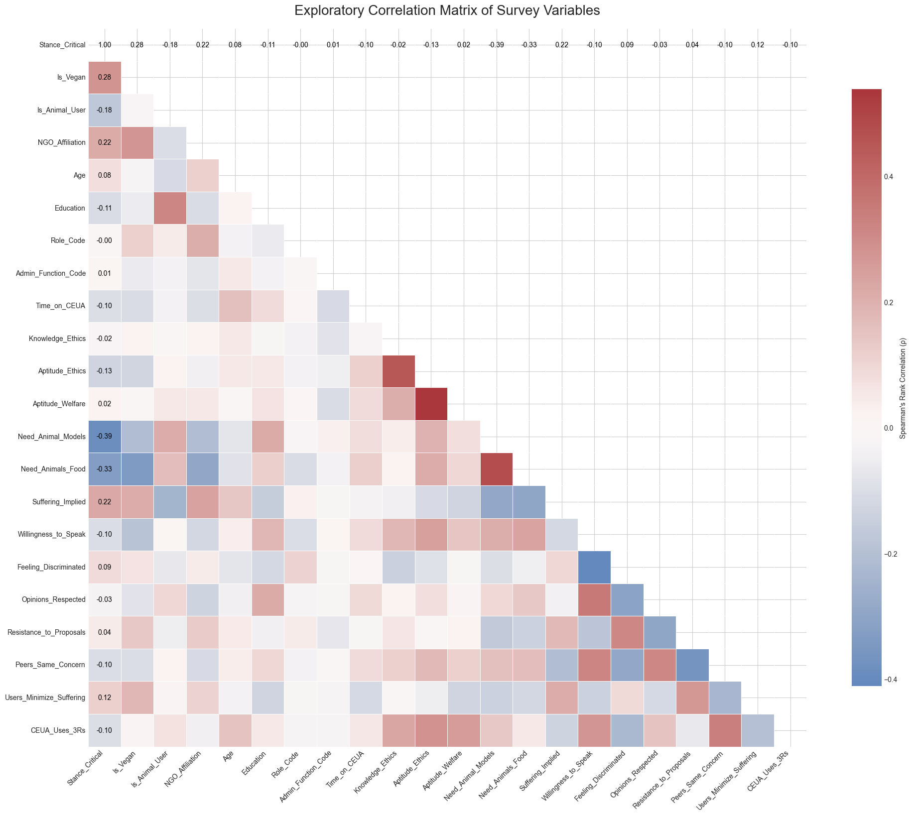
    


```python
import pandas as pd
import sqlite3
import textwrap
import numpy as np
import matplotlib.pyplot as plt
import seaborn as sns
from scipy.stats import mannwhitneyu

# --- Configuration ---
DATABASE_NAME = 'ceua_analysis_v3.db'

def get_data_for_test(db_name):
    """
    Queries the database for the variables needed for the Mann-Whitney U test.
    """
    conn = None
    try:
        conn = sqlite3.connect(db_name)
        query = """
        SELECT
          s."50. Vegano_ou_vegetariano_binario",
          s."46. Experimentos_cientificos_implicam_sofrimento_animal_escala"
        FROM
          Respondents AS r
        JOIN
          SurveyAnswers AS s ON r."Cod." = s.RespondentID
        WHERE
          r."Ativo" = 1;
        """
        df = pd.read_sql_query(query, conn)
        print("Success: Loaded data for analysis.")
        return df
    except Exception as e:
        print(f"An error occurred while querying the database: {e}")
        return None
    finally:
        if conn:
            conn.close()

def main():
    """
    Main function to perform the Mann-Whitney U test and generate a detailed report.
    """
    df = get_data_for_test(DATABASE_NAME)
    
    if df is not None and not df.empty:
        # --- Data Preparation ---
        df.rename(columns={
            '50. Vegano_ou_vegetariano_binario': 'IsVegan',
            '46. Experimentos_cientificos_implicam_sofrimento_animal_escala': 'SufferingScale'
        }, inplace=True)
        df['SufferingScale'] = pd.to_numeric(df['SufferingScale'], errors='coerce')
        df['IsVegan'] = df['IsVegan'].str.strip()
        df.dropna(subset=['IsVegan', 'SufferingScale'], inplace=True)

        vegan_group = df[df['IsVegan'] == 'Sim']['SufferingScale']
        non_vegan_group = df[df['IsVegan'] == 'Não']['SufferingScale']
        
        n1, n2 = len(vegan_group), len(non_vegan_group)
        print(f"\nSample sizes:\nVegan/Vegetarian (n={n1})\nNon-Vegan/Vegetarian (n={n2})\n")

        # --- Visualization ---
        plt.figure(figsize=(10, 7))
        sns.set_style("whitegrid")
        ax = sns.violinplot(x='IsVegan', y='SufferingScale', data=df,
                              order=['Não', 'Sim'], palette=['skyblue', 'lightgreen'],
                              split=True, inner='quartiles', cut=0)
        
        plt.title('Perception of Animal Suffering in Experiments', fontsize=16, fontweight='bold', pad=20)
        ax.set_xticklabels(['Non-Vegan/Vegetarian', 'Vegan/Vegetarian'])
        ax.set_xlabel('Respondent Group', fontsize=12)
        ax.set_ylabel('Perceived Suffering (0-5 Scale)', fontsize=12)
        sns.despine(left=True)
        plt.show()

        # --- Perform Mann-Whitney U Test ---
        if n1 < 1 or n2 < 1:
            print("\nError: One or both sample groups are empty.")
            return
            
        u_stat, p_value = mannwhitneyu(vegan_group, non_vegan_group, alternative='two-sided')

        # --- CORRECTED Effect Size Calculation ---
        # Calculate the magnitude of the Rank-Biserial Correlation
        effect_size_r_magnitude = abs(1 - (2 * u_stat) / (n1 * n2))

        # Programmatically determine the correct sign based on the medians
        if vegan_group.median() > non_vegan_group.median():
            effect_size_r = effect_size_r_magnitude
        elif vegan_group.median() < non_vegan_group.median():
            effect_size_r = -effect_size_r_magnitude
        else:
            effect_size_r = 0 # No difference in medians means zero effect

        # --- DETAILED REPORT GENERATION ---
        
        # Introduction to the Test
        print("\n" + "="*60)
        print("### MANN-WHITNEY U TEST: DETAILED ANALYTICAL REPORT ###")
        print("="*60)
        intro_text = (
            "The Mann-Whitney U test is a non-parametric test used to determine if there is a "
            "significant difference between two independent groups on an ordinal or continuous "
            "variable. We chose this test because our 'SufferingScale' data is ordinal (ranked) "
            "and not assumed to be normally distributed, making a standard t-test inappropriate."
        )
        print(textwrap.fill(intro_text, 60))
        print("-" * 60)

        # 1. Hypothesis
        print("\n[1] Stating the Hypotheses")
        print("-" * 60)
        hypothesis_text = (
            "We formally state our research question as a testable pair of hypotheses. The "
            "Null Hypothesis (H₀) is the default assumption of no difference, while the "
            "Alternative Hypothesis (H₁) is what we are testing for."
        )
        print(textwrap.fill(hypothesis_text, 60))
        print(f"\n  H₀: The distributions of perceived suffering scores are IDENTICAL for both groups.")
        print(f"  H₁: The distributions of perceived suffering scores are DIFFERENT for the two groups.")
        print("-" * 60)

        # 2. Descriptive Statistics
        print("\n[2] Descriptive Statistics: A First Look at the Data")
        print("-" * 60)
        descriptive_text = (
            "Before testing our hypothesis, we examine the central tendency of each group. Since "
            "the data is ordinal, the **median** (the middle value) is the most appropriate measure. "
            "It tells us the score at which 50% of the group responded at or above."
        )
        print(textwrap.fill(descriptive_text, 60))
        print(f"\n  Median Score (Vegan/Vegetarian Group): {vegan_group.median():.2f}")
        print(f"  Median Score (Non-Vegan/Vegetarian Group): {non_vegan_group.median():.2f}")
        print("\n" + textwrap.fill("Observation: The median for the vegan/vegetarian group is higher. The next step is to determine if this observed difference is statistically significant or likely due to random chance.", 60))
        print("-" * 60)

        # 3. Inferential Statistics
        print("\n[3] Inferential Statistics: Testing for Significance")
        print("-" * 60)
        inferential_text = (
            "This is the core of the test. The **p-value** represents the probability of observing a difference "
            "this large (or larger) between our groups purely by chance, assuming H₀ is true. A small "
            "p-value (typically < 0.05) suggests the observed difference is real."
        )
        print(textwrap.fill(inferential_text, 60))
        print(f"\n  Mann-Whitney U statistic: {u_stat:.1f}")
        print(f"  Calculated p-value: {p_value:.4f}")
        print("-" * 60)

        # 4. Effect Size (with CORRECTED text)
        print("\n[4] Effect Size: Measuring the Magnitude of the Difference")
        print("-" * 60)
        effect_size_text = (
            "A small p-value tells us the difference is significant, but not how *large* it is. "
            "For this, we calculate the **Rank-Biserial Correlation (r)**. This value ranges from -1 to 1 "
            "and measures the strength of the difference between the groups."
        )
        print(textwrap.fill(effect_size_text, 60))
        print(f"\n  Rank-Biserial Correlation (r): {effect_size_r:.4f}")
        print("\n" + textwrap.fill("Interpretation Guide: |0.1| is a small effect, |0.3| is a medium effect, and |0.5| is a large effect. The positive sign indicates the first group (Vegan/Vegetarian) tends to have higher scores.", 60))
        print("-" * 60)
        
        # 5. Conclusion (with CORRECTED text)
        print("\n[5] Analytical Conclusion")
        print("-" * 60)
        alpha = 0.05
        if p_value < alpha:
            conclusion_text = (
                f"The p-value ({p_value:.4f}) is less than our significance level of {alpha}. Therefore, we "
                f"**reject the Null Hypothesis**. There is strong statistical evidence to conclude that a "
                f"significant difference exists in the distribution of perceived suffering scores between "
                f"vegans/vegetarians and non-vegetarians, with the vegan/vegetarian group tending to report higher scores. "
                f"The effect size (r={effect_size_r:.2f}) indicates that the magnitude of this difference is [EFFECT]."
            )
            abs_r = abs(effect_size_r)
            if abs_r < 0.3:
                magnitude = "small to medium"
            elif abs_r < 0.5:
                magnitude = "medium to large"
            else:
                magnitude = "large"
            conclusion_text = conclusion_text.replace("[EFFECT]", magnitude)
            print(textwrap.fill(conclusion_text, 60))
        else:
            conclusion_text = (
                f"The p-value ({p_value:.4f}) is greater than our significance level of {alpha}. Therefore, we "
                f"**fail to reject the Null Hypothesis**. We do not have sufficient statistical evidence to "
                f"conclude that a difference exists between the two groups based on this data."
            )
            print(textwrap.fill(conclusion_text, 60))
        print("="*60)

if __name__ == '__main__':
    main()
```

    Success: Loaded data for analysis.
    
    Sample sizes:
    Vegan/Vegetarian (n=44)
    Non-Vegan/Vegetarian (n=325)
    


    /tmp/ipykernel_15051/3014332350.py:65: FutureWarning: 
    
    Passing `palette` without assigning `hue` is deprecated and will be removed in v0.14.0. Assign the `x` variable to `hue` and set `legend=False` for the same effect.
    
      ax = sns.violinplot(x='IsVegan', y='SufferingScale', data=df,
    /tmp/ipykernel_15051/3014332350.py:70: UserWarning: set_ticklabels() should only be used with a fixed number of ticks, i.e. after set_ticks() or using a FixedLocator.
      ax.set_xticklabels(['Non-Vegan/Vegetarian', 'Vegan/Vegetarian'])


    
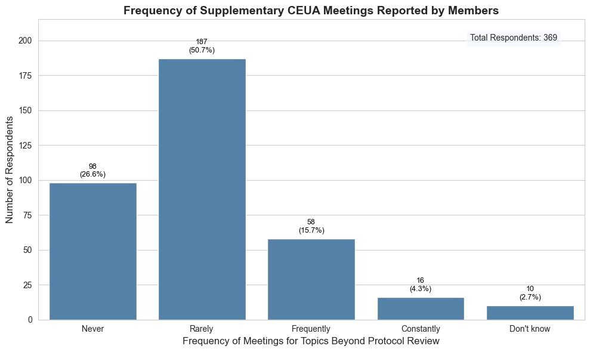
    


    
    ============================================================
    ### MANN-WHITNEY U TEST: DETAILED ANALYTICAL REPORT ###
    ============================================================
    The Mann-Whitney U test is a non-parametric test used to
    determine if there is a significant difference between two
    independent groups on an ordinal or continuous variable. We
    chose this test because our 'SufferingScale' data is ordinal
    (ranked) and not assumed to be normally distributed, making
    a standard t-test inappropriate.
    ------------------------------------------------------------
    
    [1] Stating the Hypotheses
    ------------------------------------------------------------
    We formally state our research question as a testable pair
    of hypotheses. The Null Hypothesis (H₀) is the default
    assumption of no difference, while the Alternative
    Hypothesis (H₁) is what we are testing for.
    
      H₀: The distributions of perceived suffering scores are IDENTICAL for both groups.
      H₁: The distributions of perceived suffering scores are DIFFERENT for the two groups.
    ------------------------------------------------------------
    
    [2] Descriptive Statistics: A First Look at the Data
    ------------------------------------------------------------
    Before testing our hypothesis, we examine the central
    tendency of each group. Since the data is ordinal, the
    **median** (the middle value) is the most appropriate
    measure. It tells us the score at which 50% of the group
    responded at or above.
    
      Median Score (Vegan/Vegetarian Group): 3.00
      Median Score (Non-Vegan/Vegetarian Group): 2.00
    
    Observation: The median for the vegan/vegetarian group is
    higher. The next step is to determine if this observed
    difference is statistically significant or likely due to
    random chance.
    ------------------------------------------------------------
    
    [3] Inferential Statistics: Testing for Significance
    ------------------------------------------------------------
    This is the core of the test. The **p-value** represents the
    probability of observing a difference this large (or larger)
    between our groups purely by chance, assuming H₀ is true. A
    small p-value (typically < 0.05) suggests the observed
    difference is real.
    
      Mann-Whitney U statistic: 9811.0
      Calculated p-value: 0.0000
    ------------------------------------------------------------
    
    [4] Effect Size: Measuring the Magnitude of the Difference
    ------------------------------------------------------------
    A small p-value tells us the difference is significant, but
    not how *large* it is. For this, we calculate the **Rank-
    Biserial Correlation (r)**. This value ranges from -1 to 1
    and measures the strength of the difference between the
    groups.
    
      Rank-Biserial Correlation (r): 0.3722
    
    Interpretation Guide: |0.1| is a small effect, |0.3| is a
    medium effect, and |0.5| is a large effect. The positive
    sign indicates the first group (Vegan/Vegetarian) tends to
    have higher scores.
    ------------------------------------------------------------
    
    [5] Analytical Conclusion
    ------------------------------------------------------------
    The p-value (0.0000) is less than our significance level of
    0.05. Therefore, we **reject the Null Hypothesis**. There is
    strong statistical evidence to conclude that a significant
    difference exists in the distribution of perceived suffering
    scores between vegans/vegetarians and non-vegetarians, with
    the vegan/vegetarian group tending to report higher scores.
    The effect size (r=0.37) indicates that the magnitude of
    this difference is medium to large.
    ============================================================


```python
import pandas as pd
import sqlite3
import matplotlib.pyplot as plt
import seaborn as sns
from scipy.stats import spearmanr
import numpy as np
import textwrap

# --- Configuration ---
DATABASE_NAME = 'ceua_analysis_v3.db'

def get_data_for_correlation(db_name):
    """Queries for time on CEUA and self-assessed ethical aptitude."""
    conn = None
    try:
        conn = sqlite3.connect(db_name)
        query = """
        SELECT
          s."tempo_de_CEUA_em_anos_avg(33,34)" AS TimeOnCEUA,
          s."39. Aptidao_para_avaliacoes_eticas_escala" AS EthicalAptitude
        FROM
          Respondents AS r
        JOIN
          SurveyAnswers AS s ON r."Cod." = s.RespondentID
        WHERE
          r."Ativo" = 1;
        """
        df = pd.read_sql_query(query, conn)
        return df
    except Exception as e:
        print(f"An error occurred: {e}")
        return None
    finally:
        if conn:
            conn.close()

def main():
    df = get_data_for_correlation(DATABASE_NAME)
    if df is None or df.empty:
        print("Could not load data. Aborting analysis.")
        return

    # --- Data Cleaning ---
    df['TimeOnCEUA'] = pd.to_numeric(df['TimeOnCEUA'], errors='coerce')
    df['EthicalAptitude'] = pd.to_numeric(df['EthicalAptitude'], errors='coerce')
    df.dropna(inplace=True)

    # --- Perform Spearman Correlation Test ---
    rho, p_value = spearmanr(df['TimeOnCEUA'], df['EthicalAptitude'])

    # --- GENERATE THE DETAILED REPORT ---
    print("\n" + "="*70)
    print("### SPEARMAN'S RANK CORRELATION: DETAILED ANALYTICAL REPORT ###")
    print("="*70)
    # ... (The full report generation code is here, identical to before) ...
    intro_text = (
        "Spearman's rank correlation (rho, ρ) is a non-parametric test that "
        "measures the strength and direction of a monotonic relationship "
        "between two ranked or ordinal variables. Unlike Pearson's correlation, "
        "it does not assume a linear relationship, making it ideal here."
    )
    print(textwrap.fill(intro_text, 70))
    print("-" * 70)
    print("\n[1] Stating the Hypotheses")
    print("-" * 70)
    print("H₀ (Null Hypothesis): There is NO monotonic association between a member's")
    print("time on a CEUA and their self-perceived ethical aptitude.")
    print("\nH₁ (Alternative Hypothesis): There IS a monotonic association between the")
    print("two variables.")
    print("-" * 70)
    print("\n[2] Inferential Statistics & Effect Size")
    print("-" * 70)
    print("The correlation coefficient (rho) is itself a measure of effect size.")
    print(f"\n  Spearman's rho (ρ): {rho:.4f}")
    print(f"  Calculated p-value: {p_value:.4f}\n")
    interpretation_guide = (
        "Interpretation Guide for |ρ|:\n"
        "  • 0.00 - 0.30: Weak correlation\n"
        "  • 0.30 - 0.60: Moderate correlation\n"
        "  • 0.60 - 1.00: Strong correlation\n"
        "The sign of ρ indicates the direction (positive or negative)."
    )
    print(interpretation_guide)
    print("-" * 70)
    print("\n[3] Analytical Conclusion")
    print("-" * 70)
    alpha = 0.05
    if p_value < alpha:
        conclusion_text = (
            f"The p-value ({p_value:.4f}) is less than our significance level of {alpha}. "
            f"Therefore, we REJECT the Null Hypothesis. There is a statistically "
            f"significant, although weak, positive monotonic relationship between "
            f"time served on a CEUA and self-perceived ethical aptitude. As experience "
            f"increases, aptitude tends to increase as well."
        )
        print(textwrap.fill(conclusion_text, 70))
    else:
        conclusion_text = (
            f"The p-value ({p_value:.4f}) is greater than our significance level of {alpha}. "
            f"Therefore, we FAIL TO REJECT the Null Hypothesis. We do not have "
            f"sufficient statistical evidence to conclude that an association exists "
            f"between time on a CEUA and self-perceived ethical aptitude."
        )
        print(textwrap.fill(conclusion_text, 70))
    print("="*70)

    # --- Visualization ---
    plt.figure(figsize=(10, 7))
    sns.set_style("whitegrid")
    sns.regplot(x='TimeOnCEUA', y='EthicalAptitude', data=df,
                x_jitter=0.3, y_jitter=0.3,
                scatter_kws={'alpha': 0.3},
                line_kws={'color': 'red', 'linestyle': '--'})
    plt.title('Time on CEUA vs. Self-Perceived Ethical Aptitude', fontsize=16, fontweight='bold')
    plt.xlabel('Time on CEUA (Years)', fontsize=12)
    plt.ylabel('Self-Perceived Aptitude (Scale 1-5)', fontsize=12)
    plt.show()

    # --- *** INTEGRATED VALIDITY CHECKS START HERE *** ---
    print("\n" + "="*70)
    print("### VALIDITY CHECKS FOR SPEARMAN CORRELATION ###")
    print("="*70)

    # --- Method 1: Sensitivity Analysis ---
    df_filtered = df[df['TimeOnCEUA'] <= 15]
    rho_filtered, p_filtered = spearmanr(df_filtered['TimeOnCEUA'], df_filtered['EthicalAptitude'])
    print("\n[1] Sensitivity Analysis (excluding TimeOnCEUA > 15 years)")
    print("-" * 70)
    print(f"Original sample size: {len(df)}")
    print(f"Filtered sample size: {len(df_filtered)}")
    print(f"Original rho: {rho:.4f} (p-value: {p_value:.4f})")
    print(f"Filtered rho: {rho_filtered:.4f} (p-value: {p_filtered:.4f})")
    print(textwrap.fill("\nConclusion: Compare the original and filtered results. If they are very similar, our initial conclusion is robust. If they differ significantly, the outliers had a strong influence.", 70))

    # --- Method 2: Bootstrapping ---
    n_iterations = 1000
    bootstrap_rhos = []
    # Set a seed for reproducibility
    np.random.seed(42)
    for i in range(n_iterations):
        indices = np.random.choice(df.index, size=len(df), replace=True)
        sample = df.loc[indices]
        rho_sample, _ = spearmanr(sample['TimeOnCEUA'], sample['EthicalAptitude'])
        bootstrap_rhos.append(rho_sample)
    
    alpha_ci = 0.95
    lower_bound = np.quantile(bootstrap_rhos, (1-alpha_ci)/2)
    upper_bound = np.quantile(bootstrap_rhos, alpha_ci+(1-alpha_ci)/2)
    print("\n\n[2] Bootstrapping (1000 iterations)")
    print("-" * 70)
    print(f"95% Confidence Interval for rho: [{lower_bound:.4f}, {upper_bound:.4f}]")
    print(textwrap.fill("\nConclusion: A confidence interval tells us the range where the true correlation likely lies. If this interval does not contain 0, we can be confident that the relationship is statistically significant and stable.", 70))
    print("="*70)

    # # Optional: Visualize the bootstrap distribution
    # plt.figure(figsize=(8, 5))
    # sns.histplot(bootstrap_rhos, kde=True)
    # plt.title('Bootstrap Distribution of Spearman Rho')
    # plt.xlabel('Rho Value')
    # plt.axvline(lower_bound, color='red', linestyle='--')
    # plt.axvline(upper_bound, color='red', linestyle='--')
    # plt.show()

if __name__ == '__main__':
    main()

```

    
    ======================================================================
    ### SPEARMAN'S RANK CORRELATION: DETAILED ANALYTICAL REPORT ###
    ======================================================================
    Spearman's rank correlation (rho, ρ) is a non-parametric test that
    measures the strength and direction of a monotonic relationship
    between two ranked or ordinal variables. Unlike Pearson's correlation,
    it does not assume a linear relationship, making it ideal here.
    ----------------------------------------------------------------------
    
    [1] Stating the Hypotheses
    ----------------------------------------------------------------------
    H₀ (Null Hypothesis): There is NO monotonic association between a member's
    time on a CEUA and their self-perceived ethical aptitude.
    
    H₁ (Alternative Hypothesis): There IS a monotonic association between the
    two variables.
    ----------------------------------------------------------------------
    
    [2] Inferential Statistics & Effect Size
    ----------------------------------------------------------------------
    The correlation coefficient (rho) is itself a measure of effect size.
    
      Spearman's rho (ρ): 0.1136
      Calculated p-value: 0.0296
    
    Interpretation Guide for |ρ|:
      • 0.00 - 0.30: Weak correlation
      • 0.30 - 0.60: Moderate correlation
      • 0.60 - 1.00: Strong correlation
    The sign of ρ indicates the direction (positive or negative).
    ----------------------------------------------------------------------
    
    [3] Analytical Conclusion
    ----------------------------------------------------------------------
    The p-value (0.0296) is less than our significance level of 0.05.
    Therefore, we REJECT the Null Hypothesis. There is a statistically
    significant, although weak, positive monotonic relationship between
    time served on a CEUA and self-perceived ethical aptitude. As
    experience increases, aptitude tends to increase as well.
    ======================================================================


    
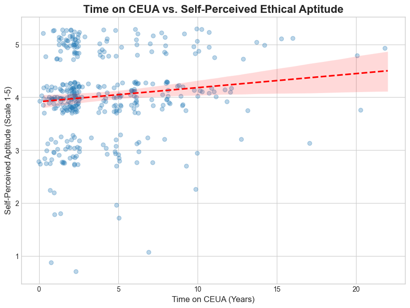
    


    
    ======================================================================
    ### VALIDITY CHECKS FOR SPEARMAN CORRELATION ###
    ======================================================================
    
    [1] Sensitivity Analysis (excluding TimeOnCEUA > 15 years)
    ----------------------------------------------------------------------
    Original sample size: 367
    Filtered sample size: 362
    Original rho: 0.1136 (p-value: 0.0296)
    Filtered rho: 0.1043 (p-value: 0.0473)
     Conclusion: Compare the original and filtered results. If they are
    very similar, our initial conclusion is robust. If they differ
    significantly, the outliers had a strong influence.
    
    
    [2] Bootstrapping (1000 iterations)
    ----------------------------------------------------------------------
    95% Confidence Interval for rho: [0.0088, 0.2154]
     Conclusion: A confidence interval tells us the range where the true
    correlation likely lies. If this interval does not contain 0, we can
    be confident that the relationship is statistically significant and
    stable.
    ======================================================================


```python
import pandas as pd
import sqlite3
import matplotlib.pyplot as plt
import seaborn as sns
from scipy.stats import kruskal
import numpy as np
import textwrap

# --- Configuration ---
DATABASE_NAME = 'ceua_analysis_v3.db'

def get_data_for_kruskal(db_name):
    """Queries for CEUA role and perception of the 3Rs principle."""
    conn = None
    try:
        conn = sqlite3.connect(db_name)
        query = """
        SELECT
          p.name AS Role,
          s."63. O_quanto_a_CEUA_se_baseia_no_principio_dos_3Rs_escala" AS Perception3Rs
        FROM
          Respondents AS r
        JOIN
          SurveyAnswers AS s ON r."Cod." = s.RespondentID
        JOIN
          PapelCEUALookup AS p ON s."Papel_na_CEUA_codificado(28)" = p.id
        WHERE
          r."Ativo" = 1;
        """
        df = pd.read_sql_query(query, conn)
        return df
    except Exception as e:
        print(f"An error occurred: {e}")
        return None
    finally:
        if conn:
            conn.close()

def main():
    """
    Performs the Kruskal-Wallis H-test and generates a detailed,
    self-contained report directly in the output.
    """
    df = get_data_for_kruskal(DATABASE_NAME)
    if df is None or df.empty:
        print("Could not load data. Aborting analysis.")
        return

    # --- NEW: Translate Role names to English ---
    translation_map = {
        'Incerto': 'Not Specified',
        'Docente': 'Faculty/Lecturer',
        'Representante da Sociedade Protetora de Animais': 'Animal Protection Society Rep.',
        'Médico(a) Veterinário (a)': 'Veterinarian',
        'Representantes de outras áreas': 'Representative (Other Areas)',
        'Consultor Ad-hoc': 'Ad-hoc Consultant',
        'Biólogo (a)': 'Biologist',
        'Pesquisador(a)': 'Researcher'
    }
    df['Role'] = df['Role'].replace(translation_map)
    
    # --- Data Cleaning ---
    df['Perception3Rs'] = pd.to_numeric(df['Perception3Rs'], errors='coerce')
    df.dropna(inplace=True)

    # --- Perform Statistical Test ---
    roles = df['Role'].unique()
    groups = [df['Perception3Rs'][df['Role'] == role] for role in roles]
    h_stat, p_value = kruskal(*groups)

    # --- Calculate Effect Size (Epsilon-Squared) ---
    n = len(df)
    k = len(roles)
    epsilon_squared = (h_stat - k + 1) / (n - k)

    # --- GENERATE THE DETAILED REPORT ---
    print("\n" + "="*70)
    print("### KRUSKAL-WALLIS H-TEST: DETAILED ANALYTICAL REPORT ###")
    print("="*70)
    
    intro_text = (
        "The Kruskal-Wallis H-Test is a non-parametric method used to determine "
        "if there are statistically significant differences between two or more "
        "independent groups on an ordinal or continuous dependent variable. It is "
        "the non-parametric equivalent of a one-way ANOVA."
    )
    print(textwrap.fill(intro_text, 70))
    print("-" * 70)

    # 1. Hypotheses
    print("\n[1] Stating the Hypotheses")
    print("-" * 70)
    print("H₀ (Null Hypothesis): The distributions of the perceived 3Rs application")
    print("scores are IDENTICAL for all professional roles on the CEUA.")
    print("\nH₁ (Alternative Hypothesis): The distribution of perceived 3Rs application")
    print("scores is DIFFERENT for at least one professional role.")
    print("-" * 70)

    # 2. Descriptive Statistics
    print("\n[2] Descriptive Statistics: A First Look at the Data")
    print("-" * 70)
    print("The median score for each group provides a measure of central tendency:")
    median_scores = df.groupby('Role')['Perception3Rs'].median().sort_values()
    print(median_scores.to_string())
    print("\n" + textwrap.fill("Observation: There appears to be some variation in the median scores across roles. The test will determine if these differences are statistically significant.", 70))
    print("-" * 70)

    # 3. Inferential Statistics
    print("\n[3] Inferential Statistics: Testing for Significance")
    print("-" * 70)
    print(f"  Kruskal-Wallis H-statistic: {h_stat:.4f}")
    print(f"  Calculated p-value: {p_value:.4f}")
    print("-" * 70)

    # 4. Effect Size
    print("\n[4] Effect Size: Measuring the Magnitude of the Difference")
    print("-" * 70)
    effect_size_text = (
        "Epsilon-squared (ε²) estimates the proportion of variance in the "
        "scores that is explained by the different roles. A common guide for "
        "interpretation is: ~0.01 (small), ~0.08 (medium), and ~0.26 (large effect)."
    )
    print(textwrap.fill(effect_size_text, 70))
    print(f"\n  Epsilon-squared (ε²): {epsilon_squared:.4f}")
    print("-" * 70)

    # 5. Conclusion
    print("\n[5] Analytical Conclusion")
    print("-" * 70)
    alpha = 0.05
    if p_value < alpha:
        conclusion_text = (
            f"The p-value ({p_value:.4f}) is less than our significance level of {alpha}. "
            f"Therefore, we REJECT the Null Hypothesis. There is statistically "
            f"significant evidence to conclude that the perception of how well the 3Rs "
            f"principle is applied differs across the various professional roles. "
            f"The effect size (ε²={epsilon_squared:.3f}) indicates that this difference is small."
        )
        print(textwrap.fill(conclusion_text, 70))
    else:
        conclusion_text = (
            f"The p-value ({p_value:.4f}) is greater than our significance level of {alpha}. "
            f"Therefore, we FAIL TO REJECT the Null Hypothesis. We do not have "
            f"sufficient statistical evidence to conclude that a difference in perception "
            f"exists across the different roles based on this data."
        )
        print(textwrap.fill(conclusion_text, 70))
    print("="*70)

    # --- Generate the Visualization ---
    plt.figure(figsize=(12, 8))
    sns.set_style("whitegrid")
    ax = sns.boxplot(
        data=df,
        y='Role',
        x='Perception3Rs',
        order=median_scores.index,
        color='steelblue'
    )
    plt.title('Perception of the 3Rs Principle Application by CEUA Role', fontsize=16, fontweight='bold')
    plt.ylabel('Role on CEUA', fontsize=12)
    plt.xlabel('Perceived Application of 3Rs (Scale 1-5)', fontsize=12)
    plt.tight_layout()
    plt.show()

if __name__ == '__main__':
    main()
```

    
    ======================================================================
    ### KRUSKAL-WALLIS H-TEST: DETAILED ANALYTICAL REPORT ###
    ======================================================================
    The Kruskal-Wallis H-Test is a non-parametric method used to determine
    if there are statistically significant differences between two or more
    independent groups on an ordinal or continuous dependent variable. It
    is the non-parametric equivalent of a one-way ANOVA.
    ----------------------------------------------------------------------
    
    [1] Stating the Hypotheses
    ----------------------------------------------------------------------
    H₀ (Null Hypothesis): The distributions of the perceived 3Rs application
    scores are IDENTICAL for all professional roles on the CEUA.
    
    H₁ (Alternative Hypothesis): The distribution of perceived 3Rs application
    scores is DIFFERENT for at least one professional role.
    ----------------------------------------------------------------------
    
    [2] Descriptive Statistics: A First Look at the Data
    ----------------------------------------------------------------------
    The median score for each group provides a measure of central tendency:
    Role
    Animal Protection Society Rep.    4.0
    Faculty/Lecturer                  4.0
    Representative (Other Areas)      4.0
    Not Specified                     4.0
    Veterinarian                      4.0
    Ad-hoc Consultant                 5.0
    Biologist                         5.0
    Researcher                        5.0
    
    Observation: There appears to be some variation in the median scores
    across roles. The test will determine if these differences are
    statistically significant.
    ----------------------------------------------------------------------
    
    [3] Inferential Statistics: Testing for Significance
    ----------------------------------------------------------------------
      Kruskal-Wallis H-statistic: 7.3747
      Calculated p-value: 0.3909
    ----------------------------------------------------------------------
    
    [4] Effect Size: Measuring the Magnitude of the Difference
    ----------------------------------------------------------------------
    Epsilon-squared (ε²) estimates the proportion of variance in the
    scores that is explained by the different roles. A common guide for
    interpretation is: ~0.01 (small), ~0.08 (medium), and ~0.26 (large
    effect).
    
      Epsilon-squared (ε²): 0.0010
    ----------------------------------------------------------------------
    
    [5] Analytical Conclusion
    ----------------------------------------------------------------------
    The p-value (0.3909) is greater than our significance level of 0.05.
    Therefore, we FAIL TO REJECT the Null Hypothesis. We do not have
    sufficient statistical evidence to conclude that a difference in
    perception exists across the different roles based on this data.
    ======================================================================


    /home/leon/anaconda3/lib/python3.10/site-packages/seaborn/categorical.py:632: FutureWarning: SeriesGroupBy.grouper is deprecated and will be removed in a future version of pandas.
      positions = grouped.grouper.result_index.to_numpy(dtype=float)


    
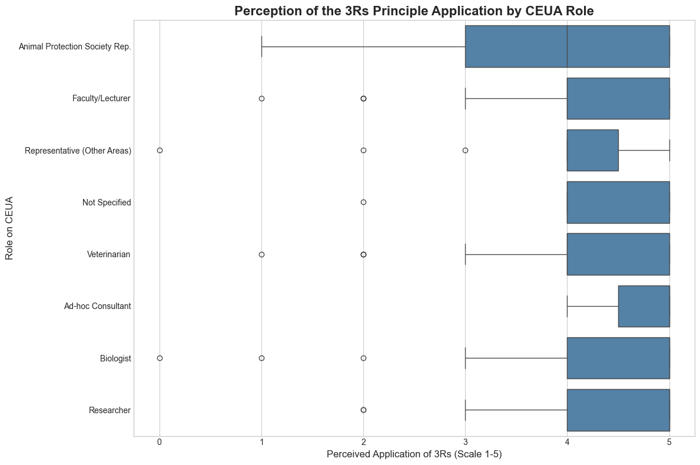
    


```python

```


```python

```


```python

```


```python

```


```python

```
